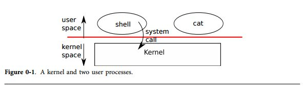

オペレーティングシステムインタフェース
=====================================

オペレーティングシステムの仕事は、複数プログラム間でコンピュータを共有し、単体ハードウェアによるサポートよりも便利なサービスセットを提供することである。オペレーティングシステムは低レイヤのハードウェアを管理、抽象化する。
例えば、ワードプロセッサを使うために、どのような種類のディスクハードウェアが利用されているかについて考える必要はない。
オペレーティングシステムはハードウェアを分割させ、多くのプログラムがコンピュータを共有し同時動作(もしくは動作しているように見える)を実現している。
最後に、オペレーティングシステムはプログラム同士が相互通信をするための制御された方法を提供している。
これにより各プログラムはデータを共有し協調して動作することができるようになっている。

オペレーティングシステムはユーザプログラムに、インタフェースを通じてサービスを提供する。
良いインタフェースを設計することは難しいことは分かる。
一方で、私達はインタフェースをシンプルかつ狭くすることで、実装をより簡単にしたいと思う。
また一方で、アプリケーションの機能により洗練されたものを要求する傾向にある。
この難しい関係を解消するための方法は、いくつも組み合わせることのできる少数のメカニズムに依存したインタフェースを設計することである。
メカニズムの種類を減らすことにより、高い汎用性を提供することができるようになる。
本書はひとつのオペレーティングシステムを具体的な例として取り上げ、その概念を説明する。
このオペレーティングシステムはxv6と呼ばれる。
xv6はKen ThompsonとDennis Ritcheにより開発されたUnixオペーレーティングシステムのインタフェースだけでなく、Unixの内部デザインも真似ている。
Unixは数少ないインタフェースを提供するが、これらのインタフェースはうまく組み合わせて動作し、驚くほど程度の高い汎用性を提供する。
このインタフェースはBSD、Linux、Mac OS X、Solarisなどの現代のオペレーティングシステムでも採用されている。
またMicrosoft WindowsでもUNIX系のインタフェースを僅かながら採用している。
xv6を理解することはこれらのシステムや他のシスメウお理解するための良いスタートポイントになる。
図0-1に示すように、xv6は伝統的なkernelという、実行中のプログラムに対してサービスを提供するための特殊なプログラムの形式をしている。
各実行中のプログラムはプロセスと呼ばれ、命令、データ、スタックを含んでいるメモリを持っている。
命令はプログラムの計算を実行するためのものである。データは計算するための変数などが入っている。スタックはプログラムの呼出コールを構成する。



プロセスがカーネルサービスを呼ばなければならなくなった場合、オペレーティングシステムのインタフェースを通じてカーネルサービスのプロシージャ呼出がなされる。このようなプロシージャのことをシステムコールと呼ぶ。システムコールがカーネルの中に入る;カーネルはサービスを実行し戻ってくる。従って、プロセスはユーザ空間とカーネル空間での実行を行き来することとなる。

カーネルはCPUのハードウェア保護機構を使って各プロセスはユーザ空間で実行されているときに自分のメモリ領域のみアクセスしているかをチェックする。カーネルはこれらの保護を実装するために必要な権限を持っているときに実行される； これらの権限を持っていないユーザプログラムの実行を除いてxxx。ユーザプログラムがシステムコールを起動すると、ハードウェアが権限レベルを上昇させあらかじめカーネル内で配置された関数が実行される。

システムコールの集合は、カーネルが提供しユーザプログラムが見ることのできるインタフェースである。xv6カーネルはUnixカーネルが伝統的に提供しているサービスとシステムコールの一部分を提供している。図0-2はxv6のシステムコールの一覧である。
本章では、以降でxv6のサービスの概要を示すープロセス、メモリ、ファイルディスクリプタ、パイプ、ファイルシステム、そして短いコードによるこれらの説明と、シェルがどのようにしてこれらを扱うかについて議論する。シェルによるシステムコールの利用は、彼等がどのように注意深く実装したかを説明するものである。

シェルはユーザのコマンドを読み込み実行するための最初のプログラムであり、伝統的なUnix系システムにおける主たるユーザインタフェースである。シェルはユーザプログラムであり、カーネルの一部ではない。これがシステムコールインタフェースの力を説明している: これらには何も特別なことは無い。また、これはシェルを簡単に置き換えることができるということを意味している; 結果として、現代のUnixシステムでは多くのシェルが存在し選択することができる。これらのシェルは独自のインタフェースやスクリプティングインタフェースを持っている。xv6のシェルはUnix Bourne Shellの基本となるシンプルな実装であり、これらの実装は8350行で見ることができる。


| System call               | Description                              |
|---------------------------|------------------------------------------|
| fork()                    | Create process                           |
| exit()                    | Terminate current process                |
| wait()                    | Wait for a child process to exit         |
| kill(pid)                 | Terminate process pid                    |
| getpid()                  | Return current process’s id              |
| sleep(n)                  | Sleep for n seconds                      |
| exec(filename, *argv)     | Load a file and execute it               |
| sbrk(n)                   | Grow process’s memory by n bytes         |
| open(filename, flags)     | Open a file; flags indicate read/write   |
| read(fd, buf, n)          | Read n byes from an open file into buf   |
| write(fd, buf, n)         | Write n bytes to an open file            |
| close(fd)                 | Release open file fd                     |
| dup(fd)                   | Duplicate fd                             |
| pipe(p)                   | Create a pipe and return fd’s in p       |
| chdir(dirname)            | Change the current directory             |
| mkdir(dirname)            | Create a new directory                   |
| mknod(name, major, minor) | Create a device file                     |
| fstat(fd)                 | Return info about an open file           |
| link(f1, f2)              | Create another name (f2) for the file f1 |
| unlink(filename)          | Remove a file                            |

# プロセスとメモリ

xv6のプロセスはユーザ空間メモリ(命令、データ、スタック)とカーネルによるプロセス毎の状態を記録した空間から構成される。xv6はプロセスを時分割共有することができる;これは複数の実行待ちのプロセスで透過的にスイッチしながらCPUを入手できるようにする仕組みである。プロセスが実行されていないならば、xv6はCPUレジスタを保存し、次のプロセスのレジスタをリストアする。カーネルはプロセス識別子、pidを各プロセスに割り当てる。

プロセスはforkシステムコールを利用して新しいプロセスを作成する。Forkは子プロセスと呼ばれる新しいプロセスをいいする。子プロセスは、親プロセスと呼ぶ呼出元のプロセスと全く同一のものである。Forkは親プロセスと子プロセスの両方に返される。親ならばforkは子プロセスのpidを返し、子ならばゼロを返す。例えば、次のようなプログラムを考える。

```cpp
int pid = fork();
if(pid > 0){
    printf("parent: child=%d\n", pid);
    pid = wait();
    printf("child %d is done\n", pid);
} else if(pid == 0){
    printf("child: exiting\n");
    exit();
} else {
    printf("fork error\n");
}
```

exit システムコールは、呼び出し元のプロセスの実行を中止し、メモリや開いているファイルなどを開放する。waitシステムコールは、終了した子プロエッスのpidを返す; もし呼び出し元の子プロセスがどれも終了しなかった場合、waitシステムコールは終了するまで待つ。この例では、出力には
```bash
parent: child=1234
child: existing
```

と出力されるが、どちらの行が先に出力されるかは別らない。これは親プロセスと子プロセスがどちらが先にprintfコールを呼び出すかに依存する。子プロセスが終了し親プロセスのwaitが帰ってくると、親プロセスが

```bash
parent: child 1234 is done
```

と出力する。ここで親プロセスと子プロセスは別々のメモリと別々のレジスタを用いて実行されたことに注意したい: 一方の変数を変更しても、他方には影響していない。
execシステムコールは呼び出し元のプロセスのメモリを、ファイルシステム中に格納されている新しいメモリイメージに置き換える。そのファイルは特定のフォーマットをしていなければならず、どの部分に命令が格納されているか、どの部分がデータか、どこから命令がスタートするか、などが記述されていなければならない。xv6はELFフォーマットを用い、これについては第2章でより詳細に議論する。execが成功すると、呼び出し元のプログラムには帰ってこない; その変わりに、ELFヘッダにより宣言されたエントリポイントからファイルがロードされ、命令が実行され始める。execは2つの引数を取る: 実行ファイルが格納されているファイル名と、文字列で表現されている引数の配列である。例えば、

```cpp
char *argv[3];
argv[0] = "echo";
argv[1] = "hello";
argv[2] = 0;
exec("/bin/echo", argv);
printf("exec error\n");
```

 上記のプログラム列は、プログラム/etc/echoのインスタンスを呼び出し、引数リストとして、echo helloをセットし、実行する。殆どのプログラム、伝統的にプログラム名を挿入している最初の引数を無視する。
xv6シェルは上記の呼び出しの方法を用いてユーザの変わりにプログラウを実行する。シェルのメイン構造はシンプルである; 8501行目のmainを参照して欲しい。mainループはgetcmdを利用してコマンドラインの入力を読み込む。次にforkを呼び出し、シェルプロセスのコピーを生成する。親プロセスであるシェルは、子プロセスがコマンドを実行している間、waitを呼んで待つ。例えば、ユーザがプロンプト上で”echo hello”とタイプした場合、runcmdは”echo hello”を引数として呼び出す。runcmd(8406)行目は実際のコマンドを実行する。”echo hello”を実行するために、exec(8426行目)が呼び出される。execの呼び出しが成功すると、子プロセスはruncmdの変わりにechoを実行する。どこかの段階でechoがexitを呼び出すと、親プロセスが呼び出され、main(8501行目)上のwaitに制御が帰される。読者はforkとexecが何故1つの処理として実行されないのか不思議の思うことであろう;プロセスの作成とプログラムのロードを分割することが、非常に賢いデザインである、ということについては後で参照する。
xv6は殆どのユーザ空間メモリを暗黙的に割り当てる: forkは子プロセスのコピーに必要なメモリ領域を確保し、execは実行可能なファイルを保持するための十分なメモリ領域を確保する。プロセスが実行中により多くのメモリが必要であれば(おそらくはmallocなどを使って)、sbrk(n)を呼び出してデータメモリのサイズをnバイトまで増やすことができる; sbrk新しいメモリの場所を返す。
xv6はユーザや、あるユーザを他のユーザから保護する機構は持っていない; Unixのターミナルでは、xv6のプロセスはrootとして動作する。

# I/Oとファイルディスクリプタ

ファイルディスクリプタはプロセスが読み書きを行う、カーネルが管理する小さな数字で表現されるオブジェクトである。プロセスはファイルやディレクトリ、デバイスをオープンしたり、パイプを作成するため、既存のディスクリプタを複製するためにファイルディスクリプタを獲得する。簡単化のために、このファイルディスクリプタというオブジュクトを簡単に「ファイル」と呼ぶことにする; ファイルディスクリプタのインタフェースは、ファイル、パイプ、デバイスなどの違いを抽象化し、これらの全てのバイトストリームのように扱うことができるようにする。

内部的には、xv6カーネルはふファイルディスクリプタをプロセス毎のテーブルとして取り扱ている。従って全てのプロセスはファイルディスクリプタのためのプライベートな空間を持っており、それらはゼロから始まる識別子である。慣習として、プロセスはファイルディスクリプタ0(標準入力)から読み込みを行い、ファイルディスクリプタ1(標準出力1)へ書き込みを行い、エラーメッセージをファイルディスクリプタ2(標準エラー出力)へ出力する。これから私達が見ていくように、シェルはこれらの慣習をうまく用いてI/Oのリダイレクトやパイプラインを実現する。シェルはこれらの3つのファイルディスクリプタはオープンであることを常に保証し(8507行目)、デフォルトとファイルディスクリプタはコンソールである。

readとwriteシステムコールはファイルディスクリプタにより指定されたオープンしているファイルから、バイト列を読み込んだり、バイトレツを書き込んだりするものである。read(fd,buf,n)はファイルディスクリプタfdから最大でnバイトを読み込み、bufにコピーし、読み込んだバイト数を返す。各ファイルディスクリプタはファイルの保持しているオフセットを参照している。readは現在のオフセットからデータを読み込み、読み込んだバイト数分だけオフセットを進行させる: 後続のreadは最初のreadが読み込みを完了した場所から読み込みを続ける。もしこれ以上読み込むデータが存在しない場合、readはゼロを返し、ファイルの最後であることを伝える。

write(fd,buf,n)はbufからnバイトをファイルディスクリプタに書き込み、書き込まれたバイト数を返す。nよりも小さな値が返された場合、何らかのエラーが発生したことを示している。readのように、writeもファイルの保持している現在のファイルオフセットを参照しており、書き込んだバイト数分だけオフセットを進ませる: 各writeは前のwriteによりどれだけ進んだかを見て、書き込みを行う。
以下のプログラム列(このプログラムはcatの基本的な構造を示している)は、データを標準入力から読み込んで、標準出力に出力している。もしエラーが発生すると、標準エラー出力にメッセージを出力する。

```cpp
char buf[512];
int n;
for(;;){
    n = read(0, buf, sizeof buf);
    if(n == 0)
    break;
    if(n < 0){
        fprintf(2, "read error\n");
        exit();
    }
    if(write(1, buf, n) != n){
        fprintf(2, "write error\n");
        exit();
    }
}
```

このプログラム列の重要な部分は、catはファイルから読み出すか、コンソールか、パイプから読み出すかについては知っていないといことである。同様に、catはファイルか、それ以外のところに書き込むかについては感知しない。ファイルディスクリプタの利用と、ファイルディスクリプタ0が入力、ファイルディスクリプタ1が出力であるという慣習を使うことにより、catをより簡単に実装することができるようになる。

closeシステムコールは、ファイルディスクリプタを開放し、未来のopen,pipe,dupシステムコール(後の章を参照のこと)で再利用できるようにするためのものである。新たに割り当てられたファイルディスクリプタは、現在のプロセスで利用されていないディスクリプタの最小値が利用される。

ファイルディスクリプタとforkはI/Oのリダイレクトを簡単に実装するために相互に動作する。forkは親プロセスのファイルディスクリプタのテーブルをメモリにコピーし、子プロセスは親と完全に同一なファイルをオープンしていることになる。システムコールexecは呼び出し元のプロセスのメモリを置き換えるが、ファイルテーブルは維持する。この動作によりシェルがforkによりI/Oのリダイレクトを実装し、選択したファイルディスクリプタを再度オープンし、新しいプログラムを実行する。以下がコマンド列 cat < input.txtを実行したときのシェルの動作を簡単化したものである。

```cpp
char *argv[2];
argv[0] = "cat";
argv[1] = 0;
if(fork() == 0) {
    close(0);
    open("input.txt", O_RDONLY);
    exec("cat", argv);
}
```

子プロセスがファイルディスクリプタ0を閉じることにより、openがそのファイルディスクリプタを新しいファイルinput.txtに0を使うことを保証している。0は最小のファイルディスクリプタなので、close(0)をすると次に必ず使われる。catはファイルディスクリプタ0(標準入力)をinput.txtの参照として利用する。

forkはファイルディスクリプタのテーブルをコピーするが、内部の各ファイルオフセットは親プロセスと子プロセスで共有している。次の例を考える。

```cpp
if(fork() == 0) {
    write(1, "hello ", 6);
    exit();
} else {
    wait();
    write(1, "world\n", 6);
}
```

このコード列を実行すると、ファイルディスクリプタ1に割り付けらてたファイルにはデータとして"hello world"が出力される。親プロセスのwrite(waitのおかげで、子プロセスが完了してから実行される)は子プロセスのwriteがどこまでオフセットを進めたかを調査してから実行する。この動作により連続したコマンド列によって、連続した出力を実現することが可能になる(echo hello; echo world > output.txt)

dupシステムコールは既存のファイルディスクリプタを複製すし、同一のI/Oオブジェクトに対して新しいディスクリプタを返す。どちらのファイルディスクリプタもオフセットを共有しており、あたかもファイルディスクリプタがforkにより複製されたように動作する。これがhello worldをファイルに書き込むためのもう一つの方法である:

```cpp
fd = dup(1);
write(1, "hello ", 6);
write(fd, "world\n", 6);
```

2つのファイルディスクリプタは、もしこれらが同一のファイルディスクリプタからforkとdupのシステムコールより生成されたものならば、オフセットを共有している。そうでなければ、ファイルディスクリプタは同一のファイルをオープンしたとしてもオフセットを共有しない。dupシェルで以下のようなコマンドを実現することができるようになる: ```ls existing-file non-existing file > tmp1 2>&1```
2>&1はシェルに対してコマンドがファイルディスクリプタの2番目をファイルディスクリプタの1と複製させることを示している。既存のファイルの名前と、存在していないファイルを表示しようとしたエラーメッセージはファイルtmp1に出力される。xv6シェルはエラーファイルのディスクリプタのリダイレクトをサポートしないが、実装の方法を知っておいて損はない。

ファイルディスクリプタはファイルがどのように接続されているかを隠蔽することができるため、強力な抽象化の手段である: ファイルディスクリプタ1に書き込んでいるプロセスは、ファイルに書き込みをしているかもしれないし、コンソールのようなデバイスへ書き込みをしているかもしれないし、あるいはパイプに書き込みをしているかもしれない。

# パイプ

パイプは、プロセスから見るとファイルディスクリプタのペアとして見え、ひとつは読み込み用で一つは書き込み用である。パイプに一方に書き込みを行うと、パイプのもう一方からデータを入手することができる。パイププロセス間で通信する手段を提供する。
以下のサンプルコードは、プログラムwcの標準入力をパイプの入力側に接続する例である。

```cpp
int p[2];
char *argv[2];
argv[0] = "wc";
argv[1] = 0;
pipe(p);
if(fork() == 0) {
	  close(0);
	  dup(p[0]);
	  close(p[0]);
	  close(p[1]);
	  exec("/bin/wc", argv);
} else {
  write(p[1], "hello world\n", 12);
  close(p[0]);
  close(p[1]);
}
```

このプログラムはpipeを呼び出し、新しいパイプを作成して配列pに読み込み用ファイルディスクリプタと書き込み用ファイルディスクリプタを登録する。
forkの実行後、親プロセスと子プロセスはそれぞれそのパイプのファイルディスクリプタを参照する。子プロエッスは読み込み用のファイルディスクリプタである0を複製し、p中のファイルディスクリプタを閉じ、wcを実行する。wcが標準入力からファイルを読み込むと、それはパイプから読み込まれたことになる。親プロセスがパイプの書き込み側に書き込みを行い、ファイルディスクリプタの両方を閉じる。
データが取得できなければ、pipe中のreadはデータが書き込まれるまでか、全ての書き込み用のパイプが閉じるまで待つ;校舎の場合には、readは0を返し、あたかもデータファイルの最後まで到達したかのように振る舞う。readが新しいデータが到着するまで実行をブロックするという事実の理由として、子プロセスが上記のwcを実行する前にパイプのwrite側のファイルディスクリプタを閉じることが重要だらである: もしwcのファイルディスクリプタの一つが書き込み用パイプを参照していれば、wcは決してファイルの最後にはならない。

xv6のシェルは```grep fork sh.c | wc -l```のようなパイプラインを上記のコード列のように実現する(8450行)。子プロセスがパイプラインの左側と右側を接続するためのパイプを作成する。次に、パイプラインの左側のためのコマンドのためにruncmdを実行し、次にパイプラインの右側のコマンドのためにruncmdを実行する。そして左側のコマンドと右側のコマンドのどちらもごあ終了するまで、waitを2回呼ぶことで待ち合わせをしている。パイプラインの右側のコマンドそのものにもパイプが含まれていた場合(例えば、 ```a | b | c```)、子プロセスを2回生成する(1回目はb用であり、2回目はc用)。従って、シェルはプロセスのツリーを形成することになる。このツリーの葉はコマンドであり、接続ノードは左側のノードと右側のノードが終了するのを待つプロセスである。基本的には、接続ノードがパイプラインの左側を実行する機能を含めることができるのだが、これを正しく実現するためには実装が複雑になる。

パイプは一時ファイルを利用するのよりもより強力である: 以下のパイプライン
```bash
echo hello world | wc
```
をパイプを使わずに実現しようとするならば、
```bash
echo hello world > /tmp/xyz; wc < /tmy/xyz
```
としなければならない。ここにはパイプラインと一時ファイルで少なくとも3つの基本的な違いがある。まず、パイプはリダイレクションを利用することで自動的に一時ファイルを消去する。シェルは最後に/tmp/xyzを削除して終了することに気をつけなければならない。次に、パイプは非常に長いデータストリームも渡すことができ、一方でファイルのリダイレクトでは、全てのデータを格納するための十分に多きいディスク領域が必要になる。3番目に、パイプは同期を実現することができる: 2つのプロセスはパイプのペアを用いることにより、御互いにメッセージを送ることができ、readは、他のプロセスがwriteを実行するまでブロックさせることができるようになる。

# ファイルシステム
xv6のファイルシステムは解釈されないデータファイルと、データファイルの名前に対する参照と他のディレクトリを参照する情報が含まれているディレクトリを提供する。xv6はディレクトリを特殊な種類のファイルとして実装している。ディレクトリはツリーを構成する。ディレクトリは特殊なディレクトリであるrootから開始される。/a/b/cのような形式で表現されるパスはルートディレクトリ/に含まれるディレクトリaに含まれるディレクトリbに含まれる名前cのファイルもしくはディレクトリをrootが参照するため名前である。/から始まらないパスは現在のディレクトリから始まる相対的なパスとして評価される。この現在のディレクトリはchdirシステムコールにより切り替えることができる。以下のどちらのコード列も、同一のファイルを呼び出すものである(全てのディレクトリは存在するものとする)

```cpp
chdir("/a");
chdir("b");
open("c", O_RDONLY);
```

```cpp
open("/a/b/c", O_RDONLY);
```

最初のコード列は、プロセスの現在のディレクトリを/a/bに変更する; 2番目のコード列はプロセスの現在のディレクトリを変更しない。

新しいファイルやディレクトリを作成するためには、複数のシステムコールが存在する: mkdirは新しいディレクトリを作成し、openはO\_CREATEフラグを新しいデータファイルに付与する。mknodは新しいデバイスファイルを作成する。以下の例はこれらの全てを説明したものである。

```cpp
mkdir("/dir");
fd = open("/dir/file", O_CREATE|O_WRONLY);
close(fd);
mknod("/console", 1, 1);
```

mknodはファイルシステム上にファイルを作成するが、中には何も入っていない。その変わりに、このファイルのメタデータには、このファイルはデバイスファイルであるということが記録され、メジャーデバイス番号とマイナーデバイス番号が記録される(この2つの番号がmknodの引数に指定されている)。この2つの番号により、カーネルデバイスを識別する。後続のプロセスがファイルを開くと、カーネルはファイルシステムを参照する代わりに、カーネルデバイスの実装を参照するように方向転換する。

fstatはファイルディスクリプタが参照するオブジェクトの情報を探索する。fstatはその情報をlstat.hに定義されているstruct stat構造体に格納する:

```cpp
#define T_DIR 1 // Directory
#define T_FILE 2 // File
#define T_DEV 3 // Device
struct stat {
   short type; // Type of file
   int dev; // File system’s disk device
   uint ino; // Inode number
   short nlink; // Number of links to file
   uint size; // Size of file in bytes
};
```
ファイル名は、ファイルそのものとは区別して取り扱われる; 内部的には同一のファイルであることはinodeを使って表現され、inodeはlinkを呼ぶことにより複数の名前を持つことができる。linkシステムコールは他のファイルシステムの名前を同一のinodeに対して付ける。次のプログラム列は、新しいファイルを作成して名前としてaとbを付ける。

```cpp
open("a", O_CREATE|O_WRONLY);
link("a", "b");
```

aに対して読み書きするのと、bに対して読み書きすることは同一である。どちらのinodeも、内部では同一の"inode番号"として識別される。上記のコード列を実行すると、fstatを実行することにより、aとbが内部では同一のファイルを参照していることを決定できる: どちらのfstatも同一のinode番号(ino)を返し、nlinkの番号が2とセットされているからである。

ulinkシステムコールはファイルシステムから名前を除去する。ファイルのinodとその内容を保持していたディスクスペースは、ファイルのリンク番号が0になり、どこからも参照されなくなるときに始めて解放される。従って、上記のコード列に以下を追加すると、
```cpp
unlink("a")
```
により、bという名前でのみアクセスできるようになる。さらに、

```cpp
fd = open("/tmp/xyz", O_CREATE|O_RDWR);
unlink("/tmp/xyz");
```

上記のコード列は、プロセスがfdを消去するときか、終了するときにクリーンすべきである一時ファイルを除去するための慣用句である。

xv6では、ファイルシステムのためのコマンドはmkdir,ln,rm,などのようなユーザレベルのプログラムとして実装されている。この設計では、誰でもシェルを拡張して新しいユーザコマンドを作成することができる。後から考えてみると明らかなこのではあるのだが、当時のUnix以外のシステムでは、これらのコマンドはシェルの内部に実装されていることが多かった(そしてシェルはカーネルに内蔵されていた)。

一つの例外がcdであり、これはシェルに内蔵されている(8516行目)。cdは現在のワーキングディレクトリをシェル自身が変更しなければならない。もしcdコマンドを通常のコマンドとして実行すると、シェルが子プロセスをforkし、子プロセスがcdを実行してcdは「子プロセスの」ワーキングディレクトリを変更するだけで終わってしまう。親プロセス(例えば、シェルそのもの)のワーキングディレクトリは変更されない。

# 現実の世界

Unixにおいて、「標準的な」ファイルディスクリプタ、パイプ、そして便利な文法を活用することにより、汎用的で再利用可能なプログロムを書くことができるのは大きな強みである。スパークした、「ソフトウェアツール」の全体的な文化のアイデアはUnixの力と人気によるものであり(xxx)、シェルは、いわゆる最初の「スクリプト言語」であった。UnixのシステムコールのインタフェースはBSD,Linux,Mac OS x などでも利用されている。

現代のカーネルでは、xv6よりもはるかに多くのシステムコールやカーネルサービスを提供している。殆どの部分であ、現代のUnixから派生したオペレーティングシステムは、デバイスを特殊ファイルとして見せるような初期のUnixのモデルを踏襲しておらず、先に議論したコンソールのようなデバイスファイルとして表現されている(xxx)。Unixの開発者達はPlan 9をビルドし続けているため、現代の装置や、ネットワークの表現や、グラフィックスや他の資源の操作をファイルやファイルツリーの操作として実現しており、「資源はファイルである」という方針を続けている。

ファイルシステムの抽象化は強力なアイデアであり、World Wide Webのような現代の殆どのネットワーク資源にも適応されている。それでも、オペレーティングシステムのインタフェースとして他のモデルも存在する。MulticsのようなUnixよりも前のシステムではファイルストレージをメモリのように抽象化し、全く異なるインタフェースを作り出していた。Multicsの設計の複雑性はUnixの設計者達にも直接影響を与え、彼等はなるべく全てをシンプルに作ろうとした。

本書はxv6をUnix系のインタフェースインタフェーウとして実装する方法について述べるが、アイデアと概念はUnixだけに適用されるものではない。多くのオペレーティングシステムは内部のハードウェアの上で複数のプロセスが走っており、各プロセスが独立して動作しプロセス間の通信を行う機構が提供されている。xv6を学んだあとは、読者はより複雑なオペレーティングシステムを学ぶことによって、xv6の内部の考え方がそれらのシステムにも同様に存在していることを見ることができるだろう。
