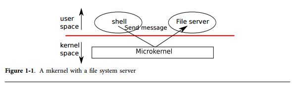
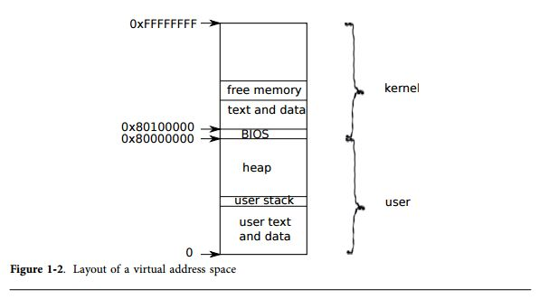
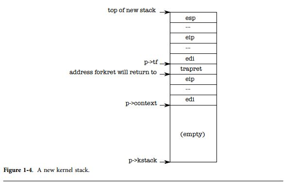

オペレーティングシステムの構成
=====================

オペレーティングシステムの鍵は、様々な活動をサポートすることである。例えば、第0章で述べたシステムコールを用いて、プロセスは`fork`を呼び出すことにより新しいプロセスを開始することができる。オペレーティングシステムはこれらのプロセスがコンピュータ上の資源を「時分割共有」できるように管理する必要がある。例えば、プロセスがコンピュータ上に存在するプロセッサ数よりも多くのプロセスを生成したとしても、全てのプロセスは正しく動作しなければならない。加えて、オペレーティングシステムは各プロセスが「独立して」動作するための管理を行わなければならない。つまり、あるプロセスにバグがあり異常終了したとしても、そのプロセスと依存関係の無いプロセスに影響を与えてはならないということである。プロセス間で相互作用を可能にするため、完全な独立性は非常に強力な機能である; 例えば、ユーザにとって複雑なタスクを実行するために複数のプロセスを組み合せる(例えばパイプなど)ことができれば便利である。従って、オペレーティングシステムの実装は、「多重化、独立、相互作用」の3つの要件を達成する必要がある。
本章では、オペレーティングシステムが上記の3つの要件を満たすために、どのように構成されているかについて概要を説明する。これを実現するためには様々な手段が存在するが、本書では多くのUnixオペレーティングシステムでも採用されている「モノリシックカーネル」という方式を中心に、焦点を当てて説明を行う。本章では、この構成をまずxv6が動作を開始し、最初のプロセスが開始するところからトレースして説明する。この中で、本書ではxv6が提供する主たる抽象化について簡単に説明する。つまり、どのようにプロセスが相互作用を行い、どのようにして多重化、独立、相互作用の要求を満たすような構成を取っているのかについて説明する。xv6の殆どの部分は、最初のプロセスについての特別な場合分けについては避けており、xv6が提供する標準的な操作を再利用することで実現している。以降の章では、それぞれの抽象化についてより詳細に説明する。
xv6はPCプラットフォーム上で、Intelの30386よりも後続の("x86")のプロセッサで動作し、多くの低レイヤの機能(例えば、プロセスの実装など)はx86の仕様に則して作られている。本書の読者はいくつかのアーキテクチャについて少しのアセンブリレベルでのプログラミングの経験があり、x86の仕様については、必要なときに随時説明する。付録Aで、PCプラットフォームについて概要を説明している。

# 物理資源の抽象化

オペレーティングシステムについて考えるとき最初に思い浮かぶ質問は、何故それが必要なのか？ということである。つまり、誰かが図0-2のシステムコールをライブラリとして実装しておき、アプリケーションとリンクさせておけば良いのではないかと考える訳である。この方法では、各アプリケーションは各々のライブラリを持っており、それぞれのアプリケーションで適切なライブラリを持っている。この方法ではアプリケーションはハードウェアと直接通信を行い、ハードウェア資源を各々のアプリケーションが最適な方法で使用する(例えば、最高の性能を得るための構成や所望の性能を得るための構成でアクセスを行う)。組み込みデバイス向けのいくつかの小さなオペレーティングシステムや、リアルタイムシステム向けのオペレーティングシステムではこのような方法を取っている。
この方式の問題は、アプリケーションが自由にライブラリを使えることであり、つまりは各アプリケーションが「ライブラリを適切に使わない」ということである。もしアプリケーションがオペレーティングシステムのライブラリを利用しなければ、オペレーティングシステムは時分割共有をアプリケーションに強制させることができない。各アプリケーションが正しく動作しているということに依存するしかなくなり、例えば定期的にプロセッサの取得を諦め、他のアプリケーションがプロセッッサを獲得するようにしなければならない。このような「協力作業が必要な」時分割共有の構成は、全てのアプリケーションが正しく動作していることを信用しても大丈夫かもしれないが、各アプリケーションが相互に信用ならないものであると、強力な独立性を提供することができなくなる。
強力な独立性を実現するためには、各アプリケーションが直接ハードウェア資源にアクセスすることを禁止し、その代わりに各資源をサービスとして抽象化することが有効だと思われる。例えば、各アプリケーションはファイルシステムに対して`open`, `read`, `write`, `close`などのシステムコールでのみアクセスし、直接ディスクセクタは読まないようにする。これによりアプリケーションがパス名を利用することにより、オペレーティングシステムが(インタフェースの実装者として)ディスクを管理することができるようになる。
同様に、Unixのアプリケーションが`fork`を用いてプロセスとして動作することにより、アプリケーションが異なるプロセス間でスイッチする際の、レジスタのセーブとリストアをオペレーティングシステムが実現できるようになる。これにより、アプリケーションはプロセスのスイッチングについて気に掛ける必要が無くなる。さらに、例えばアプリケーションが無限ループに陥ったとしても、オペレーティングシステムが強制的にアプリケーションをプロセッサの外にスイッチすることができるようになる。
別の例として、Unixのプロセスは`exec`を用いることにより、直接物理的なメモリを操作する代わりにメモリイメージを構築できるようになる。これにより、オペレーティングシステムはどの領域をどのプロセスが使うかを決定し、メモリ領域が足りなければ領域の移動を行い、これらのイメージを格納しておくためのファイルシステムの利便性をアプリケーションに提供できるようになる。
アプリケーション間で制御された相互作用をサポートするために、Unixのアプリケーションはファイルディスクリプタのみを使うことができる。(例えば、物理的なメモリの一部を予約するといったような)他の共有のための方法を取ることはない。Unixのファイルディスクリプタは共有のための詳細を抽象化し、ターミナル、ファイルシステム、パイプなどを使ってアプリケーションの相互作用が発生したとしても、詳細を隠すことができるようになる。
図0-2に示すようなシステムコールのインタフェースは注意深く設計され、利便性のためにプログラマに提供されているが、これらのインタフェースを実装することにより強力な独立性を実現できている。Unixインタフェースは資源を抽象化するだけでなく、それが非常に良いものであるということを証明している。

# ユーザモード、カーネルモード、システムコール

システムコールを利用するソフトウェアとシステムコールを実装する側のソフトウェアの間で強い独立性を提供するためには、オペレーティングシステムとアプリケーションの間に強力な境界が必要になる。アプリケーションにミスがあった場合にオペレーティングシステムまでもが終了するのは避けたい。その代わりに、オペレーティングシステムはアプリケーションをクリーンアップして、他のアプリケーションを実行し続けるこができる。この強力な独立性は、アプリケーションはオペレーティングシステムによって管理されるデータ構造を書き換えることができてはならないことを意味し、オペレーティングシステムの命令列を書き換えることができてはならないということを意味する。

このような強力な独立性を提供するために、プロセッサはハードウェア的なサポートを提供する。例えば、x86プロセッサは他のプロセッサと同様に、命令を実行するための2つのモードを提供する:**カーネルモード** と **ユーザモード** である。カーネルモードでは、プロセッサは **権限のある命令** を実行することができる。例えばディスク（か、それ以外のI/Oデバイス)への書き込みを行うのは権限命令である。もしアプリケーションがユーザモードで実行されている中で権限のある命令を実行すると、実行してはならない命令を実行したということでプロセッサはその命令を実行せず、その代わりにカーネルモードに移行してカーネルモード中のソフトウェアはアプリケーションをクリーンアップする。第0章の図0-1ではその構成を示している。アプリケーションはユーザモードでのみ実行することができ(例えば、数を加算する、など)、これを **ユーザ空間** で実行していると呼ぶ。カーネル空間(もしくは、カーネルモード)で実行しているソフトウェアのことを **カーネル **と呼ぶ。

ユーザモードのアプリケーションがディスクの読み書きをしたい場合、アプリケーション自身はI/O命令を実行することができないため、カーネルモードに以降する必要がある。プロセッサはユーザモードからカーネルモードにスイッチし、カーネルによって指定されるエントリポイントに入ることができる命令を提供している。(x86プロセッサでは`int`命令に相当する。)プロセッサが一度カーネルモードに以降すると、カーネルはシステムコールの引数をチェックし、アプリケーションが要求した操作の実行を許可するか決定する。カーネルモードに遷移した時に、カーネルがエントリポイントを設定することが重要である; もしアプリケーションがカーネルのエントリポイントを決定することができなければ、悪意のあるアプリケーションが引数の判定を行うコードをスキップすることができるからである。

# カーネルの構成
オペレーティングシステムの鍵となる設計の疑問として、オペレーティングシステムのどのような場所をカーネルモードで実行すれば良いかということがあげられる。シンプルな回答は、システムコールインタフェースがカーネルへのインタフェースである。つまり、`fork`, `exec`, `open`, `close`, `read`, `write` などは全てカーネルコールである。この選択は、オペレーティングシステムの実装は全てカーネルモードで実行されるということを示している。このカーネル構成を**モノリシックカーネル**と呼ばれる。
この構成では、オペレーティングシステムの全ての部分は、フルハードウェア権限を持って実行される。この構成は、OSの設計者がどのオペレーティングシステムの部分でフルハードウェア権限が不要であるか考慮する必要が無いため便利である。さらに、オペレーティングシステムの異なる部分が協調することも簡単である。例えば、オペレーティングシステムはバッファキャッシュと呼ばれるファイルシステムと仮想メモリシステムの間で共有する機能を持つことができる。
モノリシックな構成の弱点は、オペレーティングシステムの異な領域間のインタフェースがしばしば複雑ということである(これについては、本書の後の方で見ていく)。これによりオペレーティングシステムの開発者は間違いを犯しやすくなる。モノリシックカーネルでは、カーネルモードでの異常終了はカーネルが異常終了したことと同じ意味のため、間違いは致命傷となる。もしカーネルが異常終了すると、コンピュータは動作しなくなり、アプリケーションも動作しなくなる。コンピュータは再起動せざるを得なくなるのである。

カーネルの間違いによるリスクを削減するためには、OSの設計者はなるべくカーネルモードで動作する領域を減らすことを考える。殆どのオペレーティングシステムが権限の必要な命令を実行することがなく、従ってユーザレベルアプリケーションとして動作させることができる。これによりメッセージによりアプリケーション間での通信ができるようになる。このカーネルの構成を**マイクロカーネル**と呼ぶ。
図1-1は、マイクロカーネルの構成を示している。この図では、ファイルシステムはユーザレベルアプリケーションとして動作している。オペレーティングシステムで、サービスは通常のユーザプログラムとして動作しこれをサーバと呼ぶ。アプリケーション同士がファイルサーバを通じて相互作用を行うために、マイクロカーネルはあるユーザモードのアプリケーションから他方のアプリケーションに向けてメッセージを送信するための最小のメカニズムを提供している。例えば、もしシェルのようなアプリケーションがファイルを読み書きしたければ、ファイルサーバにメッセージを送信してレスポンスを待てば良い。

マイクロカーネルでは、カーネルインタフェースはいくつかの低レイヤの関数で構成されており、これらはアプリケーションを開始したり、I/Oを操作したり、アプリケーションに向けてメッセージを送信したりする。この構成により、オペレーティングシステムの殆どの機能はユーザレベルのサーバとして実装することができるようになるため、カーネルはより少ないコード量により実装することができるようになる。
現実の世界では、モノリシックカーネルとマイクロカーネルのオペレーティングシステムの両方が存在する。例えばLinuxは殆どがモノリシックカーネルとして実装されているが、いくつかのOSの機能はユーザレベルのサーバとして実装されている(例えば、ウィンドウシステムなど)。xv6は、Unixオペレーティングシステムに習い、モノリシックカーネルとして実装されている。従って、オペレーティングシステムインタフェースはカーネルインタフェースに相当する。xv6は多くの機能をサポートしないため、xv6のカーネルはマイクロカーネルよりも小さい。

# プロセスの概要
(Unixオペレーティングシステムとしての)xv6の独立性の単位は「プロセス」である。プロセスの抽象化によって、あるプロセスは他のプロセスからメモリの内容、CPUファイルディスクリプタなどの情報を破壊されたり、盗み見られたりすることを防ぐ。また、独立性によりプロセスがカーネルそのものを破壊してしまうことも防ぐ(例えば、独立性を強制することによりカーネルを保護している)。カーネルはプロセス抽象化を実装していなければならず、これによりバグのあるプログラムや悪意のあるプログラムがカーネルもしくはハードウェアに対して攻撃を仕掛ける(例えば独立性を破るような操作)ことを防いでいる。カーネルにより利用されているプロセスを生成するメカニズムには、ユーザ/カーネルモードフラグ、アドレス空間、スレッドのタイムスライスなどが含まれており、これらについては本節にて概要を示す。
独立性を提供するために、プロセスは固有の抽象化されたマシンを持っているかのように実現される。プロセスはプログラムとプライベートなメモリシステム、もしくは「アドレス空間」を提供し、他のプロセスがその領域を読み書きすることを防ぐ。プロセスは同様にプログラムが自分の命令を実行するための固有のCPUを持っているかのように動作するための抽象化を提供する。
xv6はハードウェアに実装されているページテーブルを利用して、各プロセスが固有のアドレス空間を保有することを実現している。図1-2に示すように、アドレス空間には、仮想アドレスの0番から始まる「ユーザメモリ」の領域が含まれている。まず命令が登場し、次にグローバルな変数、スタック、そして最後にヒープ領域(`malloc`用)が存在している。ヒープ領域はプロセスが必要に応じて拡張できるように配置されている。

各プロセスのアドレス空間は、カーネルの命令とデータが、ユーザのプログラムメモリ上に同様にマップされている。プロセスがシステムコールを呼び出すと、プロセスのアドレス空間上にマップされたシステムコールが呼び出される。この構成により、カーネルのシステムコールのコードはユーザメモリを参照するようになっている。ユーザメモリ領域が拡張されていくことを想定して、xv6のアドレス空間では、カーネルは0x80100000から始まる高い領域にマップされている。
xv6カーネルは各プロセスの多くの状態を管理しており、それらは``struct proc``(2353行目)により集められている。プロセスが保持するカーネル状態の最も重要な情報はそのページテーブルと、カーネルスタック、実行状態である。私達は`p->xxx`という表記によって、`proc`構造体のメンバ変数を表現することにする。
各プロセスは実行のスレッド(もしくは単に**スレッド**)を保持しており、これはプロセスの命令を実行するものである。スレッドはサスペンドしたり、再開したりする。プロセスの間を透過的にスイッチするためには、カーネルは現在実行されているスレッドをサスペンドし、他のプロセスのスレッドを再開する。スレッドの非常に多くの状態(ローカル変数、関数コールのリターンアドレスなど)は、スレッドのスタックに保持されている。各プロセスは2つのスタックを持っている: ユーザスタックとカーネルスタックである(`p->kstack`)。プロセスがユーザ命令を実行しているならば、ユーザスタックのみが利用されており、カーネルスタックは空である。もしプロセスが(システムコールや割り込みなどにより)カーネルモードに入った場合、カーネルコードが実行され、プロセスのカーネルスタックが利用される; プロセスがカーネルモード中は、ユーザスタックは現在のデータを保持しているが、実際には使用されていない。プロセスのスレッドは、ユーザモードとカーネルモードを、ユーザスタックとカーネルスタックを利用してアクティブに行き来する。カーネルスタックは分離されており(そしてユーザコードからも保護されている)、カーネルはプロセスのユーザスタックが破壊されていたとしても、カーネルコードを実行ることができるようなっている。
プロセスがシステムコールを生成すると、プロセッサはカーネルスタックに遷移しハードウェアの権限レベルを上昇させる。そしてカーネル命令を実行開始する。システムコールが完了すると、カーネルはユーザ空間に戻ってくる: ハードウェアの権限は再び下がり、ユーザスタックに再びスイッチされ、システムコール命令が実行された直後からユーザ命令が実行される。プロセスのスレッドはI/Oなどを待つために実行を「ブロック」することができ、I/Oが完了すると、再び実行を再開する。
`p->state`はプロセスの現在の実行状態を示す。これは「run:実行状態」「running:実行可能状態」「wait:待ち状態(I/O用)」「exit:終了状態」である。
`p->pgdir`はプロセスのページテーブルを保持しており、これはx86のハードウェアが期待するフォーマットで構成されている。xv6はページングのハードウェアを参照する際にプロセスの`p->pgdir`を活用する。プロセスのページテーブルはプロセスのメモリを割り当て、情報を格納するための物理ページのアドレス情報を保持する役割も担っている。

# コード例: 最初のアドレス空間
xv6の構造をより具体的に紹介するために、私達は、カーネルがカーネル自身のために、最初のアドレス空間をどのようにして作成するのかについて見ていく。カーネルがどのようにしてアドレス空間を作成し、どのようにして最初のプロセスを開始し、最初のプロセスを作るためのシステムコールをどのようにして呼び出すのかについて見ていく。これらの操作をトレースすることにより、私達はxv6がどのようにプロセスの協力な独立性を提供しているのかを見ることができる。最初のステップとして協力の独立性はカーネルが自分自身のアドレス空間上で実行する状態を構築するところからである。

PCの電源を入れると、PCは自分自身を初期化して「ブートローダ(boot loader)」をディスクからメモリに展開し、実行する。
付録Bにその詳細を説明している。
xv6のブートローダはxv6のカーネルをディスクから読み出して、`entry`から実行を開始する(1040行目)。
x86のページングハードウェアはカーネルが実行された時点では有効になっていない; 仮想アドレスは物理アドレスを直接マッピングした状態になっている。

ブートローダがxv6のカーネルを物理アドレスの0x100000へロードする。
カーネルを0x80100000へロードしない理由は、カーネルは自分自身の命令とデータが、小さなマシンだと大きな物理メモリなアドレス空間に配置できない状況を想定して、このような配置になっている。
カーネルを0x0に配置するのではなく、0x100000に配置する理由は、0xa0000から0x100000にはI/Oデバイスが含まれているからである。

カーネルの残りが実行できるようにするためには、`entry`が0x80000000から始まる仮想アドレス空間(`KERNBASE`と呼ばれる)を0x0から始まる物理アドレス空間にマッピングする。
2つの領域の仮想アドレスを1つの物理メモリの領域にマッピングすることは、ページテーブルでは一般的であり、後にもこのような例をいくつか紹介する。

この`entry`のページテーブルは`main.c`に定義されている(1311行目)。
ページテーブルの詳細は第2章で見ていくが、簡単に説明するとエントリ0は仮想アドレス0:0x400000を物理アドレス0:0x400000にマッピングしている。
このマッピングは`entry`が低いアドレスで実行されている期間は必要な設定であり、しかし最終的には削除される。

`entry`の512番目は仮想アドレス`KERNBASE`:`KERNBASE`+0x400000を物理アドレス0:0x400000にマッピングしている。
このエントリはカーネルが`entry`を実行し終えたときに利用される; カーネルはより高い仮想アドレスにマッピングされるが、カーネルは命令やデータがブートローダのロードしたより低いアドレスで実行されることを想定している。
このマッピングにより、カーネルの命令とデータは4Mバイト以内である制限が生じる。

`entry`に戻ると、`entry`は`entrypgdir`の物理アドレスを制御レジスタ`%cr3`にロードする。
ページングハードウェアは`entrypgdir`の物理アドレスを知っていなければならない。
これは、ページングハードウェア仮想アドレスの変換方法をまだ知らないからである; まだページテーブルは存在していないのである。
シンボル`entrypgdir`は高いメモリ空間のアドレスを指し、マクロ`V2P_W0`(0220行目)は物理アドレスを算出するために`KERNBASE`を減算するためのマクロである。
ページングハードウェアを有効にするためには、xv6は`%cr0`レジスタに対して`CR0_PG`をフラグを設定する。

ページングが有効になったとしても、プロセッサは相変わらず低いアドレス上で実行されている。
これは`entrypgdir`が低いアドレスにマッピングされているからである。
もしxv6が`entrypgdir`からエントリ0を取り除くと、コンピュータは、有効なページの後ろに配置されている命令を実行したときにクラッシュしてしまう。

さて、`entry`はカーネルのCコードに遷移する必要があり、高いメモリアドレスに遷移して実行する必要がある。
まずスタックポインタ`%esp`を作成し、メモリのスタック領域に設定する(1054行目)。
stackを含む全てのシンボルは高いアドレス空間上に配置されているため、低いマッピンが除去されたとしてもスタックは有効である。
最後に`entry`はmainにジャンプして、高いアドレスに遷移する。この間接的なジャンプを実現するためにはアセンブラが必要であり、そうでなければ、コンパイラはPC相対の直接ジャンプを生成し、低いメモリ領域のmainを実行してしまう。PCはスタック上に格納されていないため、mainはリターンすることはできない。
ここからは、カーネルは高いアドレスのmainに遷移して実行を開始する。

# コード例: 最初のプロセスを生成する
ここまでで、カーネルは自分のアドレス空間で実行することができるようになった。次に、カーネルはどのようにしてユーザレベルプロセスを生成し、どのようにしてカーネルプロセスとユーザレベルプロセス、そしてプロセスそのもの同士の独立性を保つのかを見ていく。
main関数がいくつかのデバイスとサブシステムを初期化すると、main関数は`userinit`(1239行目)を呼び出して最初のプロセスを作成する。`userinit`関数の最初の仕事は、`allocproc`を呼び出すことである。`allocproc`(2455行目)の仕事はプロセステーブルのスロット(`struct proc`構造体)とカーネルスレッドが実行可能になるために、プロセスの状態を初期化することである。`allocproc`は新しいプロセスが生成されると呼び出されるが、一方で`userinit`は最初のプロセスでしか呼ばれない。`allocproc`はprocテーブルをスキャンして、UNUSEDな状態のスロットを探索する(2461-2463行目)。利用していないスロットを探索すると、`allocproc`はそのスロットの状態を`EMBRYO`として利用できるようにマークし、プロセスのユニークなpidを割り当てる(2451-2469行目)。次に、`allocproc`はプロセスのカーネルスレッドのためにカーネルスタックを割り当てる。もしメモリ割り当てに失敗すると、`allocproc`はその状態をUNUSEDとし、ゼロを返し失敗であることを通知する。

さて、`allocproc`は新しいプロセスのためのカーネルスタックを構築しなければならない。`allocproc`は最初のプロセスを生成するのと同様に、`fork`を使って記述することができる。`allocproc`は特別に容易されたカーネルスタックと、最初に実行が開始されたときにユーザ空間に「戻る」ためにいくつかのカーネルレジスタの設定する。図1-4に、準備の完了したカーネルスタックのレイアウトを示す。`allocproc`はこの一連の動作の中の一部分を担い、新しいプロセスのカーネルスレットが、`EMBRYO`され、さらに`trapret`により最初に実行されるときのための戻り値となるプログラムカウンタを設定する役割を担っている(2486-2491)。カーネルスレッドは、`p->context`からコピーされた命令と、レジスタ内容を用いて実行を開始する。よって、`p->context->eip`を`forkret`に設定することによって、`forkret`の先頭からカーネルスレッドが動作するようになる(2783行目)。この関数はスタックの底辺に格納されているアドレスに戻ってくる。コンテキストスイッチを実現するためのコード(2958行目)は、スタックポインタを`p->context`の一つ上を指すように設定する。`allocproc`は`p->context`をスタックの上に載せ、その上に`trapret`を載せる；これにより、`forkret`に戻されることになる。`trapret`はカーネルスタックのトップに格納されているユーザレジスタを書き戻し、プロセスにジャンプする(3277行目)。このセットアップは、オリジナルの`fork`の動作と最初のプロセスを生成する手順と同一であるが、最初のプロセスを生成する手順では、`fork`から帰ってから実行するのではなく、ユーザ空間のアドレス0から実行を開始する。

第3章でも見るが、ユーザソフトウェアからカーネルへ制御を転送する方法は、システムコール、割り込み、例外などの割り込み機構を用いて実現される。プロセスが実行中に制御がカーネルに遷移しても、ハードウェアとxv6のtrapエントリコードがユーザレジスタをプロセスのカーネルスタック上に保存する。`userinit`は新しいスタックの上に値を書き込み、プロセスが割り込みによりカーネルに入ったときに、あたかもそこに存在していたかのような状況を実現する。これにより、コードがカーネルスタックから戻ってきて、プロセスのユーザコードに遷移しても正しく動作するのである。これらの値は、ユーザレジスタに格納されている`struct trapframe`である。ここで、新しいプロセスのカーネルスタックは図1-4に示すように、完全に準備されたものになっている。
最初のプロセスは、小さなプログラム(`initcode.S`(8200行目))を実行する。プロセスにはプログラムを格納するための物理的なメモリが必要であり、プログラムはそのメモリにコピーされなければならない。またプロセスはメモリを参照するためにページテーブルを設定しなければならない。
`userinit`は``setupkvm``(1837行目)を呼び出して、(最初に)プロセスのページテーブルを、カーネルが使うようにメモリのみをマッピングする。第2章でこの関数については詳細に学ぶが、大まかに見れば、`setupkvm`と`userinit`は図1-2に示すようなアドレス空間を生成する。
最初のプロセスのメモリの初期内容は、`initcode.S`からコピーされる。これはカーネルのビルドプロセスの一部であり、リンカがこのバイナリをカーネルに埋め込み、2つの特別なシンボルを定義する。これが`_binary_initcode_start` と `_binary_initcode_size`である。これらはバイナリの場所とサイズを示している。`userinit`は`inituvm`を呼び出すことによりこのバイナリを新しいプロセスのメモリ空間にコピーする。`inituvm`は物理メモリのページを割り当て、そのメモリ空間を仮想アドレスの0番にマッピングする。そしてバイナリをページの領域にコピーするのである(1903行目)。
`userinit`は初期のユーザモードの状態とともに、トラップフレームを設定する:`%cs`レジスタには`DPL_USER`の権限で動作している`SEG_UCODE`セグメントのためのセグメントセレクタが入っており、同様に`%ds`,`%es`,`%ss`も権限`DPL_USER`として`SEG_UDATA`を利用する。`%eflags`の`FL_IF`ビットは、ハードウェアの割り込みを許可するために設定され、これらは第3章で再び調査する。
スタックポインタ`%esp`はプロセスの最も大きな有効仮想アドレスである`p->sz`に設定される。この命令ポインタは初期化コードのエントリポイントである、アドレス0に設定される。
関数`userinit`は`p->name`を`inicode`に設定する。これはデバッグ用である。`p->cwd`を設定することにより、プロセスの現在のワーキングディレクトリを設定する;第6章では、`namei`について詳細を調査していく。
一度プロセスが初期化されると、`userinit`は`p->state`を`RUNNABLE`に設定し、スケジュール可能な状態であることをマークする。
