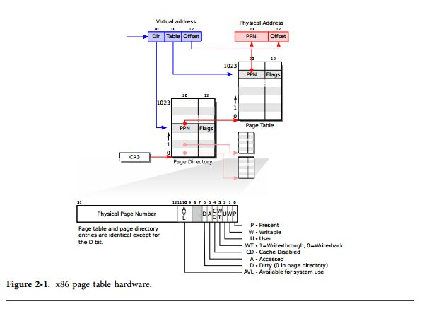
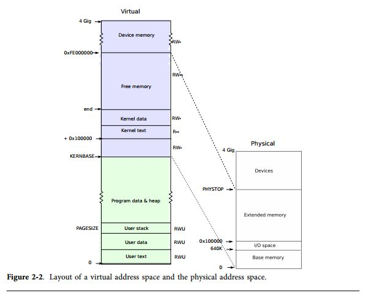
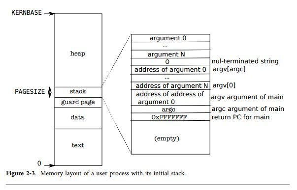

ページテーブル
=========

ページテーブルは、オペレーティングシステムがメモリアドレスの意味を制御するために必要なメカニズムである。ページテーブルにより、xv6は複数のプロセスが複数のアドレス空間を持つことができるようになり、さらにプロセス間でメモリ領域を犯すことを防ぐことができる。ページテーブルにより提供される間接的なレベル付けにより、多くの巧妙な手段を利用することができるようになる。xv6はページテーブルをアドレス空間の分割とメモリの保護に利用する。それ以外にも、いくつかの簡単なページテーブルのトリックが存在する:いくつかのアドレス空間を同一のメモリにマッピングする、同じメモリ領域を1つ以上のアドレス空間にマッピングする(各ユーザページはカーネルの物理的なメモリ領域にマップされる)、ユーザスタックをマッピングされていないページから守る、などのことが可能になる。本章では、x86ハードウェアが提供するページテーブルについて説明し、xv6がそれをどのように利用しているのかについて見る。

# ページングハードウェア
まず、x86命令は(ユーザ命令もカーネル命令も)仮想アドレス空間を操作することを覚えておこう。マシンのRAM、物理メモリは物理アドレスによってインデックが付けられている。x86ページテーブルハードウェアは、仮想アドレスから物理アドレスに向けてマッピングをすることにより、これらの2つのアドレスを結び付けている。
x86ページテーブルは、論理的には2^20(1,048,576)個のページテーブルエントリ(PTE)の配列である。各PTEは20ビットの物理ページ番号(PPN)といくつかのフラグを保持している。ページングハードウェアはこの上位の20ビットを使いPTEを探すためにページテーブルのインデックスに変換する。ページングハードウェアは仮想アドレスから物理アドレスの変換において下位の12ビットは変更しない。これにより、ページテーブルはオペレーティングシステムに対して仮想アドレスから物理アドレスに変換する手段を提供する。このときに、4096(2^12)バイトのアラインされた塊が並ぶことになる。このような塊のことを **ページ** と呼ぶ。

図2-1に示すように、実際の変換には2ステップが必要である。ページテーブルは2レベル木として物理メモリに格納されている。木のルートは4096バイトの **ページディレクトリ** であり、1024個のPTEのような **ページテーブルページ** を提供している。各ページテーブルページは1024個の32ビットPTEである。ページングハードウェアは、仮想アドレスの上位の10ビットを使ってページディレクトリのエントリを選択する。もしページディレクトリのエントリが存在すれば、ページングハードウェアは次の10ビットを使ってページディレクトリページが参照しているページテーブルページからPTEを選択する。もしページディレクトリエントリかPTEが存在していなければ、ページングハードウェアは失敗を宣告する。この2レベルの構造により、ページテーブルはが非常に幅広いアドレス空間からマッピングの存在しない殆どのケースを除外することができるようになる。



各PTEにはフラグビットが格納されており、関連付けられたアドレスが利用できるかどうかを示している。`PTE_P`はPTEが存在しているかを示している:もしこれがセットされてなければ、ページの参照によりエラーが発生する(つまり、許可されていない)。`PTE_W`はどの命令がページへ書き込みを発行して良いかを制御してチェックする。もしこのビットがセットされていないと、その領域はページのデータ読み込みとフェッチのみがサポートされていることを意味する。図2-1はこれらがどのように動作するかを示している。フラグと全ての他のページハードウェアは`mmu.h`(700行目)に記述されている。
ここで、いくつか用語について補足しておく。物理メモリはDRAM上の保存用セルを参照している。物理メモリの1バイトは、物理アドレスと呼ばれるアドレスを持っている。命令は常に仮想アドレスしか利用しない。ページングハードウェアはこれを物理アドレスに変換し、これをDRAMに転送しストレージの読み書きを行う。このディスカッションのレベルでは、仮想メモリアドレスだけで、仮想メモリのようなものは存在しないとする。

# プロセスのアドレス空間
`entry` によって作成されたページテーブルは、カーネルのCコードを実行させるにはまだ十分なマッピングを備えてはいない。しかし、`main`は`kvmalloc`(1857行目)を即座に呼び出して、新しいページテーブルに変更する。何故ならば、カーネルはプロセスのアドレス空間を記述するためのより洗練された計画を持っているからである。
各プロセスは分離されたページテーブルを保持しており、xv6のプロセスが切り替わるとxv6はページテーブルのハードウェアに対してテーブルをスイッチするように指示する。
図2-2に示すように、プロセスのユーザメモリは仮想アドレス0番地から始まり、`KERNBASE`まで広がっている。プロセスは最大で2GBまでのメモリを確保している。`memlayout.h`(200行目)によってxv6のメモリレイアウトのための定数を宣言しており、仮想アドレスから物理アドレスへの変換マクロを定義している。



プロセスがより多くのメモリを必要とすると、xv6はより多くのストレージを確保するためにフリーな物理ページを探し、PTEをそのプロセスのページテーブルに追加し、新しい物理ページを指すようにする。xv6はPTEに対して`PTE_U`,`PTE_W`,`PTE_P`フラグを設定する。殆どのプロセッサはプロセスのユーザアドレス空間全体を利用することは無い; xv6は使用していないPTEに対しては、`PTE_P`をクリアにしておく。異なるプロセスのページテーブルがユーザアドレスを異なる物理メモリのページに変換するため、各プロセスはプライベートなユーザメモリを確保することができる。
xv6はカーネルが全てのプロセスのページテーブルで実行するために必要なマッピングも持っている; これらののマッピングは`KERNBASE`の上位に登場する。このマッピングは、仮想アドレスの`KERNBASE`:`KERNBASE`+`PHYSTOP`を物理アドレスの`0:PHYSTOP`までにマッピングする。このマッピングの理由は、カーネルがカーネル自身の命令とデータを利用できるようにするためである。もう一つの理由はカーネルはしばしば与えられた物理メモリのページに書き込む必要がある。例えば、ページテーブルを作成したときは、予測可能な仮想アドレス上に全ての物理ページが保持されていたほうが便利である。この配置の問題は、xv6が物理メモリを2GB以上作成することができないことである。いくつかのデバイスはメモリマップドI/Oを利用しており、物理アドレスが`0xFE000000`から開始するものがある。従って、xv6のページテーブルは、その領域へのダイレクトマッピングも持っている。xv6は`KERNBASE`よりも上位のPTEに対して`PTE_U`フラグを設定せず、カーネルだけがそれを利用することができるのである。
全てのプロセスが、ユーザメモリとカーネル全体を参照するためのページテーブルを保持することによって、システムコールや割り込みが発生したことによるユーザコードからカーネルコードへの変換が便利になる: このようなスイッチでは、ページテーブルのスイッチが必要無くなる。カーネルの殆どの部分では、自身のページテーブルは不要である;常にいくつかのプロセスのページテーブルを借りている状態である。
まとめると、xv6は各プロセスが自身のメモリしか利用しないことを保証しており、各プロセスのメモリ空間は仮想アドレスの0番地から連続して取られている。xv6は最初にプロセス自身が参照するメモリ領域のみPTEの`PTE_U`ビットを設定するように実装されていぅ。次に、ページテーブルの機能を用いて後続の仮想アドレスを、プロセスに割り当てられた任意の物理ページへと変換する。

#コード例: アドレス空間の作成
`main`から呼ばれた`kvmalloc`(1857行目)は、カーネルを実行するのに必要な`KERNBASE`よりも上位のマッピングを行うためのページテーブルの作成とスイッチを行う。殆どの処理は`setup-kvm`で実行される(1837行目)。最初にページディレクトリを格納するためのメモリを割り当てる。次に`mappages`を呼び出し、`kmap`(1828行目)配列に記述されているカーネルに必要なアドレス変換処理を設定する。変換する領域は`PHYSTOP`までの領域で、カーネルの命令列とデータが含まれている領域と、実際にはI/Oデバイスが割り当てられている領域である。`setup-kvm`はユーザメモリ向けのマッピングは一切設定しない; この設定は後で行われる。

`mappages`(1779行目)は仮想アドレスの領域を該当する物理アドレスの領域へのマッピングをページテーブルに設定する。この領域の各仮想アドレスは、ページのインターバルによって別々に設定される。マッピングされた仮想アドレスのために、`mappages`は`walkpgdir`を呼び出して、そのアドレスのためのPTEのアドレスを探索する。次にPTEを初期化して関係のあるページテーブルの番号を設定し、所望のパーミッション(

`PTE_W`や`PTE_U`など)を設定し、`PTE_P`を設定することでPTEが有効化する(1791行目)。

`walkpgdir`(1754行目)は、x86のページングハードウェアの動作を模倣しており、仮想アドレス変換のためにPTEを探索する(図2-1を参照のこと)。`walkpgdir`はページディレクトリのエントリを探索するために仮想アドレスの上位10ビットを利用する(1759行目)。もしページディレクトリのエントリが存在しなければ、必要なページテーブルは割り当てられていないということになる; もし`alloc`の引数が設定されていれば、`walkpgdir`はメモリの割り当てを行い、その物理アドレスをページディレクトリに格納する。最後に、仮想アドレスの次の10ビットを利用してページテーブルページ内のPTEのアドレスを探索する(1772行目)。

# 物理メモリの割り当て
カーネルは実行時のページテーブルやプロセスのユーザメモリ、カーネルスタック、パイプバッファのために、解放されている領域の中から物理メモリを割り当てる必要がある。
xv6はランタイムでの割り当てを実現するために、カーネルの最後の領域から`PHYSTOP`までの物理メモリの領域を。その際に4096バイトのページの割り当てや解放を実行する。解放されているページ自身をリンクリストに繋いで記録しておく; ページを解放すると、このリストに解放されたページが挿入される。
ここで、ブートストラップの問題が発生する:全ての物理メモリはフリーリストを初期化するために順番にマッピングされなければならないが、このようなマッピングが発生するページテーブルには、ページテーブルページの割り当ても必要となる。xv6はこの問題を、xv6が立ち上がっているときには異なるページアロケータを使用することで解決している。このページアロケータは、カーネルのデータセグメントの直後からメモリを割り当てる。このアロケータはメモリの解放はサポートしておらず、`entrypgdir`中の4MBまでのマッピングに制限されている。しかし最初のカーネルのページテーブルを割り当てるのには、これで十分である。

# コード例: 物理メモリアロケータ
アロケータのデータ構造は、割り当てのための利用可能な物理メモリページの **フリーリスト** である。各フリーページリストの要素は`struct run`である(3014行目)。このデータ構造を保持するためのメモリはどのようにしてアロケータは取得するのだろうか？アロケータは各フリーページの`run`構造体をフリーページのそものに格納している。従って、それ以外に格納場所を確保する必要は無い。フリーリストはスピンロックにより保護されている。リストとロックは構造体によってラップされており、この構造体のフィールドをロックで守っているのだということを明確にしている。今のところは、**acquire** と **release** の呼び出しについては無視し、ロックについては無視することにする; 第4章で、ロックの詳細について見ていくことにする。

`main`関数が`kinit1`と`kinit2`を呼び出し、アロケータを初期化する。2回に分けて呼び出すのは、`main`の多くが4Mバイトを越えるロックやメモリを扱うことができないからである。`kinit1`は最初の4Mバイトにロックをしないメモリ割り当てを行い、`kinit2`はロックの有効化と他に割り当て可能なメモリを割り当てる。`main`の目的は、物理メモリがどれだけ利用可能かを計ることだが、x86でこれを実現するのは難しい。その代わらに、マシンは240Mバイト(`PHYSTOP`)の物理メモリを持っていると仮定し、フリーメモリのプールを初期化する。`kinit1`と`kinit2`は``freerange``を呼び出し、ページ毎に`kfree`を呼び出すことでフリーリストにメモリを追加していく。PTEは4096バイトの境界にアラインされた物理アドレス(つまり、4096の倍数)しか参照することができないので、`freerange`は`PGROUNDUP`を用いてフリーページが物理アドレスにアラインされていることを保証する。このアロケータはメモリが全く存在しないところからスタートする; ページが`kfree`をコールし管理できるようにするのである。

アロケータは、高位置のメモリにマップされている仮想アドレスを用いて物理ページを参照するのであり、物理アドレスそのものを使って参照している訳ではない。
これが、`kinit`が`p2v(PHYSTOP)`を使って`PHYSTOP`(物理アドレス)を仮想アドレスに変換している理由である。アロケータは、アドレスの計算をしやすいように時々アドレスを整数として取り扱う(例えば、`kinit`内の全てのページを参照する場合など)、またはメモリの内容を読み書きするためにアドレスをポインタとして取り扱う(例えば、各ページに格納されている`run`構造体の操作など); このアドレスの2つの方法による使い分けが、アロケータのコードが完全なCの型変換となっている理由である。もう一つの理由がは、メモリの割り当てと解放は本質的にメモリのタイプの変更と同一だからである。

関数`kfree`(3065行目)は、まずメモリ中の全バイトを値を1に設定するところから始まる。これにより、解放したはずの領域を読み込もうとしたコードは(これは「危険な参照」である)、所望の内容の代わりにゴミが読み込まれることとなる; このようなコードは、本来はなるべく早くブレークされるべきである。次に、`kfree`は`v`を`struct run`へのポインタへキャストし、`r->next`へ前のフリーリストの先頭を設定し、`freelist`そのものを`r`と設定する。`kalloc`はフリーリストの最初の要素を取り出し、フリーリストから除去する。

# アドレス空間のユーザメモリ部分
図2-3はxv6で実行されるプロセスのユーザメモリ領域のレイアウトを示している。ヒープ領域はスタックの上側に存在し、ヒープが拡張できるようになっている(これは`sbrk`によって実行される)。スタックは単一のページに収められ、初期化時の内容は`exec`によって作成される。コマンドラインの引数として格納される文字列は、同様にスタックの上位にポインタの配列として格納されている。これでやっと`main`関数を、関数呼び出し`main(argc,argv)`のように呼び出すための準備が整う。スタックがスタックページから飛び出していくことを防ぐために、ガードページが、スタックの下側に配置されている。
ガードページはマップされておらず、従ってスタックがスタックページを越えてしまった場合にアドレスを変換できないことによるページエラーが発生するようになっている。



# コード例: `exec`
`exec`システムコールはアドレス空間のユーザメモリ部分を作成する。`exec`は、ファイルシステムに格納されているファイルでアドレス空間の一部を初期化する。`exec`(6310行目)は、まずは名前で指定されたバイナリのパスを`namei`(6321行目)を用いて開く。
`namei`についいては第6章で説明する。次に、ELFヘッダを読み込む。ELFバイナリは、ELFヘッダ、`struct elfhdr`(0955行目)から始まり、プログラムセクションヘッダ`struct proghdr`(0974行目)が続いている。各`proghdr`は、メモリにロードされなければならないアプリケーションのセクションを記述している; xv6プログラムは1つのセクションヘッダしか保持していないが、他のシステムでは命令とデータなど、複数のセクションを保持している。

まず最初に、ファイルがELFバイナリを持っているかどうかを簡単にチェックする。ELFバイナリは4バイトの「マジックナンバ」0x7F,'E','L','F'、もしくは`ELF_MAGIC`(0952行目)から始まる。ELFヘッダが正しいマジックナンバであれば、`exec`はこのバイナリは正しく構成されていると仮定する。

`exec`は`setupkvm`(6334行目)を用いてユーザマッピングがされていない新しいページを確保し、`allocuvm`(6346行目)を用いて各ELFのセグメント向けにメモリを確保し、`loaduvm`(6348行目)を用いて各セグメントをメモリにロードする。
`allocuvm`は要求された仮想アドレスが`KERNBASE`よりも小さいことをチェックする。
`loaduvm`(1918行目)は`walkpgdir`を用いて割り当てられたメモリの物理アドレスを探し、ELFセグメントの各ページに対して書き込みを行う。そして、`readi`によってファイルから読み込みを行う。

`exec`によって作成される最初のプログラムである`/init`のためのプログラムのセクションヘッダは、以下のようになっている:

```
# objdump -p _init

_init: file format elf32-i386

Program Header:
    LOAD off 0x00000054 vaddr 0x00000000 paddr 0x00000000 align 2**2
         filesz 0x000008c0 memsz 0x000008cc flags rwx
```
プログラムのセクションヘッダの`filesz`はおそらく`memsz`よりも小さいため、そのギャップ、ファイルを読み込むのではなく、ゼロを埋め込むことにより埋められる(Cのグローバル変数のため)。
`/init`では、`filesz`は2240バイトであり`memsz`は2252バイトである。従って、`allocuvm`は2252バイトを保持するための十分な物理メモリを確保するが、実際には`/init`は2240バイトしか利用しない。

次に、`exec`はユーザスタックの割り当てと初期化を行う。`exec`は1ページ分しかスタックの割り当てを行わない。`exec`は一度スタックのトップに引数の文字列をコピーし、`ustack`にそのポインタの位置を記録する。`main`により渡される`argv`リストの最後には、nullポインタが配置される。`ustack`の最初の3つのエントリは、偽のPC戻り値、`argc`, `argv`である。

`exec`はスタックページの下にアクセス不可能なページを配置する。これにより、プログラムはスタックをより多く利用しようとすると、異常終了するようになっている。アクセス不可能なページは`exec`の引数が非常に大きなときにも利用される; このような状況では、`copyout`関数により`exec`が引数をスタックにコピーするときに、コピー先のページがアクセス不可能であり、-1が返される。

新しいメモリイメージの準備の最中に、もし`exec`が不正なプログラムセグメントのようなエラーを発見した場合は`bad`ラベルに飛び、新しいイメージを廃棄して-1を返す。`exec`はシステムコールが成功することを保証するために、古いイメージが解放されるまで待たなければならない: もし古いイメージが破棄されたら、システムコールは-1を返すことができなくなってしまう。`exec`でエラーが発生する唯一のケースはイメージの生成の途中に発生する。一度イメージが完成すると、`exec`は新しいイメージをインストールすることができ(6394行目)、古いイメージは解放される(6395行目)。最後に、`exec`は0を返す。

# 現実の世界

殆どのオペレーティングシステムと同様に、xv6はメモリの保護とマッピングのためにページングハードウェアを利用する。殆どのオペレーティングシステムはxv6よりも洗練された方法でページングを管理している; 例えば、xv6はディスクからのデマンドページングや、コピーオンライトfork、共有メモリ、遅延割り当てページ、スタックの自動拡張などの処理が実装されていない。x86はセグメンテーションによるアドレス変換もサポートしている(付録Bを参照のこと)が、xv6はセグメントはCPU毎に利用され、固定アドレスだが異なるCPUから異なる値が読み込まれる、`proc`のような変数にのみ利用している(`seginit`を参照のこと)。
セグメントを利用せずにCPU毎(もしくはスレッド毎)のストレージ管理を実装するためには、CPU毎のデータ領域を所望のレジスタに保持することが必要になるが、x86は汎用レジスタの数が少ないため、必要な労力に対してセグメンテーションを利用する価値が無い。

メモリをより多く積んだマシンでは、4Mバイトのページを扱えるx86の"Super Pages"機構を利用したほうが良い。物理メモリが小さいときは、ディスクへのページアウトなどの割り当てを細粒度に実施できる小さなページを利用した方が良い。例えば、プログラムが8kバイトのメモリしか利用しないのに、4Mバイトのページを割り当てるのは無駄である。大きなページを利用することによって、より多くのRAMを利用することができ、またページテーブルの処理のオーバヘッドを削減することができる。xv6はSuper Pagesを1箇所でのみ: 初期ページテーブルでのみ利用している(1311行目)。配列の初期化処理では、1024個のPDEのうち2つを設定しており、インデックスが0と512(`KERNBASE>>PDXSHIFT`)に相当する場所を設定している。それ以外の場所はゼロに設定している。xv6はこれらの2つのPDEをPTE_PSと設定することにより、これらがSuperPagesであることを設定している。カーネルはさらに、`CR_PSE`ビット(ページサイズ拡張)を`%cr4`に設定することでハードウェアに対してSuperPagesを利用できることを通知している。

xv6は240MBのRAMの構成を仮定していたが、実際のRAMの構成を決定しなければならない。x86では、少なくとも3つのアルゴリズムが必要である: 1つめは、指定した物理アドレス空間がメモリのように動作する領域であり、値が正しくその領域に保存することができることである; 2つめは、PCが保持している16ビットの不揮発性のRAMの場所以外から、数キロバイトの対を読むことができることである; 
3番目はマルチプロセッサのテーブルの一部として、メモリレイアウトを確認するためにBIOSメモリを参照できることである。メモリレイアウトテーブルを読み込むことは、複雑な処理を必要とする。

メモリ割り当ては昔からホットな話題であり、問題となるのは、有限のメモリをどのように効率的に利用するか、という問題と、どのように将来の要求に答えるようにレイアウトを準備するか、ということである; Knuhの論文を参照されたい。今日では、空間効率性よりも速度を重視する傾向がある。加えて、より洗練されたカーネルは4096バイトのブロックよりも、より多くの異なるサイズの小さなブロックを割り当てている; 実際のカーネルをアロケータはこのような小さな割り当てを、大きな割り当てと同様に取り扱う必要がある。

# 演習問題

1. 実際のオペレーティングシステムがどの程度のメモリサイズを扱うことができるか調査しなさい。
2. xv6がスーパページを利用しなければ、`entrypgdir`はどのように宣言するのが正しいか？
3. xv6を変更して、メモリの使用量を削減するために、カーネルとプロセスでページを共有するように変更しなさい。
4. `exec`のUnixの実装では、伝統的にシェルスクリプトのための特別な処理が追加されている。もしファイルを実行する前に、テキストに#!が含まれていれば、そのファイルを解釈実行するためのプログラムが記述されているものとしている。
  例えば、`exec`が`myprog arg1`を実行するように要求され、`myprog`の先頭に`#!/interp`と記述されていれば、`exec`は`/interp`を `/interp myprog arg1`の形式で実行する。xv6で、このような実行をサポートするように変更しなさい。

