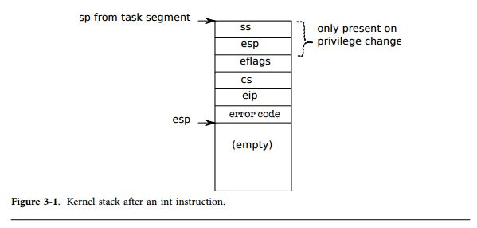
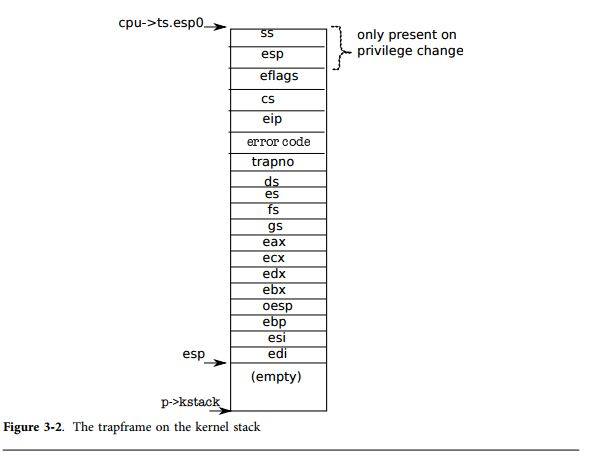

第3章 トラップ、割り込み、ドライバ
==================================

プロセスを実行している際、CPUは通常の処理ループを実行している; 命令を読み込み、プログラムカウンタを進め、命令を実行し続けている。しかし、ユーザプログラムからのカーネルへの遷移の制御要求イベントが発生することがある。このイベントには、注目をしてもらうためのデバイスからのシグナル要求や、ユーザプログラムの異常(例えば、PTEの存在しない仮想アドレスの参照)、ユーザプログラムのシステムコールによるカーネルへのサービスの要求などが含まれる。これらのイベントをうまく取り扱うためには、以下の3つの困難を解消する必要がある: 1) カーネルはプロセッサをユーザモードからカーネルモードに遷移させる(そして最終的には戻ってくる); 2) カーネルとデバイスは、デバイスが並列動作を制御する; 3) カーネルはデバイスのインタフェースを理解しなければならない。上記の3つの問題をうまく取り扱うために、ハードウェアの深い理解と慎重なプログラミングをすることで、結果的に不透明なカーネルコードになってしまう可能性もある。本章では、xv6が、これらの問題をどのようにして取り組んでいるのかについて説明する。

# システムコール、例外、割り込み

前章の最後に見たように、ユーザプログラムはシステムコールによってオペレーティングシステムにサービスを要求する。**例外**という用語は、プログラムの異常な動作により発生する割り込みのことを指す。プログラムの異常な動作の例として、ゼロによる除算、PTEに存在しないアドレスへのメモリアクセスなどがある。**割り込み**という用語は、ハードウェアデバイスにより発生するシグナルのことを指し、オペレーティングシステムは何か処理をしなければならない。例えば、クロックチップは割り込みを100ミリ秒に1回発生させることで、カーネルが時分割共有を実現できるようになっている。もう一つの例として、ディスクが読み込み動作を行うと、割り込みを発生させることでオペレーティングシステムに対して、読み込んだブロックを取り込む準備ができたことを通知する。

全ての割り込みを処理するのは、プロセスではなくカーネルである。それは、殆どのケースにおいて、カーネルのみ必要な権限と状態を持っているからである。例えば、クロックの割り込みに反応してプロセスを切り替える時分割を実現するとき、自分で能動的に立ち上がることの出来ないプロセスをプロセッサにロードするためには、カーネルを起動しなければならない。

オペレーティングシステムは発生する準備を整えておく必要があるケースとして、以下の3つが挙げられる。まず、システムは次回の回復に備えてプロセッサのレジスタを退避しておかなけばならない。システムはカーネル上で実行の準備をしなければならない。システムはカーネルが実行を開始するための場所を選択しなければならない。カーネルはイベントについての情報(例えば、システムコールの引数など)を入手できなければならない。これらは全て、セキュアな状態で実行される; システムはユーザプロセスとカーネルの独立性を維持していなければならない。

これらの目標を達成するためには、オペレーティングシステムがハードウェアがどのようにしてシステムコール、例外、割り込みを処理するのかについて理解していなければならない。殆どのプロセッサはこれらの3つのイベントは単一のハードウェア機構によって処理される。例えば、x86では、プログラムは`int`命令を実行して割り込みを発生させ、システムコールを起動し、同様に、例外も割り込みを発生させる。従って、もしオペレーティングシステムが割り込みを処理することができるのであれば、オペレーティングシステムはシステムコールや例外も処理することができる。

基本的な考え方は以下の通りである。割り込みによって通常の処理ループが停止し、**割り込みハンドラ**と呼ばれる新しいプログラムのシーケンスが実行される。割り込みハンドラを実行する前にプロセッサは自身のレジスタを退避し、割り込み処理から復帰するときにそのレジスタ値を書き戻せるようにする。割り込みハンドラへ遷移すること、割り込みハンドラから戻ってくることは、プロセッサがユーザモードとカーネルモードを行き来することを意味する。

用語について: x86の公式な用語は割り込み(interrupt)であるが、xv6は**トラップ**とも呼ぶ。これはPDP11/40で使われていた言葉であり、伝統的なUnixの用語であるためである。本章ではトラップと割り込みは同じ意味で使用しているが、トラップは現在プロセッサ上で動作しているプロセスによって発生させられるものであり(例えば、プロセスがシステムコールを発生させ、結果としてトラップを発生させる)、割り込みは現在実行されているプロセスとは関係無く、デバイスによって発生させられるものである。例えば、ディスクはあるプロセスによって要求されたブロックの読み込みを完了すると、割り込みを発生させる。割り込みの特徴(つまり、割り込みは他の動作と並列に発生する)により、割り込みはトラップよりもより難しいものとなる。同一のハードウェア機構を使用してユーザモードとカーネルモードをセキュアにセキュアに遷移する方法については、次節で議論する。

# x86の保護

x86は4つの保護レベルを持っている。0が最も保護レベルが強く、3が最も保護レベルが弱い。実際には、殆どのオペレーティングシステムは、0か3の2つの保護レベルしか使用しない。0がカーネルモード、3がユーザモードに相当する。x86において、実行している命令の現在の保護レベルは`%cs`レジスタのCPLフィールドに保存されている。x86では、割り込みハンドラは割り込みディスクリプタテーブル(IDT)によって定義されている。IDTは256エントリであり、該当する割り込みを処理する際に`%c`と`%eip`が利用される。

x86のシステムコールを生成するために、プログラムは`int n`命令を実行する。nはIDTのインデックスである。`int`命令は次の処理を行う:

* IDTからn番目のディスクリプタをフェッチする。nは`int`命令のオペランドである。
* `%cs`のCPLフィールドをチェックし、ディスクリプタの保護レベルであるDPL以下であることを確認する。
* ターゲットセグメントセレクタがPL<CPLであった場合にのみ、CPUの内部レジスタである`%esp`と`%ss`を保存する。
* `%ss`と`%esp`をタスクセグメントディスクリプタからロードする。
* `%ss`をプッシュする。
* `%esp`をプッシュする
* `%eflags`をプッシュする
* `%cs`をプッシュする
* `%eip`をプッシュする
* `%eflags`のいくつかのフィールドをクリアする
* `%cs`と`%eip`にディスクリプタの値をセットする

`int`命令は複雑な命令であり、これら全ての動作が必要かどうか疑問に思うもしれない。CPL<=DPLであることのチェックにより、カーネルがシステムの他の権限レベルについて禁止している。例えば、ユーザプログラムが`int`命令の実行に成功すると、DPLは3になっている。もしユーザプログラムが適切な権限を持っていない`int`命令を実行した場合、一般的な保護の失敗を意味する`int` 13が返される。他の例として、ユーザが適切なスタックを準備することができず、`int`命令が値を保存するためのユーザスタックを準備することができない場合には、xxx。

図3-1は`int`命令が完了した時のスタックの状態を示している。この状態では、権限レベルの変更も完了している(ディスクリプタの権限レベルはCPLよりも小さい)。もし`int`命令が権限レベルの変更を要求しなかった場合、x86は`%ss`と`%esp`を保存しない。どちらのケースでも、`int`命令を実行した後は、`%eip`はディスクリプタテーブルによって指定されたアドレスを指しており、命令のアドレスは`int n`によって指定されるハンドラの最初の命令を指している。これらのハンドラを実装するのがオペレーティングシステムの役割であり、以降ではxv6がどのように実行しているのかについて見る。

オペレーティングシステムは`iret`命令を利用して`int`命令から戻ってくることができる。
`iret`命令は`int`命令によってスタックに保存されていたデータを回復し、`%eip`に保存されていたアドレスから実行を再開する。

# 最初のシステムコール
第1章では、`initcode.S`がシステムコールを呼ぶところまでを見た。そのコードをもう一度見てみよう(8213行目)。`exec`を呼び出すのに必要な引数がプロセスのスタックにプッシュされ、システムコールの番号が`%eax`にセットされる。システムコールの番号は`syscalls`配列のエントリ番号に一致し、`syscalls`エントリには関数ポインタが格納されている。`int`命令がユーザモードからカーネルモードに切り替わり、適切なカーネル関数(例えば、`sys_exec`など)を実行するために`sys_exec`の引数を適切に探索することができるようにしなければならない。次節から、xv6がどのようにしてこれらのシステムコールを呼び出しているのか、そして同様のコードをどのようにして割り込みと例外処理で再利用しているのかについて見ていく。

# コード例: アセンブリ言語で記述されたトラップハンドラ

xv6は`int`命令が実行されプロセッサがトラップを発生した場合にそのトラップを正しく処理できるようにx86のハードウェアを準備しておく必要がある。x86は256種類の異なる割り込みを処理することができる。割り込み0から31はソフトウェアによる例外であり、ゼロ除算や、不正メモリアクセスなどが定義されている。
xv6は32から63までの領域にハードウェア割り込みを割り当てており、64をシステムコールの割り込みに割り当てている。

`tvinit`(3317行目)は、`main`から呼び出され、テーブル`idt`の256エントリの準備を行う。割り込みの種類が`i`である場合、`vectors[i]`に格納されたアドレスのコードによって割り込みが処理される。各エントリポイントは異なっているが、それはx86がトラップ番号を割り込みハンドラに通知しないためである。256種類の異なるハンドラを呼び出すことが、256種類のケースを識別する唯一の手段である。

`tvinit`はユーザシステムコールトラップである`T_SYSCALL`を特別なトラップとして扱う; この型のトラップであることを識別するために、2番目の引数として1を渡すというように規定している。トラップゲートは`FL`フラグをクリアせず、システムコールハンドラ中で他の割り込みが発生することを許可する。

カーネルはシステムコールゲートの優先度を`DPL_USER`に設定し、ユーザプログラムが明示的な`int`命令によりトラップを発生させるようになっている。xv6はプロセスが`int`命令による割り込み(例えば、デバイス割り込み)を発生させることを許さない; もしそれらが割り込みを発生させようとした場合、一般保護例外が発生し、ベクトル13に飛ぶ。

ユーザモードからカーネルモードに権限が切り替わった場合、カーネルはユーザプロセスのスタックを利用すべきではない。ユーザプロセスは悪意のあるものである可能性があり、`%esp`にプロセスの利用していないユーザメモリの一部を設定される可能性がある。xv6は、x86のハードウェアをプログラムしてタスクセグメントディスクリプタを設定し、ハードウェアがスタックセグメントセレクタをロードし、新しい値を`%esp`に設定する際に、スタックをスイッチする。関数`switchuvm`(1873行目)はユーザプロセス中に存在するカーネルスタックのトップアドレスをタスクセグメントディスクリプタに設定する。

トラップが発生すると、プロセッサのハードウェアは以下のように動作する。もしプロセッサがユーザモード中で実行していると、`%esp`と`%ss`をタスクセグメントディスクリプタからロードし、古い`%ss`と`%esp`を新しいスタック上にプッシュする。もしプロセッサがカーネルモードで実行されていたら、上記の動作は発生しない。
次に、プロセッサは`%eflags`,`%cs`,`%eip`レジスタをプッシュする。いくつかのトラップのために、プロセッサはエラー情報もプッシュする。プロセッサは`%eip`と`%cs`を、関連するIDTエントリからロードする。

xv6はPerlスクリプト(3200行目)を用いて、IDTのエントリが指すべきエントリポイントを生成する。各エントリは、プロセッサがエントリを挿入しなかった場合、エントリ自身がエラーコードをプッシュし、`alltraps`関数にジャンプする。

`alltraps`(3254行目)は続けてプロセッサのレジスタを保存する; `%ds`, `%es`, `%fs`, `%gs`および汎用レジスタをプッシュする(3255-3260行目)。この努力により、カーネルスタックには、今や`struct trapframe`(0602行目)が入った形になっており、トラップ発生時のプロセッサのレジスタ値が挿入されている(図3-2を参照)。プロセッサは`%ss`, `%eps`, `%eflags`, `%cs`, `%eip`をプッシュする。プロセッサもしくはトラップベクタがエラー番号をプッシュし、`alltrap`は残りをプッシュする。`trapframe`はプロセッサのレジスタをユーザモードに戻すための全ての情報が挿入されており、カーネルが現在のプロセスに戻ってきたときにユーザモードに正しく戻れるようにしている。これにより、プロセッサはトラップが始まっても、正確に実行し続けることができるのである。第2章で紹介したように、`userinit`は手動でトラップフレームを作成している(図1-4)。

最初のシステムコールの場合には、保存された`%eip`は`int`命令が実行された直後のアドレスを指している。`%cs`はユーザコードのセグメントセレクタである。`%eflags`はint命令を実行した際の`eflags`レジスタの値である。汎用レジスタを保存するルーチンの中で、`alltraps`はシステムコール番号を保持している`%eax`も保存を行い、システムコールの番号を後で検査できるようになっている。

現在、ユーザモード中のプロセッサのレジスタは保存され、`alltraps`はプロセッサがカーネルのCコードを実行する準備を整えた。プロセッサはハンドラに入る前に`%cs`にセレクタを設定し、`%ss`を設定する； `alltraps`は`%ds`と`%es`を設定する(3263-3265行目)。さらに`%fs`と`%gs`を設定し、CPU毎のデータセセグントの`SEG_KCPU`を指すようにする(3266-3268行目)。

セグメントが正しく設定されると、`alltraps`はCのトップハンドラである`trap`を呼び出すことができるようになる。これは、今現在構築されたトラップフレームを指している`%esp`をプッシュし、`trap`命令の引数となるようにスタックの上に載せる(3272行目)。その後、`alltrap`を呼び出す(3271行目)。`trap`から帰ってくると、`alltrap`はスタック上の引数をポップし、スタックポインタを加算する(3273行目)。そしてラベル`trapret`から始まるコードを実行し始める。このコードを、最初のユーザプロセスが、ユーザ空間を終了するために実行するところを見た。同様のシーケンスが発生する: トラップフレームを取り出し、ユーザモードレジスタに挿入し、`iret`によりユーザ空間に戻ってくる。

ユーザモード中に発生したトラップについて議論してきたが、trapはカーネルが実行している最中にも発生し得る。ハードウェアがスタックをスイッチしない場合は、スタックポインタを保存し、スタックセグメントを保存する; そうでない場合には、同様のステップを実行し、ユーザモードからトラップを処理し、xv6と同様のトラップ処理コードを実行する。`iret`が最後にカーネルモードの%csを回復し、プロセッサはカーネルモードで動作し続ける。

# コード例: Cのトラップハンドラ
前節では、各ハンドラがトラップフレームを設定し、Cの関数である`trap`を呼び出した。
`trap`(3351行目)はハードウェアトラップ番号`tf->trappno`を読み込み、このトラップが何故発生したか、そして何をすべきかを決定する。トラップが`T_SYSCALL`であった場合、`trap`はシステムコールハンドラである`syscall`を呼び出す。これらについては、第5章で、`proc->killed`を調査するときに再び見る。

システムコールをチェックした後は、トラップはハードウェア割り込みをチェックする(これについては以降で議論する)。予想し得るハードウェアデバイスに加えて、トラップは予想外のハードウェアの割り込みによって、異常な割り込みが発生してしまうことがある。

トラップがシステムコールではなく、ハードウェアデバイスにより注意を払うべきものでもなかった場合、`trap`はこのトラップはトラップが実行される前にコードによって発生した異常な動作であるとみなす(例えば、ゼロ除算など)。もしこのようなトラップがユーザプロセスによって発生した場合、xv6は詳細をプリントし、`cp->killed`を設定しユーザプロセスをクリーンアップする。クリーンアップの動作については、第5章で詳細をチェックする。

もしカーネルが実行中であった場合には、これはカーネルのバグである; `trap`はこの異常動作について詳細をプリントし、`panic`を呼び出す。

# コード例: システムコール
システムコール向けには、trapはsyscall(3625行目)を呼びだす。
syscallは%eaxに含まれているシステムコールの番号をトラップフレームからロードし、システムコールのテーブルを指すようにする。
最初のシステムコールでは、%eaxはSYS_exec(3457行目)が入っており、syscallはSYS_execのシステムコールテーブルのエントリを読み出し、sys_execを実行する。

syscallはシステムコール関数の戻り値を%eaxに保存する。
trapがユーザ空間に戻ってきたときに、この戻り値はcp->tfからマシンのレジスタに戻される。
従って、execが戻ってくると、システムコールのハンドラの値が返されることになる。
システムコールは、伝統的に、エラーが発生すると負の値を返すようにしており、正の値だと成功を示す。
もしシステムコールの番号が不正であれば、syscallはエラーを表示し、-1を返す。
移行の章では、いくつかのシステムコールの実装について中身をチェックしていく。
本章では、システムコールのメカニズムについてを取り扱うことにする。
ここでは、もうひとつシステムコールの呼び方について説明しておく: システムコールの引数の設定である。
ヘルパー関数のargint, argptr, argstrはn番目のシステムコールを、それぞれ整数、ポインタ、文字列として探索する。
argintはn番目の引数の位置を特定するために、ユーザ空間の%espレジスタを利用する: l%espはシステムコールスタブの戻りアドレスを指している。
引数はその上に配置されており、%esp+4である。
従って、n番目の引数は%esp+4+4*nの場所に存在する。

argintはfetchintを呼び出し、ユーザメモリからそのアドレス中のデータを読み出し、\*ipに書き込む。
fetchintはユーザとカーネルが同一のページテーブルを共有するために、アドレスを単純にポインタにキャストするが、カーネルはユーザによって示されたそのポインタがユーザのアドレス空間に含まれているかどうかをチェックしなければならない。
カーネルはページテーブルのハードウェアを設定し、プロセスがローカルのプライベートメモリの外にアクセスできないように設定する: もしユーザプログラムがp->szのアドレス以上の場所を参照しようとすると、プロセッサはセグメンテーションフォルトを発生させ、これまでに見てきたように、プロセスを殺す処理に入る。
これまでで、カーネルはユーザが渡してきた任意のアドレスの値を取得することができるようになるため、カーネルは実行時にそのアドレスがp->szよりも低い場所であることをチェックしなければならない。

argptrはargintと同様の目的で利用される: argptrはn番目のシステムコールの引数を解釈する。
argptrはargintを呼び出し、まずは引数を整数として読み出す。引数が整数であるかをチェックし、フェッチした整数がユーザポインタであるかどうかをチェックし、確かにアドレス空間のユーザ領域に存在することをチェックする。
この2つのチェックはargptrを呼び出している最中に実行されることに注意する。
まず、ユーザスタックポインタが引数をフェッチしている最中にチェックされる。
次に、その引数自身がユーザ空間へのポインタであった場合についてチェックされる。

argstrはシステムコールの引数トリオの中の最後である。
argstrはn番目の引数をポインタとして受け取る。
このかんすう はポインタがNULLで終わる文字列であることを保証し、完全な文字列がアドレス空間のユーザ領域の中に存在していることをチェックする。

システムコールの実装(例えば、sysproc.cやsysfile.c)は典型的なラッパである: これらの関数は引数をargint, argptr, argstrを用いてチェックし、実際のシステムコールの実装を呼び出す。
第2章では、sys_execは引数を入手するために実際にこれらの関数を利用している。

# コード例: 割り込み

マザーボード上のデバイスは割り込みを発生させることができ、xv6はそれらの割り込みを処理するためにハードウェアを設定しなければあらない。
デバイスサポートの存在しないxv6は使い物にならない; ユーザはキーボドをタイプすうことができず、ファイルシステムはディスクにデータを保存することもできない。
幸運なことに、簡単なデバイスの割り込み処理を追加し、サポートすることはそれほど複雑なことは必要ない。
これから見ていくように、割り込みはシステムコールや例外と同様のコードを利用して実現できる。

割り込みはシステムコールと似ているが、デバイスが任意のタイミングで発生させてくるところが異なる。
マザーボード上にハードウェアが存在し、それらのデバイスは必要なときにCPUにシグナルを通知してくる(例えば、ユーザがキーボードの文字をタイプした、など)。
私達は、デバイスの割り込み発生プログラムを記述しなければならず、CPUはその割り込みを受け取らなければならない。

タイマーデバイスとタイマー割り込みについて考えよう。
タイマーのハードウェアが1秒間あたりに100回の割り込みを通知するとすると、カーネはこれらの時間の通知を記録し、これに従ってカーネルは複数のプロセスの時分割を実現できるようになる。
1秒あたりに100回程度であれば、適切な応答性能で、プロセッサがハードウェアの割り込みにより圧迫されることは無い。

x86プロセッサ自身のように、PCのマザーボードは進化し、割り込みを受け渡す方法も進化している。
初期のボードはシンプルなプログラマブル割り込みコントローラ(PICと呼ばれる)を利用しており、そのコードはpicirq.cで見ることができる。

PCボード上でマルチプロセッサが実現できるようになると、それに応じて新しい割り込み処理のための方法が必要になり、各CPUは割り込みを送信するための割り込みコントローラが必要になった。
そして、それらの割り込み信号をプロセッサ間でルーティングする方法も必要になった。
この方法は、2つの部分から構成される: I/Oシステムの部分(IO APIC, ioapic.c)と、各プロセッサに付属している部分(ローカルAPIC,lapic.c)である。
xv6はマルチプロセッサボード向けに設計されており、各プロセッサは割り込みを受け取るためのプログラムを記述しておかなければならない。

また、単一のプロセッサ上でも正しく動作するように、xv6はプログラマブル割り込みコントローラ(PIC)をプログラムする(7432行目)。
各PICは最大で8個の割り込み(例えば、デバイスなど)を処理することができ,それらの信号をプロセッサの割り込み通知ピンに対して時分割で通知する。
8個以上のデバイスを利用するために、PICはカスケード接続することができ、典型的にボードには少なくとも2つのPICが搭載されている。
inbとoutb命令を利用することにより、xv6はIRQ0からIRQ7を発生させるためにマスタを、IRQ8からIRQ16を処理するためのスレーブをプログラムする。
最初に、xv6はPICを全ての割り込みをマスクするようにプログラムする。
timer.cはタイマー1を設定し、PIC上でタイマ割り込みを有効化する(8074行目)。
本書の説明では、PICのプログラミングにおける詳細は省略している。
PICについての詳細(およびIOAPICとLAPICの詳細)は本書では重要ではないが、興味のある読者は各デバイスのマニュアルを読むと良い。
マニュアルについては、ソースファイルに参照先を記載している。

マルチプロセッサでは、xv6は各プロセッサにおいてIOAPICとLAPICをプログラムしなければならない。
IO APICはテーブルを保持しており、プロセッサはina,outa命令を用いる代わりにメモリマップドI/Oを通じてテーブルのエントリにプログラムをすることができる。
初期化では、xv6は割り込み0がIRQ0などマップされるようにプログラムしていくが、これらの全てを無効化しておく。
特定のデバイスが特定の割り込みを有効化し、どのプロセッサの割り込みをルーティングするべきかについて通知する。
例えば、xv6はキーボードの割り込みをプロセッサ0に通知する(8016行目)。
以降で見るように、xv6はディスクの割り込みをシステム上のプロセッサの最大番号のものに通知する。

タイマーチップはLAPICの内部に存在し、各プロセッサはタイマー割り込みをそれぞれ独立に受け取ることができる。
xv6はlapicinit(7151行目)でそれらを設定する。
キーとなるプログラムはタイマーをプログラムする部分である(7164行目)。
このコードにより、LAPICは定期的に、IRQ0である割り込みIRQ_TIMERを発生させる。
7193行目で、CPUのLAPIC上で割り込みを有効化し、この割り込みがローカルのプロセッサに通知されるようになる。

プロセッサは、eflagsレジスタ中のIFフラグを通じて割り込みを受けるように、制御することができる。
命令cliはIFをクリーンにしてプロセッサ上の割り込みを無効化し、sti命令によりプロセッサの割り込みを有効化する。
xv6はメインのCPUがブートしている最中(8912行目)および他のプロセッサ(1226行目)がブートしている最中は割り込みを無効化する。
各プロセッサのスケジューラが、割り込みを有効化する(2714行目)。
特定のコード列中で割り込みが発生しないように制御するために、xv6はこれらのコードが実行されているときに割り込みを無効化する(例えば、switchuvmなどを参照のこと)。

ベクタ32を通じて通知されるタイマ割り込み(xv6はIRQ0として処理する)は、xv6ではidtinit(1265行目)。
ベクタ32とベクタ64(システムコールとして利用される)の唯一の違いは、べくたq32はトラップゲートではなく、割り込みゲートであるということである。
割り込みゲートはIFをクリアし、現在の割り込み処理中に、他の割り込み処理が発生してしまうことを防ぐ。
ここから先は、trap命令までは、割り込み処理はシステムコールと例外のコードと比較して、トラップフレームを作成するところも含めて同一である。

trapがタイマ割り込みを通じて呼び出されると、2つのことが発生する: tick変数(3367行目)をインクリメントし、wakeupを呼び出す。
その後、第5章で見るように、異なるプロセスに戻っていくように割り込みを発生させる。

# ドライバ
「ドライバ」はオペレーティングシステムのコードの一部で、特定のデバイスを管理するためのものである: デバイスのための割り込みハンドラを提供し、デバイスを操作し、デバイスが割り込みを発生させるように操作するなどの仕事がある。
ドライバのコードは管理するデバイスを並列に実行するため、トリッキーな作られ方をしている。
加えて、ドライバはデバイスのインタフェース(例えば、どのI/Oポートに対して何をするかなど)を理解しておく必要があり、そのインタフェースは複雑であり、しかも綺麗にドキュメント化されていない。

xv6は、デバイスドライバの良い例として、ディスクドライバを提供している。
ディスクドライバはデータをディスクからコピーするか、ディスクにデータを書き込む。
ディスクハードウェアは、伝統的にデータを、ディスク序うの512バイトのブロック列(「セクタ」と呼ばれる)として表現する: セクタ0は最初の512バイトであり、セクタ1は次の512バイト、と続いていく。
オペレーティングシステム上でディスクセクタを表現するために、オペレーティングシステムは1つのセクタに相当する構造体を持っている。
この構造体に格納されたデータは、しばしばディスクの同期とは外される: 例えば、ディスクがまだ動作しており、まだ読み込みが完了しておらず、構造体にデータが格納されていないといった状態や、構造体内のデータはアップデートされたのだが、まだディスクに書き戻されていない、などといった状態が発生する。
ドライバは、xv6上でディスクとの同期が取れていない状態でも、xv6のシステムが混乱することのないように保証してやる必要がある。

# コード例: ディスクドライバ

IDEデバイスはPCの標準的なIDEコントローラに接続されているディスクに対してアクセスを提供する。
IDEは現在ではSCSIやSATAと比較して古くなってしまった企画だが、インタフェースはシンプルで特定のハードウェアの詳細について気にすることなく、全体の構造の把握に集中することができる。
ディスクドライバはデゥスクセクタをbufferという構造体で管理する。これはstruct buf(3750行目)で表現されている。
各bufferは特定のディスクデバイスの1つのセクタを表現している。
devとsectorフィールドはデバイスとセクタ番号を表現しており、データフィールドはディスクセクタのデータのコピーを保持している。

flagsはメモリとディスクの関係の記録をしている: B_VALIDフラグはデータは読み込み済であり、B_DIRTYフラグはデータは書き戻す必要があることを示している。
B_BUSYフラグはロックビットである; あるプロセスがこのバッファを利用しており、他のプロセスはこのセクタを利用してはならないことを意味している。
bufferがB_BUSYフラグを設定していると、これはbufferがロックされているものとみなす。

カーネルは、ブート中にmain(1234行目)からideinit(4151行目)を呼び出すことでデゥスクドライバを初期化する。
ideinitはpincenableとioapicenableを呼び出すことでIDE_IRQ割り込みを有効化する(4156-4157行目)。
pincenable関数は単一プロセッサの割り込みを有効化する; ioapicenableはマルチプロセッサの割り込みを有効化するが、最後のCPU(ncpu-1)のみを有効化する:
つまり、2プロセッサのシステムではCPU1がディスク処理を担当する。

まず、ideinitがディスクハードウェアを検査する。idewait(4158行目)を呼び出して、ディスクがコマンドを受け付けられるようになるまで待つ。
PCマザーボードはディスクハードウェアの状態を示すビットをI/Oポートの0x1f7に持っている。
idewait(4133行目)はこの状態ビットを監視し、ビジービット(IDE_BUSY)がクリアされ、Readyビット(IDE_DRDY)がセットされるまで待つ。

デゥスクコントローラの準備が整うと、ideinitはディスクが何個存在しているかを検査する。
まずは、ディスク0が存在していると仮定される。何故ならば、ブートローダとカーネルはどちらともディスク0からロードされており、従って、ディスク1からチェックする必要がある。
I/Oポート0x1f6に書き込みを行い、ディスク1を選択し、状態ビットを監視して、そのディスクが有効になるまで待つ(4160-4167行目)。
もしそうでなければ、ideinitはそのディスクが存在していないとする。

ideinitの後は、バッファのキャッシュがフラグにより表現されたロックバッファを更新するためにiderwを呼び出すまでは利用されない。
B_DIRTYが設定されると、idrwはバッファをディスクに書き戻す; もしB_VALIDが設定されていなければ、iderwはディスクからバッファを読み出す。

典型的に、ディスクアクセスには数ミリセカンドが必要とされ、プロセッサにとっては時間が長い。
ブートローダはディスク読み出しコマンドを発生させ、データが更新されるまで状態ビットが更新されるのを監視する。
ブートローダでは、ポーリング(polling)もしくはビジーウェイト(busy waiting)が有効であるが、これは最適な方法ではない。
オペレーティングシステムでは、より効率的な方法により、CPUで他のプロセスを実行させ、ディスクの操作が完了すると、割り込みを受け付けるように調整する。
iderwは後者の方式を取っており、待ち合わせ状態のディスクのリクエストリストのキューを持っており、リクエストが完了すると割り込みを利用して該当するリクエストを探している。
iderwはリクエストのキューを管理するが、シンプルなディスクコントローラは一度に1つの操作しか実行することができない。
ディスクドライバはキューに載せてディスクハードウェアにリクエストを出す前に、不変な値を管理しており、キューの先頭のデータをリクエストとして送信する; そうでなければ、単純にディスクハードウェアの応答を待つ。
iderw(4254行目)は、キューの最後にバッファbを追加する(4267-4271行目)。
もしバッファがキューの先頭に存在すれば、iderwはidestartを呼び出すことにより、それをディスクハードウェアに転送する; そうでなければ、そのバッファよりも前に存在するリクエストが完了されるまで、そのリクエストは待機される。

idestart(4175行目)はバッファのデバイスとセクタに対して、フラグに応じて読み込みまたは書き込みを発行する。
書き込みであれば、idestartは現在のデータを渡し(4189行目)、割り込みによってそのデータがディスクに書き込まれたことを示す。
もし読み込み操作であれば、割り込みが通知されデータが整い、ハンドラがそのデータを読み出す。
idestartはIDEデバイスの詳細な知識が無くてはならず、正しいポートに正しい値を書き出す必要がある。
もし任意のoutb値が間違っていれば、IDEは想定とは異なる動作をする。
このためのデバイスの詳細な知識を理解するのが、デバイスドライバを記述するのが難しくしている理由の一つである。

リクエストをキューに追加し必要であればリクエストを発行し、iderwは結果を待たなければならない。
上記で議論したように、ポーリングして、結果を待つことはCPUにとって効率的ではない。
その変わりに、iderwはスリープ状態に入り、割り込みハンドラにバッファの操作が完了したことを示すフラグを記録するように操作しておく(4278-4279行目)。
このプロセスがスリープ状態に入ると、xv6は他のプロセスを起動してCPUがビジー状態になるようにする。

そうしてやっと、ディスクが操作を完了して割り込みが発生したとする。
この割り込みを処理するために、trapがideintrを呼び出す(3374行目)。
ideintr(4204行目)は、キュー上の最初のバッファを調査し、どの操作が発生したのかを特定する。
もしバッファが読み込み操作であり、ディスクコントローラがデータを待っていたらならば、ideintrはデータをinslを利用してバッファへ読み込む(4215-4217行目)。
バッファが有効になると、ideintrはB_VALIDを設定し、B_DIRTYをクリアする。そしてバッファ上でスリープ状態に入っていたプロセスを起こす(4219-4222行目)。
最後に、ideintrは次の待ち合わせ状態のバッファをディスクに渡す(4224ー4226行目)。

# 現実の世界

世の中には非常に多くのデバイスが存在し、それらのデバイスは多くの機能と、デバイスとドライバを通信するための多くのプロトコルを持っているため、PCマザーボード上の全てのデバイスをサポートするのは、非常に多くの作業が必要になる。
多くのオペレーティングシステムでは、ドライバはカーネルのコアの量よりも多い。

実際のデバイスドライバは本章のディスクドライバのものよりもより複雑であるが、基本となる考え方は同一である: 典型的に、デバイスはCPUよりも低速なため、ハードウェアが割り込みを利用してオペレーティングシステムに状態の変化を通知する。
現代のディスクコントローラは典型的にディスクリクエストの「バッチ処理」が可能になっており、リクエストの順番を変更するなどしてより効率的にディスクアームを操作できるようにしている。
ディスクがよりシンプルであれば、オペレーティングシステムはリクエストキューそのものの並べ替えを行うこともある。

多くのオペレーティングシステムは、データアクセスが非常に高速なソリッドステートドライブのドライバを持っている。
しかし、ソリッドステートドライブは伝統的なメカニカルなディスクとは異なるため、どちらのデバイスもブロックベースのインタフェースを用意し、ソリッドステートディスク上でブロックベースのインタフェースを提供するのは、RAMを読み書きするよりもコストがかかる。

他のハードウェアは、驚くほどディスクと似ている: ネットワークデバイスはパケットを保持するためにバッファリングをしており、オ_ディオデバイスは音のサンプルをバッファリングしており、グラフィックスカードはビデオのデータとコマンド列をバッファリングしている。
高バンド幅のデバイス--ディスク、グラフィックスカード、ネットワークカードなど--は、明示的なI/O(insl, outslによるもの)の代わりに、しばしばダイレクトメモリアクセス(DMA)を利用する。
DMAはディスクや他のコントローラが物理メモリに直接アクセスする手段を提供する。DMAを利用することにより、CPUはデータの転送には関わらなくなり、CPUのメモリキャシュをより効率的に使うことができるようになる。

本章における、I/O命令を使用してプログラムを行う殆どのデバイスは、これらのデバイスの古い環境を反映したものになっている。
全ての現代のデバイスはメモリマップドI/Oを利用してプログラムされている。

いくつかのドライバは、ポーリングによるリクエストの完了待機と、割り込みによるリクエストの完了待機の手法を動的に切り替える。
これは、割り込みを利用する場合はコストが高いが、ポーリングをする場合は、プロセスのイベントの前に遅延を単に挿入するだけで良いからである。
例えば、ネットワークドライバがバーストパケットを受け取るとき、デバイスドライバはさらに多くのパケットを処理しなければならないことを知っているため、割り込みモードからポーリングモードに切り替えることにより、よりコストの低い方法であるポーリングを利用してデータを処理するようになる。
全てのパケットを処理した後は、ドライバは再び割り込みモードに遷移することによって、新しいパケットが到着するとすぐにアラートされるようになる。

割り込みによって通知されるIDEドライバがどのプロセッサに通知されるかは静的に決定される。
いくつかのドライバは洗練されたアルゴリズムによって、割り込みのプロセッサへの通知のルーティングを変更して、パケットを処理する付加をうまくバランスさせながら、局所性をうまく達成する方法を取っている。
例えば、ネットワークドライバは、ある接続に対してあるパケットが到着したことを、その接続を管理しているプロセッサに伝え、他の接続についてのパケットが到着するとその通知をその接続の管理をしているプロセッサに通知している。
このルーティングが極めて洗練されたものである; 例えば、もしいくつかのネットワーク接続が短命であり、他のネットワーク接続が長命であれば、オペレーティングシステムは高スループットを達成するために、全てのプロセッサをビジー状態で保持していたくなる。

もしユーザプロセスがファイルを読み込むと、そのファイルのデータは二度コピーされる。
最初に、デバイスドライバによりディスクからカーネルメモリにコピーされ、カーネル空間からユーザ空間へ、システムコールを通じてコピーされる。
もしユーザプロセスがネットワークにデータを送信したならば、そのデータは再び二度コピーあれう: ユーザ空間からカーネル空間へ、そしてカーネル空間からネットワークデバイスへとコピーされる。
アプリケーションによっては低レイテンシをサポートすることが重要になることがあり(例えば、静的なウェブページのウェブサービスなど)、オペレーティングシステムは、このコピーの無駄を回避するために特別なコードパスを利用する。
一つの例として、現実世界のオペレーティングシステムは、典型的にハードウェアページサイズと同一のバッファを保持しており、読み込みのみのコピーはページングハードウェアを用いてプロセスのアドレス空間にマップしている。これにより、コピーが不要になる。

# 練習問題

1. syscallの最初の命令に対してブレークポイントを針、最初のシステムコールをキャッチせよ(例えば、br syscall)。この段階ではスタックには何の値が設定されているか？ブレークポイントでのx/37x $espの出力値について、各値がどのようにラベルされているかについて説明せよ(例えば、トラップのためい保存されている%ebp、trapfram.eip, スクラッチ空間、など)。

2. 新しいシステムコールを追加せよ。
3. ネットワークドライバを追加せよ。
