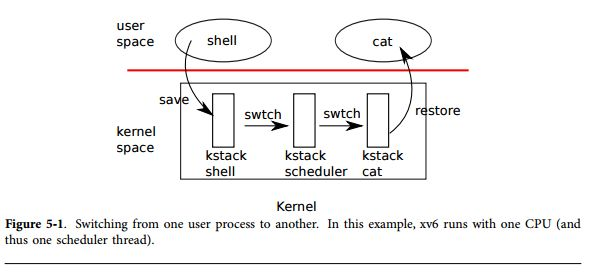
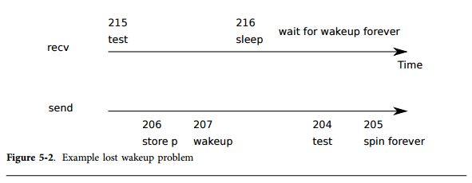

第5章 スケジューリング
==================

どのようなオペレーティングシステムも、コンピュータが持っているプロセッサの数以上のプロセスを実行し、従ってプロセス間で時分割共有が必要になる。理想的には、ユーザプロセスからはこの共有は見えないようにするべきである。共通のアプローチとしては、各プロセスが個々に仮想マシンを保持しているように見せかけ、オペレーティングシステムが複数の仮想マシンを単一のプロセッサで時分割共有して実行することである。本性ではxv6がどのようにして複数のプロセスをプロセッサ上で実行しているのかについて説明する。

# 多重化

xv6は各プロセッサがあるプロセスから他のプロセスに切り替えることで多重化を行うが、これには2つの序京がありうる。1つ目は、xv6は、あるプロセスがデバイスやパイプI/Oの完了を待つために待ち状態になると、`sleep`と`wakeup`の2つのメカニズムにより切り替えを行うか、子供が終了するのを待つか、`sleep`システムコールによって終了するのを待つ。2番目は、xv6がユーザ命令を実行中に、定期的に強制的に切り替えを行う。
この多重化により、各プロセスは自分のCPUを持っているように見えるが、xv6がメモリアロケータとハードウェアページテーブルにより各プロセスの固有のメモリを持っているように見せ掛けているだけである。

多重化を実装するには、いくつか困難な点がある。最初に、あるプロセスからどのようにして別のプロセスに切り替えるのか？xv6はコンテキストスイッチングの標準的なメカニズムを利用している; しかしアイデアはシンプルで、実装はシステムにおいて最も不透明である。2番目に、どのようにして透過的なコンテキストスイッチングを実現するのか？xv6は標準的なタイマ割り込みハンドラによりコンテキストスイッチを駆動している。3番目に、多くのCPUはプロセスを同時に切り替えており、従ってレースコンディションを避けるためにロックの機構も考える必要がある。4番目に、プロセスが終了したときに、そのメモリと資源を開放しなければならないが、しかしそれを自分自身では実行できない。何故ならば、(例えば)自分が利用しているのに自分のカーネルスタックを開放することはできないからである。xv6はこの問題をなるべくシンプルな方法で解決しようとしているが、結果として得られるコードはトリッキーである。

xv6はプロセスが自分自身を調整することのできる方法を提供しなければならない。例えば、親プロセスはその子プロセスが終了するまで待つか、他のプロセスがパイプへの書き込みを行うのを待たなければならない。プロセスが、所望のイベントが発生しているかチェックするためにCPUを無駄に利用するよりも、xv6はCPUの利用を諦めてイベントが発生するまでは眠っておき、他のプロセスが最初のプロセスを起動したほうが良い。イベントの通知を読み落とすことを避けるために、レースコンディションを避けるためのケアが必要になる。この問題と解答の例として、本章ではパイプの実装について取り扱う。

# コード例: コンテキストスイッチング

図5-1に示すように、プロセス間で切り替えを行うためには、xv6は低レイヤにおいて2種類のコンテキストスイッチを行っている: プロセスのカーネルスレッドから現在のCPUのスケジューラスレッドへの切り替えと、スケジューラスレッドからプロセスのカーネルスレッドへの切り替えである。xv6は、あるユーザ空間のプロセスから他のプロセスへ直接切り替える、ということは決してない;このような直接他のプロセスに切り替わる状況は、ユーザカーネルの変換(システムコールもしくは割り込み)によって発生することはあるが、スケジューラへのコンテキストスイッチ、新しいプロセスのカーネルスレッドへのコンテキストスイッチ、およびトラップリターンの場合のみ発生する。本章ではこのメカニズムの説明として、カーネルスレッドとスケジューラスレッドを取り扱う。



第2章で見てきたように、全てのxv6のプロセスは自分自身のカーネルスタックとレジスタセットを持っている。各CPUは任意のプロセスのカーネルスレッド向けではなく、スケジューラを実行するに分離したスケジューラスレッドを持っている。ある1つのスレッドから他のスレッドに切り替えるために、古いスレッドのCPUレジスタを対比し、新しいスレッドのレジスタを復帰させるという処理が発生する;`%esp`と`%eip`の保存と回復が実行され、CPUがスタックをスイッチすることで、実行しているコードもスイッチしたことになる。

`swtch`はスレッドのことを直接知っているわけではない;`contexts`と呼ばれるレジスタセットの保存と復帰を行う処理を実行しているだけである。プロセスがCPUを使うことを諦めると、プロセスのカーネルスレッドが`swtch`を予備、自身のコンテキストを退避してスケジューラコンテキストへと飛ぶ。各コンテキストは`struct context*`として表現されており、関連するカーネルスタックの構造体のポインタとして表現されている。
`swtch`は2つの引数を取る; `struct context **old`と`struct context *new`である。`swtch`は現在のCPUレジスタをスタックに保存して、スタックのポインタを`*old`に保存する。次に、`swtch`はnewを`%esp`にコピーし、前の保存したレジスタをポップしてから関数から戻る。

`swtch`内を見てスケジューラを追いかける代わりに、私たちのユーザプロセスが復帰するところを見てみよう。第3章において、各割り込みの最後に`trap`が``yield``を呼び出す可能性があることについて触れた。`yield`は`sched`を呼び出し、`sched`は`proc->context`に入っている現在のコンテキストを保存して`cpu->scheduler`によって保存している過去のスケジューラコンテキストにスイッチする(2766行目)。

`swtch`(2952行目)はまずスタックから引数をロードして、それを`%eax`と`%edx`(2959-2960行目)に格納する;`swtch`はスタックポインタを変更して`%esp`を通じてどこにもアクセスできなくなる前にこれを実行する必要がある。次に、`swtch`はレジスタステートを保存し、現在のスタック上にコンテキスト構造体を作成する。呼び出し先が保存するレジスタは保存する必要がある; x86は`%ebp`,`%ebx`,`%esi`,`%ebp`,`%esp`が対象である。
`swtch`は最初の4つのレジスタを明示的にプッシュする(2963-2966行目); 最後のレジスタは、`*old`に`struct context*`を書き込むことによって暗黙的に保存される。さらに、もう一つ重要なレジスタが存在する: プログラムカウンタ`%eip`は`swtch`を呼び出す`call`により保存され、`%ebp`のスタックの上に格納される。古いコンテキストを保存することによって、`swtch`は新しいコンテキストをロードする準備が整う。`swtch`はポインタを新しいコンテキストのスタックポインタに移す(2970行目)。新しいスタックは`swtch`が保存した古いスタックのもとの構造的には一緒である - 新しいスタックは前の`swtch`が呼ばれたときは古いスタックだったのである - したがって、`swtch`は新しいコンテキストを退避する手順を逆に踏んでいけばよい。`%edi`,`%esi`,`%ebx`,`%ebp`をポップし、買えされた命令アドレスは新しいコンテキストのものである。

私たちの例では、`sched`は`swtch`を呼び出して`cpu->scheduler`にスイッチして、CPU毎のスケジューラコンテキストにスイッチする。コンテキストは`scheduler`により保存され、`swtch`が呼ばれる(2728行目)。`swtch`がどこに戻るかをトレースして言ったとき、`sched`には戻らずに`scheduler`に戻る。スタックポインタは現在のCPUのスケジューラタスクを指しており、`initproc`のカーネルスタックを指しているわけではない。


# コード例: スケジューリング

前章では、`swtch`の低レイヤの詳細について確認した; では、`swtch`を例に取り、あるプロセスからスケジューラに移り、さらにプロセスに移るための方法について見ていこう。CPUの使用を取り止めたいプロセスは、プロセステーブルロックである`ptable.lock`を取得し、現在保持している全てのロックをリリースし、現在の状態(``exit``)を更新し、`sched`を呼ぶ。`yield`(2772)はこの慣習に従い、`sleep`命令と`exit`命令を実行する。これらについては後に見ることにする。`sched`はこれらの状態のダブルチェックを行い(2757-2762行目)、これらの状態のimplication行う:何故ならば、CPUはロックを獲得する場合は割り込みを無効化しておく必要があるからである。
最後に、`sched`は`swtch`を呼び`proc->context`の現在のコンテキストを保存して、`cpu->scheduler`により保持されているスケジューラコンテキストにスイッチする(2728行目)。スケジューラはforループを実行し続け、実行できるプロセスを見つけ、スイッチングすることを続ける。

xv6がは`swtch`を呼び出している間、`ptable.lock`を保持するところを見た: `swtch`の呼び出し元は既にこのロックを獲得している必要があり、ロックの制御はコードのスイッチングに渡される。この慣習はロックにとって通常のことではない; 典型的な慣習は、ロックを獲得したスレッドがロックの解放の責任を持つことであり、これは正しさを保証するためには当然のことである。コンテキストスイッチングのためには、典型的な慣習を破壊する必要がある。何故ならば、`ptable.lock`は、`swtch`を実行中には真ではないプロセスの状態とcontextフィールドの不変条件を保護しているからである。`ptable.lock`が`swtch`の間中保持されていなかった場合に発生する問題の例を示す: 異なるCPU上で`yield`が状態を`RUNNABLE`に変更した後に、どのプロセスを実行するかを来める必要があるが、`swtch`を呼ぶ前にカーネルスタックを使うことを止める。この結果により、同一のスタック上で実行している2つのCPUの実行状態を、正しく設定することができなくなる。

カーネルスレッドは、`sched`の中でいつもプロセッサの利用を止め、スケジューラ中の同一の場所にスイッチし、`sched`内で(殆ど)常にプロセスにスイッチする。従って、もしxv6がスレッドをスイッチした行番号をプリントすると、以下のようなシンプルなパタンが存在するはずである(2728行目),(2766行目)、(2728行目)、(2766行目)である。このような形式で2つのスレッドがスイッチングを発生させることを、「コルーチン」と読んでいる;この例では、`sched`と`scheduler`がそろぞれコルーチンである。

新しいプロセスが`sched`内で終了しない例がある。第2章で見たように、新しいプロセスが最初にスケジュールされたときである。新しいプロセスは、`forkret`(2783行目)から実行を開始する。`forkret`は`ptable.lock`を解放することで、この慣習を守るための存在している; そうでなければ、新しいプロセスは`trapret`からスタートすることになる。

`scheduler`(2708行目)は単純なループを実行する: 実行可能なプロセスを見つけ、それが停止するまで実行することを繰替えす。`scheduler`は殆ど全ての動作中に、`ptable.lock`のロックを保持しているが、各繰り返しにおいて、ループの外に出るときだけロックを解放する(そして、明示的に割り込みを許可する)。これは、CPUがアイドル状態のとき(`RUNNABLE`なプロセスを発見することができなかったとき)に重要である。アイドル状態のスケジューラがロックを保持し続けていると、プロセスを実行している他のCPUがコンテキストスイッチや、システムコールに関連するプロセスを実行したり、さらに特にプロセスを`RUNNABLE`に設定する操作ができず、遊休状態のCPUが二度とスケジューリングできなくなってしまう。定期的に割り込みを許可する理由は、アイドル中のCPUで、例えばシェルのようなI/O待ちの状態で`RUNNABLE`のプロセスが存在しない場合のためである;
もしスケジューラが割り込みを常に不許可にしていた場合、I/Oの割り込みはもう二度と発生しなくなってしまう。

スケジューラはテーブルを参照しながら、`p->state==RUNNABLE`であるプロセス、つまり実行可能な状態にあるプロセスを探し続ける。
プロセスを発見すると、CPU毎の現在のプロセスの変数であるprocを設定し、プロセスのページテーブルを`switchuvm`によりスイッチし、プロセスを``RUNNING``に設定し、`swtch`を実行してプロセスの実行を開始する(2722-2728行目)。

スケジューリングのコードの構造について考えるための一つの方法は、各プロセスが常に不変条件を維持するように調整されているとして、その不変条件が真でなくなるときは常に`ptable.lock`が保持されていると考えることである。不変条件の一つは、もしプロセスが`RUNNING`状態であれば、実行状態は整っており、タイマー割り込みの`yield`は正しくプロセスからスイッチすることができる; これは、CPUのレジスタがそのプロセスの値を帆いしており(例えば、それらは実際にはcontextの中には存在しない)、%cr3はプロセスのページテーブルを参照しており、`%esp`はプロセスのカーネルスタックを参照してなければならず、従って、`swtch`はレジスタを正しくプッシュしており、procはプロセスのproc[]スロットを参照していなければならない。
他の不変条件は、もしプロセスが`RUNNABLE`であれば、アイドル状態のCPUでは、スケジューラを実行することができる; p->contextはプロセスのカーネルスレッドの値を持っており、プロセスのカーネルスタックを実行しているCPUは存在せず、CPUの%cr3はプロセスのページテーブルを参照しておらず、CPUのprocはプロセスを参照してはいない。

上記の不変条件を管理することが、xv6が`ptable.lock`を1つのスレッド(しばしば`yield`の中)で獲得し、異なるスレッド(スケーウラスレッドもしくは他の次のカーネルスレッド)で解放する理由である。
実行しているプロセスの状態を`RUNNABLE`に設定するための変更が始まると、その不変条件が修正されるまでは、lockを保持していなければならない： 最短の正しい解放ポイントは、`scheduler`がプロセスのページテーブルを使用するのを止め、procをクリアするところである。同様に、一度`scheduler`が実行状態のプロセスを`RUNNING`に変更する場合は、カーネルスレッドが完全に実行する状態になるまで(`swtch`をを実行してから、例えば`yield`の中で)ロックは解放することができない。

`ptable.lock`は同様に、他の部分についても保護を行っている: プロセスのIDの割り当てと、プロセスのテーブルの解放処理と、`exit`と`wait`の相互作用と、`wakeup`のロストを避けるための手続き(次章を参照のこと)と、他にも様々なことに利用される。`ptable.lock`の他の機能について考えることは、明確性については確実に、性能についてはおそらく、分割して考えることが価値のあることになるxxx。

# `sleep`と`wakeup`

スケジューリングとロックは、あるプロセスを他のプロセスから存在を隠すことを助けるが、今のところはプロセスが意図的に相互作用することを助けるための抽象化は存在していない。`sleep`と`wakeup`はそれを埋めるものであり、プロセスがイベントを待つためにスリープ状態に入り、イベントが発生すると他のプロセスが置きる、ということができるようになる。`sleep`と`wakeup`は「sequence coordination」もしくは「conditional synchronization」のメカニズムと呼ばれ、オペレーティングシステムの文献には、他にも似たような多くのメカニズムが存在する。

この構造を説明するために、まずは簡単な生産者と消費者のキューを考える。このキューはプロセスからコマンドも受けとるIDEのドライバと似ている(第3章を参照のこと)が、IDEの特定のコードからは抽象化されている。
キューはあるプロセスが非ゼロのポインタを他のプロセスに送信することを許可している。もし送信者が1つで、受信者も1つであり、それらが異なるCPU上で動作していれば、コンパイラは強力に最適化をすることは無く、以下のような実装で実現することができる:
```cpp
100 struct q {
101     void *ptr;
102 };
103
104 void*
105 send(struct q *q, void *p)
106 {
107     while(`q->ptr` != 0)
108     ;
109     `q->ptr` = p;
110 }
111
112 void*
113 recv(struct q *q)
114 {
115     void *p;
116
117     while((p = `q->ptr`) == 0)
118     ;
119     `q->ptr` = 0;
120     return p;
121 }
```

`send`は、キューが空の間は実行し続け、ポインタpをキューに挿入する。`recv`はキューが空でない間は実行し続け、ポインタを取り出す。プロセスとして実行されているときは、`send`と`recv`はどちらとも`q->ptr`を変更するが、`send`は`q->ptr`がゼロのときだけ書き込み、`recv`は`p->ptr`が非ゼロのときだけ書き込む。従って、更新情報をロストすることはない。

上記の実装はコストが高い。もし送信者が殆ど送信をしなければ、受信者はwhileループの中でポインタがやって来るまでスピンしながら待っていなければならない。受信者のCPUは、もし受信者がCPUを消費する他の方法が存在すれば、`send`がポインタを送信するときだけ回復し、それ以外のときは眠っていられる。

以下のように動作する、`sleep`と`wakeup`の2つの呼び出しを想像してみよう。`sleep(chan)`は、任意の値`chan`上でスリープ状態に入る。これを`wait`チャネルと呼ぶ。`sleep`はスリープ状態に入るためにプロセスを呼び出し、他の仕事のためにCPUを手放す。`wakeup(chan)`はchan上でスリープ状態に入っている全てのプロセスを呼び出し(もし必要ならば)、戻るためにこれらの`sleep`を呼び出す(xxx)。chan上でプロセスあ待っていなければ、`wakeup`は何もしない。このような`sleep`と`wakeup`を利用するために、以下のようにキューの実装を変更する。

```cpp
201 void*
202 send(struct q *q, void *p)
203 {
204     while(q->ptr != 0)
205     ;
206     q->ptr = p;
207     wakeup(q); /* wake recv */
208 }
209
210 void*
211 recv(struct q *q)
212 {
213     void *p;
214
215     while((p = q->ptr) == 0)
216     sleep(q);
217     q->ptr = 0;
218     return p;
219 }
```

`recv`はスピン状態に入るのではなく、CPUを手放す。これは良い方法である。しかし、このインタフェースで、図5-2で説明した「ロストした`wakeup`」として知られている問題を解決するためのインタフェースを利用して`sleep`と`wakeup`を実装することは、簡単な話ではない。例えば、`recv`が215行目の`q->ptr==0`であることを検出したとしよう。`recv`は215と216行目の間にいるとき、`send`は他のCPU上で動作している:
`send`は`q->ptr`を非ゼロの値に書き換え、`wakeup`を呼ぶが、スリープ状態に入っているプロセスは存在せず、何も起こらない。`recv`は216行目を実行し、`sleep()`を実行することでスリープ状態に入る。ここで問題が生じる: `recv`はスリープ状態に入り、ポインタを待っているが、それは既に到着している。次の`send`が`recv`が起きてキュー上のポインタを消費するのを待つためにスリープ状態に入り、この時点でこのシステムではデッドロックが発生する。



この問題の原因は、`recv`は`q->ptr==0`が成立しなくなったときにのみスリープ状態に入り、それとは違うタイミングで`send`を実行させるところにある。以下のように、`recv`のコードを変更して不変条件を保とうとするのは間違いである：

```cpp
300 struct q {
301     struct spinlock lock;
302     void *ptr;
303 };
304
305 void*
306 send(struct q *q, void *p)
307 {
308     acquire(&`q->lock`);
309     while(q->ptr != 0)
310     ;
311     q->ptr = p;
312     wakeup(q);
313     release(&`q->lock`);
314 }
315
316 void*
317 recv(struct q *q)
318 {
319     void *p;
320
321     acquire(&`q->lock`);
322     while((p = q->ptr) == 0)
323         sleep(q);
324     q->ptr = 0;
325     release(&`q->lock`);
326     return p;
327 }
```

`recv`をこのようにして保護すると、ロックが322行目および323行目を実行されることから`send`を防ぐため、`wakeup`がロストすることを回避できる。しかしこれでもデッドロックが発生する: `recv`はスリープ状態に入っている間はロックを保持しており、ロックの解放を待つために送信者が永久に待ち続けることになる。

上記の方法を、ロックを`sleep`に渡すことにより、呼び出し元のプロセスがスリープ状態としてマークされ、スリープチャネルを待っている状態になってもロックを解放できるように変更する。ロックは受信者が自分自身をスリープ状態にするまで`send`が実行されるのを防ぎ、従って、`wakeup`はスリープしている受信者を確実に起こすことができる。受信者がスリープ状態から起きると、関数から抜ける前に再びロックを獲得する。
最終的な、正しいコードは以下のようになる:

```cpp
400 struct q {
401     struct spinlock lock;
402     void *ptr;
403 };
404
405 void*
406 send(struct q *q, void *p)
407 {
408     acquire(&`q->lock`);
409     while(q->ptr != 0)
410     ;
411     q->ptr = p;
412     wakeup(q);
413     release(&`q->lock`);
414 }
415
416 void*
417 recv(struct q *q)
418 {
419     void *p;
420
421     acquire(&`q->lock`);
422     while((p = q->ptr) == 0)
423         sleep(q, &`q->lock`);
424     q->ptr = 0;
425     release(&`q->lock`);
426     return p;
427 }
```

`recv`が``q->lock``を保持することによって、`send`が`recv`が`q->ptr`をチェックし、`sleep`を呼ぶ前に起きようとすることを防ぐ。もちろん、受信側のプロセスはスリープ中は`q->lock`を解放しなければならず、従って送信者は起きることができる。
従って、`q->lock`をアトミックに解放、スリープ状態に入るために、受信者のプロセスを起こしてからスリープ状態に入ることができる。

# コード例: `sleep`と`wakeup`

xv6の`sleep`と`wakeup`の実装を見てみよう。基本的なアイデアは、`sleep`は現在のプロセスを`SLEEPING`状態に設定し`sched`を呼び、プロセッサを解放する; `wakeup`はwaitチャネル上のスリープ状態のプロセスを探し、`RUNNABLE`に設定する。

`sleep`(2803行目)はいくつかのチェックから始まる: まず、現在のプロセスである必要があり、`sleep`はロックを渡されてなければならない(2808-2809行目)。次に、`sleep`は`ptable.lock`を獲得する(2818行目)。これで、プロセスは`ptable.lock`と`lk`を獲得したので、スリープ状態に入ることができる。``lk``を獲得しているのは、呼び出し元にとって必要(例えば`recv`プロセス)である: これは、他のプロセス(例えば、動作している`send`プロセス)が`wakeup(chan)`を呼び出し始めてはいない、ということを保証するものである。今、`sleep`が`ptable.lock`を保持しており、`lk`を解放しても安全である: 他のプロセスは`wakeup(chan)`を呼び出し始めても良いが、`wakeup`は`ptable.lock`を獲得できるまで動作しない、従って、プロセスをスリープ状態に設定してから`sleep`が終了しても、`wakeup`が`sleep`を失うことを防いでいる。

いくつかの複雑な部分も存在する: `lk`は&`ptable.lock`と同一ならば、`sleep`は&`ptable.lock`を獲得しようとして、次に`lk`を解放しようとするため、デッドロックになる。このような場合には、`sleep`は獲得と解放することを止め、全体をスキップする(2817行目)。例えば、wait(2653行目)は`sleep`を&`ptable.lock`を引数にして呼び出す。

さらにいくつかステップを進めていくと、プロセスは`wakeup(chan)`を呼び出す。`wakeup`(2853行目)は`ptable.lock`を獲得し、`wakeup1`を呼び出す。`wakeup1`が実際に仕事をする関数である。`wakeup`が`ptable.lock`を獲得していることが重要であり、それはこの関数がプロセスの状態を操作し、また、これまでに見てきたように、`ptable.lock`が`sleep`と`wakeup`が互いにミスをしないように保証するものだからである。`wakeup1`は分離した関数であり、スケジューラがしばしば`ptable.lock`を既に獲得したまま`wakeup`を実行しようとするためである; この例については、後に説明する。`wakeup1`(2853行目)はプロセステーブルを順に探索する。`SLEEPING`状態で、chanとマッチングするプロセスを発見すると、プロセスの状態を`RUNNABLE`に変更する。次にスケジューラが実行されたときには、プロセスが実行可能な状態として見えているのである。

`wakeup`は、`wakeup`がどのような状態であったとしても、ガード変数をロックしている状態で呼ばれなければならない; 例として、ロックが`q->lock`であったとしよう。何故スリープ状態のプロセスが`wakeup`をミスするのかというと、スリープ状態に入る前の全てのタイミングで条件をチェックし、その条件か、`ptable.lock`のどちらか(あるいはその両方)をロックしているからである。`wakeup`はこれらのロックを保持したまま実行するため、`wakeup`は潜在的なスリープ状態のプロセスが状態をチェックする前か、潜在的なスリープ状態のプロセスがスリープ状態に入ったかどうかをチェックした後に実行されなければならない。

複数のプロセスが同一のチャネルでスリープ状態になっている可能性がある; 例えば、1つ以上のプロセスがpipeから読み込みをしようとしている場合である。一回の`wakeup`の呼び出しにより、これらのプロセスが全て起きる。そのうちの一つが、`sleep`から呼び出されたロックを獲得し、(パイプの場合は)パイプ上に書き込まれているデータを呼び出す。他のプロセスはこれを発見すると、プロセスを起こしたにも関わらず、何も読むことができない。`wakeup`が「偽装的な」ものであるという観点から、これらのプロセスは再びスリープ状態に入らなければならない。このような理由から`sleep`はプロセスの状態をチェックするループの中で常に呼び出される。

`sleep`と`wakeup`の呼び出し元は、任意の数字をチャネル番号として利用することができる; 実際には、xv6はディスクバッファなどの待ち状態になっているカーネルのデータ構造のアドレスを利用する。2つの`sleep`/`wakeup`のペアが同じチャネル番号を利用したとしても、問題は発生しない: これらは偽装した`wakeup`を行うが、この問題を許容するためにループ処理を記述している。`sleep`と`wakeup`の魅力の多くはは、軽量であること(スリープチャネルを動作させるために特別なデータ構造が必要無い)と、間接的なレイヤ(呼び出し元は、相互に通信をしている先のプロセスについて知る必要が無い)を提供しているということである。

# コード例: パイプ

前章にて扱った単純なパイプはおもちゃであったが、xv6は実際に`sleep`と`wakeup`により読み込み元と書き込み先の同期を行うキューが2つ存在する。
1つがIDEドライバである: プロセスがディスクのリクエストをキューに挿入し、`sleep`を呼び出す。
割り込みハンドラが`wakeup`を利用してプロセスに対してリクエストが完了したことを通知する。

より複雑な例として、パイプの実装がある。パイプのインタフェースについては、第0章で見た: パイプの終端に書き込まれたバイトがカーネルバッファにコピーされ、他のパイプの終端から読み出される。
以降の章では、ファイルシステムがパイプ周辺をサポートするが、ここではpipewriteとpipereadの実装について見て行こう。

各パイプはstruct pipeとして表現され、lockとdataバッファを備えている。
nreadとnwriteはバッファ上から読み込み、書き込みをされた量をカウントしている。このバッファはラップアラウンドする: buf[PIPESIZE-1]の次に書き込まれるバッファの位置はbuf[0]であるが、カウンタはラップアラウンドしない。
この記法では、バッファがフルであることは、(nwrite==nread+PIPESIZE)の条件でチェックを行い、バッファが空であると、nwrite==nreadであることを区別することができるが、バッファのインデックスは
buf[nread]の代わりに、buf[nread%PIPESIZE]で参照する必要がある。nwriteの場合も同様である。
pipelineとpipereadは同時に、2つの異なるCPUで発生すると仮定しよう。

pipewrite(6530行目)はパイプのロックを獲得するところから始まり、カウンタとデータをロックして、関連する不変条件を確保する。
piperead(6551行目)は同様にロックを獲得しようとするが、それはできない。
acquire(1571行目)の中でスピンを行い、ロックを待つ。
pipereadが待っている間、pipewriteは書き込むバイトを読み出しながらループする - addr[0],addr[1],...addr[n-1] - それぞれのデータをパイプに書き込む(6544行目)。
このループの間、バッファが一杯になる可能性がある(6536行目)。
この場合には、pipewriteは`wakeup`を実行し、スリープ状態になっている読み込み先のプロセスを起こし、バッファ上にデータが溜っていることを通知し、&p->nwrite上でスリープ状態に入り、読み込みプロセスがバッファをいくらか読み出すのを待つ。
`sleep`はpipewriteのプロセスをスリープ状態に変更する処理の中で、p->lockを解放する。

次に、p->lockが獲得可能になると、pipereadはロックを獲得してから、消費を始める: p->nread!=p->nwriteであることを発見すると(6556行目)(pipewriteはp->nwrite==p->nread+PIPESIZE(6536行目)であるから、スリープ状態に入っている)、
ループを通じて、パイプからデータをコピーし(6563-6567行目)、nreadをインクリメントしてコピーしたバイト数をカウントする。
こうして何バイトか書き込みが可能な状態になると、pipereadは`wakeup`を呼び出して(6568行目)、スリープ状態の書き込みプロセスを呼び出し、呼び出し元に戻る。
`wakeup`はバッファが一杯のためスリープ状態に入っているpipewriteを実行しているプロセスを発見し、このプロセスを`RUNNABLE`に設定する。

パイプのコードは読み込みと書き込みに別々のスリープチャネルを利用する(p->nreadとp->nwrite); これによりシステムは予期しないイベントに対してより効率的に実行することができるようになり、
多くの読み込みプロセスと書き込みプロセスが存在していても実行できるようになる。
パイプのコードはスリープ状態をチェックするループの中でスリープ状態に入る; もし複数の読み込みプロセスと書き込みプロセスが存在すると、全てのプロセスの中で1つ目のプロセスが起き上がり、状態がまだfalseであることを確認して再びスリープ状態になる。

# コード例: wait, exit, kill

`sleep`と`wakeup`は、多くの待ち動作に用いられる。
面白い例として、第0章でのwaitシステムコールにより、親プロセスが子プロセスが終了するのを待つシステムコールがある。
xv6では、子プロセスが終了すると、それは即時に死ぬ訳ではない。
代わりに、プロセスは「ゾンビプロセス(ZOMBIE)」というプロセス状態に変更され、親プロセスが終了するためのwaitを呼び出すまで待つ。
親プロセスは子プロセスのメモリ領域を解放し、struct procを再利用するための準備をする責任を持つ。
もし親プロセスが子プロセスが終了する前に終了すると、initプロセスが子プロセスの終了を待つ。
従って、全ての子プロセスは終了時のクリーンアップをするために、親プロセスを持っている。
exitとexitのプロセスの間にレースコンディションが存在するように、子プロセスと親プロセスのwaitとexitのレースコンディションの可能性があることに注意しよう。

waitはまず、`ptable.lock`を獲得するところから始まれう。
次にプロセステーブルを探索して子プロセスを発見する。
waitが現在のプロセスが子プロセスを持っているが、まだ終了していない場合、`sleep`システムコールを呼び出して、子プロセスの一つが終了するのを待つ(2689行目)ち、それが終了するとさらにスキャンを行う。
ここで、`sleep`内で解放されるロックは`ptable.lock`であり、このときの特殊ケースについては上記で説明した。

exitは`ptable.lock`ロックを獲得し、waitチャネル上で眠っている任意のプロセスを起こす。これは現在の親プロセスのprocに相当する(2628行目);
もしこのようなプロセスが存在すれば、それはwaitにより待ち状態になっている親プロセスである。
これではまだ準備は未完了のように見える。何故ならば、まだexitは現在のプロセスをZOMBIE状態に変更していないからだが、まだ安全である:
`wakeup`は親プロセスを`RUNNABLE`な状態にするが、wait内でのループはexitがptableを解放するまでは実行することができない。
`ptable.lock`は`sched`によりスケジューラに入った段階で解放されるが、従ってwaitはexitがZOMBIE状態にプロセスを変更するまで、該当する終了プロセスを発見することができない。
exitが再スケジューリングされる前に、終了したプロセスの全ての子プロセスは、親の再設定が行われ、`initproc`に渡される(2630-2637行目)。
最後にexitは`sched`を呼び出しCPUを手放す。

親プロセスがwait中で寝ているならば、いずれはスケジューラは動作していることになる。
`sleep`を呼び出すことにより、`ptable.lock`を保持していることになる; waitはプロセステーブルをスキャンし、state==ZOMBIEな子プロセスを探す(2634行目)。
子プロセスのpidを記録し、struct procをクリーンアップし、そのプロセスの関連するメモリ領域を解放する(2668-2676行目)。

子プロセスはexit中に殆どのクリーンアップを終了することができるが、親プロセスがp->kstackとp->pgdirを解放することは重要である:
子プロセスがexitを実行すると、そのプロセスのスタックはp->kstackに割り当てられたメモリ上に配置されており、それは自分自身のページテーブルを利用する。
これは、子プロセスが実行を終了し、(`sched`により)`swtch`を呼び出す場合に最後にしか解放することができない(xxx)。
これが、スケジューラが`sched`により呼ばれたスレッドのスタック上で動作するのではなく、自分自身のスタック上で動作する理由である。

exitがプロセス自身を終了することを許可すると、kill(2875行目)があるプロセスをリクエストし、xxx。
killにより直接犠牲となるプロセスを破壊するのは非常に複雑な処理である。
何故ならば、犠牲となるプロセスは他のCPUで動作していたり、カーネルデータ構造を書き換えている最中にスリープ状態になっているなどの可能性があるからである。
これらの複雑性を回避するために、killは非常に小さな構造になっている: 単に犠牲となるプロセスのp->killedを設定する。あるいはスリープ状態ならば、それを起こす。
さらに犠牲となるプロセスがカーネルから離れると、そのポイントでtrapが実行され、p->killedが設定されているならば、exitが呼び出される。
もし犠牲となるプロセスがユーザ空間上に存在するならば、システムコールをマスクするか、タイマ割り込みによって(もしくは他のデバイスの割り込みにより)すぐさまカーネル状態に入る。

犠牲となるプロセスがスリープ状態ならば、`wakeup`の呼び出しによりそのプロセスは`sleep`から戻ってくる。
これは何かが成立するまで待ち状態であるならば、成立することなく起き上がることになるため、潜在的に危険である。
しかし、xv6は常に`sleep`を呼び出すときはwhileループによりラップしているため、`sleep`から戻ってきたときは常に条件をテストしている。
いくつかの`sleep`の呼び出しはp->killedをループ中でテストしており、もしセットされていたならば、現在の動作をすべて破棄する。
このような破棄の操作が行われるが正しい唯一のケースである。
例えば、パイプの読み書きのコード(6537行目)は、killedフラグが立ち上がっていると戻ってくる;
いずれはコードはtrapに戻ってきて、再びフラグをチェックして終了する。

xv6のいくつかの`sleep`のループはp->killedをチェックしておらず、これは複数のシステムコールがアトミックであるようなコードが入っていることによる。
IDEドライバ(4279行目)がその例である: このループはp->killedをチェックしておらず、ディスクの操作は全てがファイルシステム上でインオーダで実行され、正しい状態で就労しなくてはならないためである。
クリーンアップが実行されて一部分の操作が残ったときの複雑性を回避するために、xv6はプロセスのキル操作を遅らせ、IDEドライバがプロセスを殺しても良いポイントに到達するまでキルを回避する
(例えば、ファイルシステムの操作が完了し、プロセスがユーザ空間に戻ってくる時など)。

# 現実の世界

xv6のスケジューラはシンプルなスケジューリングのポリシで実装されており、各プロセスを順番に実行していく仕組みになっている。
このポリシを「ラウンドロビン」と読んでいる。
実際のオペレーティングシステムではより洗練されたポリシを実装しており、例えば、プロセスが優先度を持つことが出来るようになっている。
このアイデアは、実行可能なより高い優先度を持っているプロセスが、スケジューラ上ではより低い優先度のプロセスよりも優先して選択されるという方針である。
これらのポリシにより、急激に実装が複雑になる可能性があり、それはより高度な要求を満たす必要があるからである: 例えば、オペレーティングシステムは公平性と高スループットを保証する必要がある。
加えて、複雑なポリシにより、「優先度の逆転」や、「コンボイ」といった予期しない相互作用が発生する可能性がある。
優先度の逆転は、低い優先度のプロセスと高い優先度のプロセスがロックを共有しており、低い優先度のプロセスがロックを獲得すると、
高い優先度のプロセスが実行できなくなってしまうことである。
長いコンボイは、多くの高い優先度のプロセスが低い優先度のプロセスが獲得している共有ロックの待ち合わせをしている際に発生する;
一度コンボイが発生すると、優先度の高いプロセスは長い時間耐える必要がある。
このような問題を避けるためには、洗練されたスケジューラの中に、さらにメカニズムを追加する必要がある。

`sleep`と`wakeup`はシンプルで効果的な方法であるが、他にも様々な方法が存在する。
最初に挑戦したことは、本章の最初で見た「ミスした`wakeup`」の問題を避けることである。
オリジナルのUnixカーネルでは、`sleep`は単純に割り込みを禁止にしており、Unixは単一のCPUで動作するためこれで十分であった。
xv6はマルチプロセッサ上で動作するため、明示的なロックにより`sleep`をする必要があった。
FreeBSDのm`sleep`は、同様のアプローチを取っている。
Plan 9の`sleep`はスリープ状態に入る直前にスケジューリングによりロックを獲得するためのコールバック関数を利用している;
この関数はミスした`wakeup`を避けるために、最後の直前のスリープ状態のチェックを実行している。
Linuxカーネルの`sleep`はwaitチャネルの代わりに、明示的なプロセスのキューを利用している; このキューは、自分自身の内部ロックを持っている。

`wakeup`内での全体のプロセスをスキャンして、chanとマッチングすることは非効率である。
より効率的な方法として、`sleep`と`wakeup`内のchanをスリープ状態のプロセスのリストと置き換える方法があげらる。
Plan 9の`sleep`と`wakeup`はこのような構造を取っており、集合ポイントもしくはrendezという構造体を保持している。
多くのスレッドライブラリは同様の構造体か、条件変数を参照している; このようなコンテキストでは、`sleep`と`wakeup`の操作はwaitとsignalから呼び出される。
全てのこのようなメカニズムは同様の特徴を持っている: スリープの条件は、スリープ中にアトミックにドロップされたいくつかのロックによって保護されている。

`wakeup`の実装により、特定のチャネルを待ち合わせている全てのプロセスが起き上がり、多くのプロセスが特定のチャネルを待っている状態が発生する。
オペレーティングシステムは、スリープ状態をチェックしている多くのプロセスをスケジューリングする。
このような方法で動作するプロセスはthundering headと呼ばれ、これは最も避けやすいものであるxxx。
殆どの条件変数は、`wakeup`のための2つのプリミティブを持っている:1つのプロセスを起こすためのsignalと、全ての待ち状態のプロセスを起こすためのbroadcastである。

セマフォは、もう一つの調停のためのメカニズムである。
セマフォは2つの操作により整数をインクリメントとデクリメントする。
セマフォはインクリメントすることができるが、セマフォの値として、デクリメントして0を下回ることは許されない。
ゼロをデクリメントすると、他のプロセスがセマフォをインクリメントするまではスリープ状態になり、これらの2つの操作は全てキャンセルされる。
整数値は典型的に、実際の値、例えばパイプバッファ中のデータのバイト数や、プロセスが保持しているゾンビ状態のプロセスの数に相当する。
明示的なカウンタの抽象化により、「ミスした`wakeup`問題」を避けることができる: 明示的に`wakeup`の数を数えるのである。
このカウンタにより、不明な`wakeup`や、thundering herd問題を避けることができる。

xv6上では、プロセスを殺したり、クリーンアップすることにより、より複雑な問題が生じる。
殆どのオペレーティングシステムではさらに複雑であるが、何故ならば、例えば、犠牲となるプロセスがカーネルの深いところでスリープ状態であるとして、
そのスタックを巻き戻すためには、注意深いプログラミングが必要である。
多くのオペレーティングシステムは、longjmpなどの例外ハンドリングにより明示的なメカニズムを使ってスタックを巻き戻していく。
さらに、待っているイベントが生じていないのに、別のイベントが発生することによってスリープしているプロセスが起き上がることがある。
例えば、プロセスがスリープ状態であり、他のプロセスがsignalを送信する場合である。
この状態では、プロセスが割り込まれたシステムコールに、-1を持って戻っていき、EINTRをエラーコードに設定する。
アプリケーションは、この値をチェックして、何をすべきかを決定する。
xv6はこのシグナルをサポートせず、このような問題は発生しない。

xv6は完全な要件を満たすkillはサポートしていない: これらはスリープループであり、p->killedをチェックする必要がある。
関連する問題として、`sleep`のループがp->killedをチェックしていたとしても、`sleep`とkillのレースコンディションが発生する;
後者がp->killedを設定して犠牲となるプロセスを`wakeup`しようとして、その直前に犠牲となるプロセスがp->killedをチェックして`sleep`を呼び出した場合である。
この問題が発生した婆い、犠牲となるプロセスは、待っている条件が発生しないと、自身がp->killedを設定されていることに気がつかない。
この問題は後に発生する(例えば、IDEドライバが犠牲となるプロセスが待っているディスクの操作から帰ってきたときなど)か、
(例えば、犠牲となるプロセスがコンソールの待ち状態だが、ユーザが全く入力をしなかった場合など)は、永遠に発生しない。

# 練習問題

1. `sleep`はデッドロックを避けるために、`lk`!=&`ptable.lock`をチェックする必要がある(2817-2820行目)。このコードは、以下ののように置き換えることで除去することができる:
```cpp
if(`lk` != &`ptable.lock`){
  acquire(&`ptable.lock`);
  release(`lk`);
}
```
を、
```cpp
release(`lk`);
acquire(&`ptable.lock`);
```
これにより`sleep`を抜けられることができるか？どのようにして実現されているか？
2. 殆どのプロセスのクリーンアップはexitもしくはwaitによって実行されるが、上記により、exitはp->stackを解放してはならない。
またexitは開いているファイルを閉じることができる唯一の関数である。何故か？これはパイプに関連する問題である。
3. xv6において、セマフォを実装せよ。mutexを用いることができるが、`sleep`と`wakeup`は使ってはならない。
xv6の`sleep`と`wakeup`をセマフォに置き換え、その結果を判定せよ。
4. killと`sleep`のレースコンディションを修正せよ。プロセスのスリープループはp->killedをチェックし、`sleep`を呼び出す前に発生した
killは、犠牲となるプロセスは、現在のシステム上から削除される結果となる。
5. 全てのスリープループがp->killedをチェックするデザインを設計せよ。
これにより例えば、IDEドライバが、他のプロセスがそのプロセスを殺したときに迅速に戻ってこれるようになる
