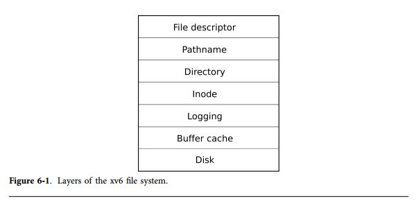
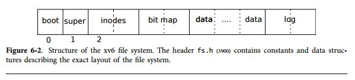
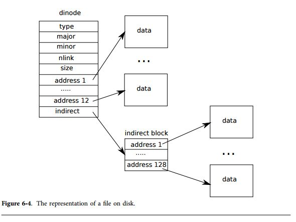

第6章 ファイルシステム
=====================

ファイルシステムの目的は、データを構成し保存することである。一般的にファイルシステムはユーザとアプリケーション間でデータを共有すると同時に**データを維持する**。従って、ファイルはコンピュータを再起動しても存在している。

xv6のファイルシステムはUNIXライクなものを提供しており、ファイル、ディレクトリ、パス名(第0章を参照のこと)をサポートし、IDEディスクに保存することで永続性を確保することができる(第3章を参照)。ファイルシステムを実現するためにはいくつかの困難を解決する必要がある。

* ファイルシステムはディスク上に、ツリー構造のディレクトリとファイルを表現するためのデータ構造を構成する必要がある。また各ファイルの内容を保持するための識別子と、どのディスク領域が空いているかという情報を保持しておく必要がある。
* ファイルシステムは **クラッシュからのリカバリ** をサポートする必要がある。つまり、(例えば電源遮断などで)クラッシュが発生しても、再起動後にファイルシステムは正しく動作する必要がある。クラッシュのリスクは、データの更新の際に割り込みが発生し、ディスク上のデータの一貫性(例えば、ファイルが存在することと、フリー状態であることを示すブロックのマークなど)に影響が出る場合などがあげられる。
* 異なるプロセスがファイルシステムを同時に扱うため、不変性を維持するようにファイルシステムを操作する必要がある。
* ディスクへのアクセスはメモリへのアクセスに比べて格段に遅く、従ってファイルシステムは頻繁に利用されるブロックについてメモリ上にキャッシュする仕組みを提供する必要がある。

本章では、上記の困難をxv6ではどのように解決しているかについて説明する。

# 概要

xv6のファイルシステムは図6-1に示すように7つの階層で構成されている。ディスク階層は、IDEハードドライブのブロックを読み書きする。バッファキャッシュ階層はディスクブロックをキャッシュし、ブロックのアクセスの同期を取り、データが格納されている特定のブロックについて、たった一つのブロックのみが変更を行っていることを保証する。ロギング階層は高位の階層のいくつかのブロックの更新操作を**トランザクション**としてラップし、またクラッシュが発生した場合でも、(例えば、全てのブロックがアップデートされたか、または一つもアップデートされていない状態を保持し)ブロックがアトミックに更新されたことを保証する。**inode**階層は個々のファイルを提供し、それぞれのノードはinodeというユニークなi-numberと、ファイルを保持しているいくつかのブロックで構成される。ディレクトリ階層はいくつかのディレクトリを構成し、特別な種類のi-nodeとして構成さえる。ディレクトリのinodeはディレクトリのエントリ列が含まれており、各エントリにはファイル名とi-numberが入っている。パス名階層は、`/usr/rtm/xv6/fs.c`のような階層的なパス構成を提供し、階層的な探索によりそれを解決する。ファイルディスクリプタ階層は多くのUNIXの資源を抽象化する(例えば、パイプやデバイス、ファイルなど)。ファイルのアクセスにはファイルシステムインタフェースを用い、アプリケーションプログラマのプログラミングを簡単化する。



ファイルシステムはinodeをどこに格納し、ディスクのどのブロックにファイルの内容を格納するかについての方針を決める必要がある。これを行うためには、xv6は、図6-2に示すようにディスクをいくつかのセクションに分割する。ファイルシステムはブロック0は使用しない(これはブートセクタを保持している)。ブロック1は「スーパブロック」と呼ばれ、ファイルシステムのメタデータを格納している(ブロックのファイルサイズ、データブロックの数、inodeの数、ログ中のブロックの数)。ブロック2以降はinodeを保持しており、ブロックあたりに複数のinodeを保持している。その後はビットマップブロックであり、使用しているブロックを記録している。殆どの残りのブロックは、データブロックである; それぞれのブロックはビットマップブロック上でフリーであることをマークされており、ファイルもしくはディレクトリが保持されている。ディスクの最後のブロックはロギング階層のログが格納されている。



本章の以降では、各階層について議論する。まずはバッファキャッシュの階層から始まり、うまく選択された下位階層の抽象化により、上位の階層がより易しくなっていることを見ていこう。

# バッファキャシュ階層

バッファキャッシュ階層の仕事は2つある: (1)ディスクブロックのアクセスの同期を行い、たった一つのブロックのコピーがメモリ中に存在し、たった一つのカーネルスレッドがそのコピーを使っていることを保証する;
(2)頻繁に利用するブロックをキャッシュし、低速なディスクから何度も読み出す必要を無くす。コードは`bio.c`に実装されている。

バッファキャッシュのためにエクスポートされた主のインタフェースは、`bread`と`bwrite`である; 前者はメモリにコピーされた、読み書き可能なブロックの内容のコピーを取得し、後者は更新されたバッファをディスクの適切なブロックに書き込む。カーネルスレッドは、書き込みが完了したときは`brelse`を呼び出して、バッファを解放しなければならない。

バッファキャシュは各ブロックを同期化し、各ブロックが、最大でも1つのカーネルスレッドしかブロックのバッファを参照を許可されていない状態を作る。もし1つのカーネルスレッドがバッファを参照しており、それを解放していなければ、他のスレッドが`bread`を呼び出して同一のバッファを参照しようとしてもそれは待たされる。より高位のファイルシステム階層はバッファキャッシュブロックの同期により、不変性が保たれることを支援している。

バッファキャッシュはディスクブロックを保持するための固定数のバッファを持っており、ファイルシステムがキャッシュ上に存在していないブロックを要請した場合は、バッファキャッシュは現在保持しているバッファと交換して、バッファをリサイクルしなければならない。バッファキャッシュは最も最近利用されていないバッファに新しいブロックを挿入する。最も利用されていないバッファは、今後最も利用されないブロックであるという仮定に基いている。

# コード例: バッファキャッシュ

バッファキャッシュは双方向のリンクリストのバッファである。
`main`から呼ばれる関数`binit`(1231行目)によってリストが`NBUF`個の静的な配列`buf`を初期化する(4350-4359行目)。全てのリンクリストを参照するバッファキャッシュへのアクセスは``bcache.head``を利用してアクセスされ、`buf`配列は利用されない。

バッファは3つの状態ビットを持っている。`B_VALID`はバッファ内にブロックのコピーが存在していることを示している。`B_DIRTY`はバッファの内容が変更されており、ディスクに書き戻す必要があることを示している。`B_BUSY`はいくつかのカーネルスレッドがそのバッファを参照しており、まだ解放されていないことを示す。

`bread`(4402行目)が`bget`関数を呼び、与えられたセクタのバッファを返す(4406行目)。もしバッファをディスクから読む必要があれば、`bread`は`iderw`を呼び出して、バッファを返すようにする。`bget`(4366行目)は与えられたデバイスとセクタ番号からバッファリストをスキャンする(4737-4384行目)。もしそのようなバッファが存在し、バッファがビシーでなければ、`bget`は`B_BUSY`フラグを立てて関数から戻る(4376ー4383行目)。もしバッファが既に使用されていれば、`bget`はバッファ上でスリープ状態に入り、解放されるのを待つ。しかし``sleep``から戻ると、`bget`はバッファが解放されたと仮定することはできない。実際、`sleep`は`buf_table_lock`を解放して再度バッファを取得するが、bが正しいバッファである保証はない : おそらく、異なるディスクセクタによって再利用されているであろう。`bget`は最初からやり直す(4383行目)必要があり、今度はまた別の時間に解決されることを期待している。

与えられたセクタがバッファキャッシュに存在しない場合、まず、`bget`はおそらく別のセクタとして利用されている一つのバッファを再利用する必要がある。次に、バッファリストをスキャンして、ビジーではないバッファを探索する: そのようなバッファは、どれでも使用可能である。`bget`はバッファのメタデータを編集し、新しいデバイスとセクタ番号を記録し、バッファから戻る前にバッファがビジーであることをマークする(4393行目)。フラグの設定は,`B_BUSY`ビットだけでなく、`B_VALID`と`B_DIRTY`をクリアすることも忘れないようにする。これにより、`bread`はバッファの過去の古い内容を読まずに、ブロックのデータをディスクから読むように設定される。

バッファキャッシュは同期のためにも利用されるので、特定のディスクセクタに対してたった一つのバッファが利用されることは重要である。割り当ての方法(4391-4393行目)は、割り当てアルゴリズムは常に安全である。それは`bget`が最初にループに入ってから、それ以降決して`but_table_lock`が解放されるまで諦めないからである。

もし全てのバッファがビジーであるならば、何かが間違っているため、`bget`はパニックで終了する。
より上品な対応としては、バッファがフリーになるまでスリープすることであるが、しかしそれでもデッドロックする可能性がある。

`bread`が呼び出し元に帰ると、呼び出し元はバッファを排他的に利用している状態になるためデータバイトの読み込みまたは書き込みができる。もし読み出し元がデータの書き込みを行ったならば、`bwrite`を呼び出して、バッファを解放する前にディスクの書き込み処理を行う必要がある。`bwrite`(4414行目)は`B_DIRTY`フラグを設定し、`iderw`を呼び出してバッファをディスクに書き込む。

読み出し元がバッファの処理を完了すると、`brelse`を呼び出して解放しなければならない(`brelse`はb-releaseの略語であり、暗号めいてはいるが、学んでおく価値がある: Unixから利用されている言葉であり、BSD、Linux, Solarisでも利用されている)。`brelse`(4425行目)はバッファをリンクリストの先頭に移動し(4432-4437行目)、`B_BUSY`ビットをクリアし、バッファ上でスリープ状態になっているプロセスを起こす。バッファを移動することによって、どのバッファが最近利用されたかが分かるようになっている(つまり、いつ解放されたかが分かるようになっている)。最初のバッファは最も最近利用されたものであり、存在しているバッファのスキャンではワーストケースで処理する必要がある。しかし、最近利用されたバッファを最初にチェックすることによって(`bcache.head`から始まり、`next`ポインタを辿っていく)、参照局所性を活用してスキャンの時間を削減することができる。最近利用されていないバッファを選択し再利用するためのスキャンでは、バッファを逆方向にスキャンすることで実現できる (`prev`ポインタを辿っていく)。

# ロギング階層

ファイルシステムにおける最も興味深い問題は、クラッシュからの回復である。多くのファイルシステムの操作ではディスクへの複数回の書き込みが発生するが、クラッシュは、ある一部分の書き込みがファイルシステム上のディスクに対して実行された後で発生し、その結果一貫性の無い状態が発生する。例えば、ディスクの書き込み順番に依存して、ファイル削除中のクラッシュでは解放されたinodeのディレクトリのエントリポイントが消失したり、割り当てはされたものの解放されないinodeが発生したりする。後者は比較的穏やかであるが、解放されたinodeを参照するディレクトリエントリは、再起動後にシステムに深刻な問題を発生させる可能性がある。

xv6はこのようなファイルシステム操作中のクラッシュの問題をシンプルなロギングによって解決している。xv6のシステムコールは、ディスク上のファイルシステム構造に対して直接的に書き込みを行わない。その変わりに、全てのディスクへの所望の書き込みは、ディスク上のログとして生成され配置される。システムコールが全ての書き込みをログすると、特別な**コミット**記録がディスクに対して書き込まれ、ログの内容が完全な操作として反映される。その後システムコールが書き込みをディスクのファイルシステムデータ構造に反映する。書き込み処理が完了すると、システムコールはディスク上からログを消去する。

システムがクラッシュし再起動すると、ファイルシステムはプロセスを実行する前に以下のような順番でリカバリするコードを実行する。もしログが完全な操作として記録されていると、リカバリコードはその書き込みをディスク上のファイルシステムに反映させる。もしログが完全な操作としてマークされていないと、リカバリコードはそのログを無視する。リカバリコードはログを消去して終了する。

xv6はファイルシステム操作中のクラッシュの問題を解決するのだろうか？もしディスクの操作コミットが完了する前にクラッシュが発生すると、ディスク上のログは完了としてマークさず、リカバリコードがそれを無視し、ディスク上の状態は操作は始まっていないものとなる。もしディスク操作が完了してからクラッシュが発生すると、リカバリコードは、例えディスクへの書き込みの初期の操作が二重に実行されることになったとしても、全ての書き込み操作を再度実行する。どちらの場合にも、ログはクラッシュに関しては操作のアトミックを保つ: 回復の後は、ディスク上の全ての操作は完了しているか、全く実行されていないかのどちらかである。

# ログの設計

ログはディスクの最後の既知の領域に配置されている。ログはヘッダブロックと、それに続いて更新されたブロックのコピー(ログされたブロック)が続いている。ヘッダブロックはセクタ番号の配列で、それぞれがログされたブロックに相当する。ヘッダブロックはログされたブロックの数を含んでいる。xv6はトランザクションコミットが発生するとヘッダブロックへ書き込みを行うが、コミットを起こす前ではなく、ログされたブロックがファイルシステムにコピーされた段階でカウントは0に戻される。従って、トランザクションの途中でクラッシュが発生すると、ログヘッダブロックのカウントが0となっている; コミット後のクラッシュは、非ゼロとしてカウントされる。

各システムコールのコードは、書き込み列の最初から最後までがアトミックであることを示している。効率化のためと、ファイルシステムコードの並列性を許容するために、ロギングのシステムは複数のシステムコールの各トランザクションをカウントすることができる。従って、単一のコミットが複数の完全なシステムコールの書き込みを誘起させることがある。アトミック性を維持するために、ロギングシステムはファイルのシステムコールが一つも実行中でないときに限ってコミットが行われる。

複数のトランザクションをまとめてコミットするというアイデアは、「グループコミット」として知られている。グループコミットは、複数のトランザクションを許容して並列に実行し、ファイルシステムが複数の「バッチ処理」のディスク書き込みを許可するようにし、単一のディスク操作がディスクドライバに発行されるようにしている。
これにより、ディスクがブロックへの書き込みのスケジュールと、ディスクのバンド幅の比率を考慮して書き込むことができるようになる。xv6のIDEドライバはバッチ処理をサポートしてはいないが、xv6のファイルシステムのデザインはそれを実行できるようにしている。

xv6はログを保持するために固定サイズのディスク領域を確保している。トランザクション中のシステムコールによって書き込まれるブロックの総量は、その領域に収まるサイズでなければならない。これにより、2つの結論が得られる。どのようなシステムコールもログ中に存在するスペースよりも幅広いブロックに書き込むことはできない。これは殆どのシステムコールにとって問題ではないが、システムコールのうちの2つが、多くのブロックにデータを書き込む可能性がある:`write`と`unlink`である。
大きなファイルの書き込みにより、多くのデータブロックへの書き込みと、多くのビットマップブロックとinodeへの書き込みを発生させる;大きなファイルへの`unlink`は、多くのビットマップブロックとinodeへの書き込みを発生させる。xv6のシステムコールは、このよう大きな書き込みが発生すると、小さな書き込みへと分割し、ログのサイズに合うようにする。`unlink`は実際には問題にはならず、これはxv6のファイルシステムはたっと一つのビットマップブロックしか利用しないからである。もう一つの結論は、ログ領域が制限されることにより、ロギングシステムはシステムコールがログ中の残りの領域にフィットするようになるまで、特定のシステムコールの書き込みを開始することができないという制約である。

# コード例: ロギング

システムコール中のログの典型的な利用例は以下のようなものである:

```cpp
begin_op();
...
bp = `bread`(...);
bp->data[...] = ...;
`log_write`(bp);
...
end_op();
```

`begin_op`(4628行目)は、ログシステムがコミットを発生していない状態になり、このシステムコールにより書き込みで発生するログが格納できるまでログ領域が十分確保されるまで待ち合わせを行う。`log.outstanding`はシステムコールの呼ばれた回数をカウントする; インクリメントされることにより、領域を予約し、システムコールが発生している最中のコミットを保護する。xv6のコードは各システムコールが`MAXOPBLOCKS`個のブロックへの書き込みまでしか発生させないという保守的な仮定を行っている。

`log_write`(4722行目)は`bwrite`の代理として動作する。`log_write`は、ブロックのセクタ番号をメモリ中に記録し、ディスク上のログのスロットを予約し、ブロックキャッシュが強制的に戻されることを防ぐために、`B_DIRTY`のマークが付加される。ブロックはコミットされるまでキャッシュ上に保持されていなければならず、それが終了すると、キャッシュされたコピーが唯一の変更の記録となる; コミットが終了するまで、ディスク上に配置されたその領域には書き込みを発生させることはできない;また、同一のトランザクションにおける読み込み処理は、その変更を参照しなければならない。`log_write`はブロックが単一のトランザクションで何度も書き込まれた場合に通知を行い、ログ中の同一のスロットにブロックを割り当てる。この最適化は、「吸収」としばしば呼ばれる。この最適化は共通の技術であり、例えば、いくつかのinodeが保持されているディスクブロックが、トランザクションにより何度か書き換えられた場合などに有効である。いくつかのディスクの書き込みを1つに吸収させることにより、ファイルシステムはログの領域を節約することができ、ディスクブロックのディスクへの書き込みのための回数を削減することにより性能を向上させることができる。

`end_op`(4653行目)は、まず全体のシステムコールの回数をデクリメントする。もしカウントがゼロだと、`commit()`を呼び出すことにより、現在のトランザクションをコミットする。この処理には、4つの段階がある。`write_log()`(4683行目)はトランザクションにより変更された各ブロックをバッファキャッシュからディスク上のログスロットにコピーする。`write_head()`(4604行目)はディスクに対してヘッダブロックの書き込みを行う: これがコミットポイントであり、この書き込み移行のクラッシュは、結果としてログからトランザクションの書き込みを再度実行することにより回復される。`install_trans()`(4572行目)はログ中から各ブロックを読み、ファイルシステムの正しい領域に書き込みを行う。最後に、`end_op()`はログヘッダにゼロをカウントする; これは、次のトランザクションによるログのブロックの書き込みが発生するより前に完了する必要がある。
これによりクラッシュによりあるトランザクションのヘッダにより、別のトランザクションのブロックが回復されてしまうことを防ぐ。

`recover_from_log`(4618行目)は、`initlog`(4556行目)により呼び出され、最初のプロセスが実行されるよりも前にブート中に呼び出される(2794行目)。これはログヘッダを読み込み、ヘッダがコミットされたトラザクションが存在すること示していたならば、`end_op()`と似たような動作を行う。

ログのを利用した例が`filewrite`(5752行目)に載っている。トランザクションは以下のようなものである。

```cppp
begin_op();
`ilock`(f->ip);
r = writei(f->ip, ...);
`iunlock`(f->ip);
end_op();
```

このコードはループに囲まれており、大きな書き込みを少数のセクタに書き込むような個々のトランザクションに分割しており、ログのオーバフローを防いでいる。`writei`の呼び出しにより、トランザクションの一部として複数のブロックへの書き込みを行う: ファイルのinodeと、1つ以上のビットマップブロックと、いくつかのデータブロックへの書き込みが行われる。

# コード例:ブロックアロケータ
ファイルとディレクトリの内容はフリーなプールから割り当てられたディスクブロックに格納される。xv6のブロックアロケータはディスク上のフリーなビットマップによって管理されており、ビットマップの1ビットが1ブロックに相当する。ビットが0の場合はそのブロックがフリーであることを示し、1ビットがそのブロックを使用していることを示す。ブートセクタ、スーパーブロック、inodeブロック、ビットマップブロックに相当するビットは常に1である。

ブロックアロケータは2つの機能を提供する: `balloc`は新しいディスクブロックを割り当て、`bfree`はブロックを解放する。`balloc`(4804)は`readsb`を呼び出してディスク(もしくはバッファキャッシュ)上からスーパブロックを呼び出して`sb`に格納する。`balloc`はどのフリーなビットマップから、どのブロックをブートセクタ、スーパーブロック、inodeから(`BBLOCK`を使って)何個消費するかを計算する。ループ(4812行目)は全てのブロックを考慮しており、0から始まって`sb.size`までループする。これはファイルシステム上のブロックの数に相当する。ビットマップがゼロのブロック、つまりフリーのブロックを探す。`balloc`がそのようなブロックを発見すると、ビットマップを更新してそのブロックを返す。効率化のために、ループは2つの部分から構成されている。外側のループはビットマップのビットの各ブロックを読み出す。内部ループはブロック内の全ての`BPB`ビットをチェックする。2つのプロセスが同時にブロックを確保しようとするとレースコンディションが発生するため、それは禁止されており、バッファキャッシュはたった1つのプロセスがビットマップブロックを参照できるようになっている。

`bfree`(4831行目)は正しいビットマップブロックを探索し、そのビットをクリアする。
`bread`と`brelse`を排他的に用いることによって、明示的なロックを避けるようにしている。

本章における以降に登場する殆どのコードでは、`balloc`と`bfree`はトランザクションの内部で呼ばれる。

# inode階層

inodeという用語は2つの関連する意味を持っている。ディスク上のファイルサイズとデータブロック番号を含むデータ構造のことを指すか、"inode"という用語が、メモリ中のinodeのことを指し、ディスク上のinodeのコピーであり、カーネル中で必要とされる外部情報という意味も持っている。

ディスク上の全てのinodeはディスク上のinodeブロックと呼ばれる連続した領域にパックされている。全てのinodeは同じサイズであり、inode番号`n`が与えられると、そのinodeの場所をディスク上で探すのはたやすい。実際、この番号`n`はinode番号、もしくはi-numberと呼ばれ、inodeがどのようにして実装によって識別されているのかを示している。

ディスク上のinodeは、`struct dinode`(3926行目)として定義されている。`type`フィールドがファイルとディレクトリと、特殊ファイル(デバイスなど)とを区別している。`type`フィールドがゼロならば、ディスク上のinodeが解放されていることを示す。`nlink`フィールドが、このinodeエントリを参照しているディレクトリエントリの数を示し、これはディスク上のinodeとそのデータが解放されたことを識別するために利用される。
`size`フィールドはファイルのサイズを格納している。`addr`配列はディスクブロック中のファイルを保持しているブロックの数を記録している。

カーネルは、メモリ中のアクティブなinodeの集合を保持している; `struct inode`(4012行目)はディスク上の`struct dinode`のメモリコピーである。カーネルは、Cのポインタがそのinodeを参照したときにのみメモリ中にそのinodeを格納する。`ref`フィールドはメモリ中のinodeを参照しているCのポインタの数を示しており、その数が0になると、カーネルはメモリ中からそのinodeを削除する。`iget`と`iput`関数はinodeを確保、解放する関数で、参照カウントを変更する。inodeへのポインタはファイルディスクリプタ、現在のワーキングディレクトリ、`exec`のような一時的なカーネルコードなどから取得することができる。

`iget`により返されるポインタは該当する`iput`()が呼ばれるまで正しいことが保証されている; inodeは削除されず、ポインタにより参照されるinodeは異なるinodeにより再利用されることは無い。`iget`はinodeへの非排他的アクセスを提供しており、従って、同一のinodeに対して複数のポインタを持つことができる。ファイルシステムのコードはこの`iget`()の動作に依存しており、inodeへの長い期間の参照(ファイルや、現在のディレクトリを開く操作など)や、複数のinodeを操作する場合(パス名の探索など)のコードのデッドロッックを避けるためのレースコンディションの防止に利用されている。

`iget`が返す`struct inode`には、便利な情報はあまり入っていない。ディスク上のinodeのコピーが保持されていることを保証するためには、コードは`ilock`関数を呼び出さなければならない。
このコードはinodeをロックし(これにより他のプロセスが`ilock`をすることが出来なくなる)、もしそのinodeをまだ読み出していなければ、ディスクからinodeを読み出す。`iunlock`は、そのinodeのロックを解放する。inodeポインタの確保と、inodeのロックの機能を分離することにより、いくつかの状況、例えば、ディレクトリの参照中においてデッドロックを回避することができる。複数のプロセスが`iget`によって返されるinodeへのCのポインタを保持することができるが、たった一つのプロセスのみが、同じ時間にinodeをロックすることができる。

inodeキャッシュは、カーネルコードもしくは、Cポインタを保持するデータ構造がinodeを利用するときだけキャッシュされる。主たる機能は複数のプロセスがinodeへ参照したときの本当の同期を取るためであり、キャッシュをすることが本来の機能ではない。もしinodeが頻繁に利用されるならば、バッファキャッシュがそれをメモリ上に保持し、inodeキャッシュを保持する訳ではない。

# コード例: inode

新しいinodeを割り当てる(例えば、新しいファイルを作成するときなど)時は、xv6は`ialloc`(4953行目)を呼ぶ。`ialloc`は`balloc`と似ている：ディスク上のinode構造体をループし、一つずつ、フリーな状態のinodeを探していく。フリーなinodeを発見すると、新しいtypeをディスク上に書き込み、inodeキャッシュからエントリを返して、最後の`iget`に渡す(4970行目)。`ialloc`の正しい動作は1つのプロセスが`bp`を参照していることを前提にしている: `ialloc`はいくつかの他のプロセスが同時に動作せずに使用可能であることを前提に動作している。

`iget`(5004行目)はinodeキャッシュ中を探索して、所望のデバイスと所望のinode番号からアクティブなエントリ(`ip->ref>0`)を見つける。該当するエントリを発見すると、そのinodeへの新しい参照を返す(5013-5017行目)。`iget`がスキャンしたように、最初の～のスロットの場所を記録しておき(5018-5109行目)、キャッシュエントリを確保しなければならないときに利用する。

inodeの内容やメタデータを読み書きする前に、`iget`は`ilock`を利用してinodeをロックしなければならない。
`ilock`(5053行目)は慣れ親しんだ`sleep`のループを用いて、`ip->flag`の`I_BUSY`ビットがクリアされ、その後セットされるのを待っている(5062-5064行目)。一度`ilock`がinodeに対する排他的なアクセスを確保すると、必要ならばディスク上からinodeのメタデータをロードする(より正確に言えば、バッファキャッシュにロードされる)。`iunlock`(5085行目)関数は`I_BUSY`ビットをクリアし、`ilock`中でスリープ状態になっている任意のプロセスを起こす。

`iput`はinodeの参照カウンタをデクリメントさせることで、Cポインタの参照を解放する(5124行目)。もしそれが唯一の参照であれば、inodeキャッシュ中のinodeスロットは解放され、別のinodeのために再利用される。

`iput`がCポインタの参照が存在せず、inodeはリンクを持っていなければ(これはディレクトリの中では発生しないxxx?)、inodeとそのデータブロックは参照されていなければならない。`iput`はinodeを再度ロックする; `itrunc`を呼び出してファイルをゼロバイトになるまで切り取り、そのデータブロックを解放する; inodeタイプを0(非割り当て)に設定する;その変更をディスクに書き込む; 最後にinodeをアンロックする(5111-5123行目)。

inodeを解放するときの`iput`のロッキングプロトコルはチェックするに値するものである。
最初に、ipを`I_BUSY`を設定することでロックすると、`iput`はそれがロック解除されたものと仮定する。
これは以下のような場合があると考えられる: 呼び出し元は`iput`を呼び出す前にipをアンロックしておく必要があり、他のプロセスがそのinodeをロックしていない。これは、このコードパス中ではinodeは参照されておらず、リンクも存在しない(つまり、どのようなパス名もそのinodeを参照しておらず)、そして未だ解放のマークが付いていない。チェックすべき2つめの場所は、`iput`がinodeのキャッシュロックを一時的に解放し(5116行目)、再度取得する(5120行目)ことである。これは`itrunc`と`iupdate`がディスクI/Oを行っている間にスリープするからである。しかしこのロックを保持していない間は、何が発生するか分からない。明らかに、一度`iupdate`が終了すると、ディスク上のinodeは解放とマークされており、平行して呼ばれる`ialloc`は`iput`が終了する前にその場所を発見することがあるかも知れない。`ialloc`は`iget`を呼び、キャッシュ中にipを発見し、その`I_BUSY`フラグがセットされているのを確認しスリープ状態に入り、`ialloc`はそのブロックの場所を返すかもしれない。今、コア中のinodeはディスクに対して同期がされていない: `ialloc`はディスクのバーションを再初期化するが、`ilock`中にメモリにロードされる呼び出し元に依存している。常にこのような動作になることを保証するために、`iput`は`I_BUSY`をクリアするだけでなく、inodeのロックを解放する前に、`I_VALID`をクリアする必要がある。これは、`flags`をゼロに設定することで実行される(5121行目)。

`iput`はディスクへ書き込みができる。これはファイルシステムを利用するシステムコールは、(例えば`read()`のようなread-onlyなシステムコールであっても)、ディスクへの書き込みを発生させることを示している。これはつまり、Read-Onlyなシステムコールも、ファイルシステムを利用する場合はトランザクションをラップしておかなければならないことを示している。

# コード例: inodeの内容

ディスク上のinode構造体である`struct inode`には、サイズとブロック番号の配列がはいっている(図6-4を参照のこと)。そのブロックのinodeデータは`dinode`の`addr`配列から探索される。データの最初の`NDIRECT`ブロックは配列中の最初の`NDIRECT`エントリにリスト化されている。; これらのブロックはdirect blocksと呼ばれる。
次の``NINDIRECT``はinodeが入っている訳ではないが、indirect blockと呼ばれるデータブロックが入っている。
`addr`配列の最後のエントリは間接ブロックのアドレスが入っている。従って、ファイルの最初の6kB(NDIRECT×`BSIZE`)バイトは、inodeのブロックリストからロードすうことができ、一方で次の64kB(`NINDIRECT`×`BSIZE`)バイトは関節ブロックをロードしてから、ロードすることができる。これはディスク上の表現としては良いが、間接ブロックへのアクセスがやや複雑である。`bmap`関数がこの表現を管理し、`readi`や`writei`などのより高位なルーチンが簡単に参照できるようにしている。`bmap`はinode ipのbn番目のデータブロックディスクブロックの番号を返す。もしipがこのようなブロックを持っていなければ、`bmap`はそれを割り当てる。



`bmap`関数(5160行目)は、まず簡単なケースから探っていく: 最初の`NDIRECT`ブロックはinode自身に並んでいる(5165-5169行目)。次の`NINDIRECT`ブロックは`ip->addrs[NDIRECT]`に配置されている間接ブロックに配置されている。`bmap`は間接ブロックを読み込み(5176行目)、ブロック中の右側からブロックの番号を読み込んでいく(5177行目)。もしこのブロック番号が`NDIRECT`+`NINDIRECT`を越えていれば、`bmap`はパニックを起こす; `writei`はこのような状態を防ぐための処理がなされている(5315行目)。

まはブロックを必要に応じて割り付ける。`ip->addrs[]`もしくは間接エントリがゼロであるこことは、どのようなブロックも割り当てられていないことを意味する。`bmap`がゼロに遭遇すると、新しいブロック番号とそれを取り替え、必要に応じて割り当てを行う(5166-5167, 5174-5175行目)。

`itrunc`はファイルのブロックを解放し、inodeのサイズをゼロにリセットする。`itrunc`(5206行目)は直接ブロックをまずは解放し(5212-5217行目)、次に間接ブロックのリストを解放していく(5222-5225行目)、そして最後に間接ブロックそのものを解放する(5227-5228行目)。

`bmap`により、`readi`および`writei`にとってinodeのデータを取得しやすくなる。`readi`(5252行目)はオフセットとカウントがファイルの最後尾を越えることがないことを確認する。ファイルの最後尾を越えて読み込みを行う場合はエラーを返し(5263-5264行目)、ファイルの最後尾から読み込む、もしくはファイルの最後尾を越えて読み込む場合は、要求したサイズよりも少ないサイズを返す(5263-5266行目)。メインループはファイルの各ブロックを処理し、バッファからデータをdstにコピーする(5268-5273行目)。`writei`(5302行目)は`readi`と似ているが、3つの異なる場所がある: `writei`はファイルの最後尾を越えて書き込もうとうると、ファイルを拡大し、最大ファイルサイズまで拡張する(5315-5316行目); ループはoutの代わりににデータをバッファへコピーする(5321行目);そしてもしファイルが書き込みにより拡張されると、`writei`はサイズを更新しなければならない(5326-5329行目)。

`readi`および`writei`は`ip>type==T_DEV`をチェックするところから開始される。このケースは、ファイルシステム中に存在していない特殊なデバイスなどを操作するときに利用される; ファイル記述階層中でこのような場合に遭遇すると、関数はその場で戻る。

関数`starti`(4773行目)はinodeのメタデータを`start`構造体にコピーし、これにより`start`システムコールによりユーザプログラムから参照できるようになる。

# コード例: ディレクトリ階層
ディレクトリは、内部的にはファイルのように実装される。
ディレクトリのinodeのタイプはT_DIRであり、そのデータはディレクトリエントリの列である。
各エントリはstruct dirent(3950行目)であり、それぞれには名前とinode番号が入っている。
名前は殆どがDIRSIZ(14)である; もしそれよりも短けれれば、NUL(0)により終端される。
ディレクトリエントリのinode番号がゼロであると、それは解放されている。

dirlookup(5361行目)は与えられ名前のディレクトリを探索する。
もし見つかったならば、該当するinodeのポインタを返し、ロックの解放を行い、呼び出し元が編集を行いたければ、ディレクトリのエントリにバイトオフセットに\*poffを設定する。
dirlookupが正しい名前のエントリを派遣すれば、\*poffを更新し、そのブロックを更新し、`iget`により取得したロックを解放したinodeを返す。
`iget`がロックを解放したinodeを返す理由が、dirlookupのためである。
呼び出し元がdpをロックすると、もし探索が.、つまり現在のディレクトリのエイリアスに対するものであるならば、戻り関数がdpを再度ロックしデッドロックが生じる前にinodeをロックする
(複数のプロセスによる探索と、..、つまり親ディレクトリの探索には、.のみが問題なのではなく、より複雑なデッドロックのシナリオがある。)
呼び出し元はdpをアンロックすることができ次にipをロックし、一度に一つしかロックを保持していないことを保証する。

dirlink(5402行目)関数は与えられた名前の新しいディレクトリエントリとinode番号をディレクトリdpに書き込む。
もしその名前が既に存在すると、dirlinkはエラーを返す(5408-5412行目)。
メインループはディレクトリエントリを読み込み割り当てられていないエントリを探索する。
そうでなければ、ループは終了し、dp->sizeにoffをセットして終了する。
どちらにしても、dirlinkは新しいエントリに対してオフセットoffを書き込むことでディレクトリに新しいエントリを追加する(5422-5425行目)。

# コード例: パス名

パス名の探索には、dirlookupを連続して呼び出すことになり、それぞれの呼び出しにより、各パスのコンポーネントを探索することになる。
namei(5540行目)はpathを評価し、該当するinodeを返す。
関数nameparentは変数である: これは最後の要素の前で停止し、親ディレクトリのinodeを返し、最後の要素をnameに返す。
どちらの呼び出しも、実際に動作させるために、namexという関数により一般化れる。

namex(5505行目)はパスの評価がどこから開始されるかを決定する。
もしパスがスラッシュから始まるのであれば、パスの探索はルートから行われる; そうでなければ、現在のディレクトリから探索が行われる(5509-5512行目)。
次にskipelemを使ってパスの各要素について調査を行う(5514行目)。
各ループのイタレーションでは、現在のinode ipに対してnameを探索しなければならない。
イタレーションは、ipをロックするところから始まり、それがディレクトリであるかをチェックする。
ディレクトリでなければ、探索は失敗である(5515-5519行目)。
(ipをロックするのは、ip->typeが足元を変更する可能性があるからではない-それは不可能である-しかし、`ilock`が動作すると、ip->typeはディスクからロードされていたことを保証するものでは無くなる)。
もし呼び出しがnameiparentであり、それが最後のパス要素であれば、ループはnameiparentの定義の通りに(xxx)、それより前に停止する; 最後のパス要素は既にnameにコピーされているため、
namexはロックされていないipのみを返す必要がある(5520-5524行目)。
最後に、ループはdirlookupを利用してパス要素を探索し、ip=`next`を設定することで、次のイタレーションに備える(5525-5530行目)。
ループがパス要素の最後まで走り切ると、ipを返す。

# ファイル記述階層

Unixインタフェースのクールな側面の一つは、Unixの殆どの資源はファイルとして表現され、コンソールのようなデバイスやパイプ、そして勿論実際のファイルもファイルとして表現される。
ファイル記述階層はこの統一性を実現するための階層である。

第0章で見たように、xv6は各プロセスで開いたファイルか、ファイルディスクリプタのテーブルを持っている。
それぞれの開いたファイルはstruct file(4000行目)として表現されており、inodeかパイプ、さらにi/oオフセットのラッパである。
openを呼び出すことによって、新しいファイル(新しいstruct file)が開かれる: もし複数のプロセスが同時に同じファイルをそれぞれ開こうとしていれば、異なるインスタンスが異なるi/oオフセットを持っている。
一方で、一つのプロセスによって開かれたファイル(同一のstruct file)は、プロセスのファイルテーブル中に複数回存在し、それは複数のプロセスのテーブルに存在する。
これにより、もし一つのプロセスがopenを利用し、ファイルをオープンし、dupを利用してエイリアスを作成するか、forkを使って子プロセスと共有することが有り得る。
一つのファイルは読み込み用と書き込み用にオープンすることが可能である。
readableもしくはwritableフィールドが、それを記録している。

システム中の全てのオープン中のファイルは、グローバルなファイルテーブルftableに保持されている。
ファイルテーブルは、ファイルを割り当てるための関数を持っており(filealloc)、これにより複数の参照を作成し(filedup)、filecloseにより参照を解放し、filereadもしくは`filewrite`により読み書きを行う。

最初の3つの関数は、今ではおなじみの形式を取っている。
filealloc(5025行目)はファイルテーブルをスキャンし、割り当てられていないファイル(f->ref==0)を探し、新しい参照を返す;
filedup(5652行目)は参照カウントをインクリメントする; fileclose(5664行目)は参照カウントをデクリメントする。
ファイルの参照カウントがゼロになると、filecloseによりタイプに応じてpipeもしくはinodeを解放する。

関数filestat,fileread,`filewrite`はファイルに対するstat,read,writeの実装である。
filestat(5702行目)はinodeに対してのみ操作が許されており、statiを呼び出す。
filereadと`filewrite`は開いているモードに応じてその操作が許されているかどうかをチェックし、パイプかinodeの実装に対して要求を受け渡す。
もしファイルがinodeとして表現されていると、filereadと`filewrite`はi/oはファイルの操作のためにオフセットを用い、ファイルを進める(5725-5726,5765-5766行目)。
パイプはオフセットの概念が無い。
inodeの関数には、ロックを持たせる必要があったことを思い出そう(5705-5707,5724-5727,5764-5778行目)。
inodeのロックは便利な副作用を持っており、readとwriteのオフセットがアトミックに更新されるということである。
従って、同じファイルへ同時に複数の書き込みがあった場合には、それぞれのデータは上書きされず、それぞれの書き込みが最後にインターレースするということになる。

# コード例: システムコール

低階層が殆どのシステムコールを提供する関数を用いるのは普通のことである(sysfile.cを参照のこと)。
しかし、いくつかの関数はより調査しなければならないものがある。

関数sys_linkとsys_`unlink`はディレクトリを編集し、inodeの作成、削除参照を行う。
トランザクションを利用する力の良い例がもう一つ存在する。
sys_link(5913行目)はその引数をフェッチするところから始まり、2つの文字列oldとnewを渡す(5918行目)。
oldが存在しており、ディレクトリでは無く(5922-5925行目)、sys_linkはip->nlinkのカウントをインクリメントする。
次に、sys_linkはnameiparentを呼び出し、親ディレクトリを探し、newエレントの最終的なパスを探し(5938行目),
oldのinodeを指す新しいディレクトリを作成する:
inode番号は、1つのディスクにつき1つの意味しか持っていない。
もしこのような関係でエラーが発生すると、sys_linkは戻ってきて、ip->nlinkをデクリメントする。

このような実装には、複数のディスクブロックの更新が必要になるため、トランザクションがこの実装を簡単化していが、
これらをどのような順番で実行するかについては考慮しなくても良い。
全て成功するか、全く成功しないかの2つしか存在しない。
例えば、トランザクションが存在しなければ、リンクをさくせ いする前にip->nlinkを更新すると、ファイルシステム上に一時的に非安全な状態を作ってしまい、
その間にクラッシュが発生すると大損害が発生してしまう。
トランザクションでは、そのようなことを考慮しなくても良い。

sys_linkは既存のinodeに新しい名前を付ける。
create関数(6057行目)は新しいinodeに対して新しい名前を付ける。
これらは、3つのファイルを作成するシステムコールの一般化である: openはO_CREATEフラグ付きの関数で、新しいファイルを作成する。
mkdirは新しいディレクトリを作成し、mkdevは新しいデバイスファイルを作成する。
sys_link、createはnameiparentを呼び出す所から始まり、親ディレクトリのinodeを取得する。
次に、dirlookupを呼び出し、その名前が既に存在しているかをチェックする(6067行目)。
もしその名前が存在すると、createの動作は、システムコールがどのような目的のために利用されているかによって動作が変わる:
openはmkdirとmkdevの2つの意味を持っている。
もしcreateがopenの変わりに呼び出され(type==T_FILE)、通常のファイル自身として存在したならば、openは成功として動作し、createも同様に動作する(6071行目)。
そうでなければ、エラーとして動作する(6072-6073行目)。
もしそのファイル名が存在していなければ、createは新しいinodeを`ialloc`を利用して割り当てる(6076行目)。
もし新しいinodeがディレクトリであれば、createは.と..のエントリを初期化する。
最後に、データが初期化されるような特性を持っていれば、createは親ディレクトリにリンクを行う(6089行目)。
sys_linkのようなcreateは2つのinodeを同時にロックする: ipとdpである。
inode ipは新たに割り当てられたものであるため、これらはデッドロックする可能性は無い:
システム中のそれ以外のファイルipのロックをしようとするかも知れないが、dpをロックすることは無い。

createを利用することで、sys_open,sys_mkdir,sys_mknodの実装が簡単になる。
sys_open(6101行目)は最も複雑である。何故ならば新しいファイルの作成は、それがすることのできる機能の一部だからである。
openがO_CREATEフラグと共に渡されれば、create(6114行目)を呼び出す。
そうでなければ、namei(6120行目)を呼び出す。
createはロックされたinodeを返すが、nameiはそうではない。
従って、sys_openは読み出しのためだけに利用され、書き込みには利用されない。
inodeが一つの方法かそれ以外でしか入手できなかったと仮定すると、sys_openはファイルとファイルディスクリプタを割り当て(6132行目)、
ファイルを埋める(6142-6146行目)。
現在のプロセステーブルにのみ存在するため、それ以外のプロセスは部分的にしか初期化はされないことに注意する。

第5章では、私達がファイルシステムについて学ぶ前にパイプの実装について調査した。
sys_pipe関数はファイルシステムに実装を接続し、パイプのペアを作成する機能を提供する。
その引数は2つの整数のための空間へのポインタであり、2つの新しいファイルディスクリプタを提供する。
次に、パイプを割り当て、ファイルディスクリプタを設置する。

# 現実の世界

現実世界のオペレーティングシステムが持っているバッファキャッシュはxv6のものよりも複雑だが、同様に2つの目的のために実装されている:
ディスクへのアクセスをキャッシュし、同期アクセスを実現するというものである。
xv6のバッファキャッシュはV6のように、シンプルなLeast Recently Used(LRU)のポリシで実装されている;
より複雑な入れ替えのポリシで実装そうることもできるが、どの実装が優れているかは状況に依存する。
より効率的なLRUキャッシュはリンクリストを除去し、探索のためにハッシュテーブルを用いて、LRUの置き換えのためにヒープ構造を利用している。
現代のバッファキャッシュはメモリマップファイルをサポートするために仮想メモリシステムを統合している。

xv6のロギングシステムは非効率である。
コミットはファイルの対して、システムコールを使って同時に発生させることができない。
システムは、ブロック中の僅かなバイトが書き換えられとしても、ブロック全体をログする。
同時に同期的なログの書き込みを行い、それぞれはディスク全体を回転される時間を要する。
実際のロギングシステムはこのような問題に全て焦点を当てている。

キャッシュリカバリをサポートするためには、ロギングは唯一の方法ではない。
初期のファイルシステムは再起動の間はScavengerを利用していた(例えば、UNIXのfsckプログラムなど)。
これにより、全てのファイルとディレクトリ、ブロックとinodeフリーリストをチェックし、探索と誤っている部分の修復を行っていた。
scanvengingは大きなファイルシステムでは時間がかかってしまい、さらにオリジナルのシステムコールがアトミックな動作をする方法では、システム上の矛盾を解決できないことがあった。
ログを使った回復の方法はより高速であり、クラッシュした場合にはシステムコールをアトミックに動作させることができる(xxx)。

6は初期のUNIXが採用していたinodeとディレクトリのディスク上基本レイアウトと同じものを利用している;
この構造は長年維持されてきた。
BSDのUFS/FFSとLinuxのext2lext3は基本的にこれと同じものを利用している。
このファイルシステムのレイアウトの最も効率の悪いところはディレクトリである。
ディレクトリの探索には全てのディスクブロックの線形スキャンが必要である。
これはディレクトリがディスクブロック中にわずかしか存在しない場合は妥当な構成であるが、ディレクトリ中に複数のファイルが存在する場合は高価な実装である。
MicrosoftのNTFS,Mac OX XのHFS, SolarisのZFSは、ディレクトリのバランス木の構造で実装している。
この実装は複雑であるがディレクトリの探索を対数時間で実行することができる。

xv6はディスク操作の失敗に対して敏感である: もしディスク操作が失敗すると、xv6はパニックを起こしてダウンする。
これが妥当な方式であるかどうかは、ハードウェアに依存する: もしオペレーティングシステムが冗長にディスクの失敗をマスクする特別なハードウェアの上で動作しているのだとしたら、
おそらくオペレーティングシステムは失敗することは頻繁ではなくなり、パニックを発生すること自体は問題ではなくなる。
一方で、オペレーティングシステムが標準的なディスクを利用している場合は、ディスク操作の失敗を検出する必要があり、より丁寧に対処する必要がある。
よって、ファイル中のブロックのロスは残りのファイルシステムの利用には影響を与えない。

xv6は、ファイルシステムはディスクデバイスにフィットする必要があり、そのサイズは変化しないことを前提にしている。
より大きなデータベースやマルチメディアファイルが必要なにり、ストレージのサイズを増加させなければならない場合、オペレーティングシステムは
「ファイルシステムあたり1つのディスク」という制約を取り除かなければならない。
基本的なアプローチは大くのディスクを集めて、一つの論理的なディスクとすることである。
ハードウェア的な解決法としては、RAIDのような方式が最も有名であるが、現在のトレンドは、可能な限りソフトウェアを用いてディスクのまとめを実現することである。
これらのソフトウェアの実装は、典型的に、論理的なディスクの増加や縮退などをオンザフライに実現できるようなリッチな機能を持っている。
もちろん、オンザイフライにディスクの拡張や縮小を実現できるストレージ階層には、同様のことが実現できるファイルシステムが必要である:
xv6が利用している固定サイズのinodeブロックでは、このような環境ではうまく動作しない。
ディスク管理をファイルシステム自体から分離させるのが、最も綺麗な実装であるが、
インタフェース間が複雑になり、SunのZFSや、それらを組み合せたようないくつかの実装が必要になる。

xv6のファイルシステムには現代のファイルシステムの多くの機能が欠落している; 例えば、スナップショットと、インクリメンタルなバックアップのサポートが抜けている。

現代のUNIXのシステムは、同一のシステムコールを利用してディスク上の多くの種類の資源にアクセスすることができるようにサポートをしている:
名前付きパイプや、ネットワーク接続や、リモート接続のネットワークファイルシステムや、/procのような監視と制御インタフェースである。
xv6のfilereadおよび`filewrite`のif文の代わりに、これらのシステムでは典型的にオープンするファイルの関数ポインタのテーブルを持っている。
その関数ポインタを呼び出すことによって、そのinodeの実装に対する機能を呼び出すことができる。
ネットワークファイルシステムとユーザレベルファイルシステムでは、それらの呼び出しをネットワークのRPCに変換し、関数から戻る前にレスポンスを待つという機能が追加されている。

# 練習問題

1. 何故`balloc`ではpanicを起こすようになっているのか？xv6は回復できるか？
2. 何故`ialloc`ではpanicを起こすようになっているのか？xv6は回復できるか？
3. 何故fileallocはファイル外の場所を操作してもpanicを起こさないようになっているのか？何故これは一般的なのか、これはハンドリングする価値があるか？
4. ipに相当するファイルが他のsys_linkの呼び出しと`iunlock`(ip)とdirlinkの間に他のプロセスによりアンリンクを受け付けたとする。リンクは正しく生成されるか？そうでない場合は何故か？
5. createは4つの関数呼び出しを発生させる(1つは`ialloc`から、残りはdirlinkから)。もし一つが成功しなかったら、createはpanicを呼び出す。何故これは妥当な設計なのか？何故これらの4つのいずれかの呼び出しも失敗することができないのか？
6. sys_chdirは`iput`(cp->cwd)を呼び出す前に`iunlock`(ip)を呼び出し、cp->cwdをロックをしようとするが、`iput`の後に`iunlock`(ip)を呼び出そうとするとデッドロックする。何故こうなるのか？
